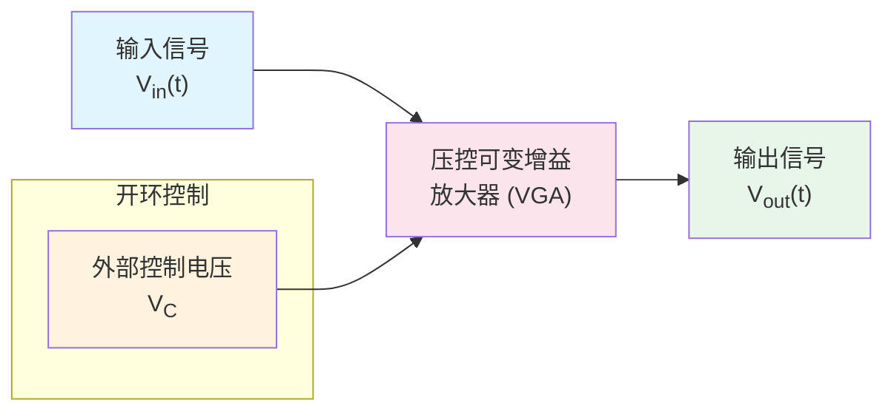
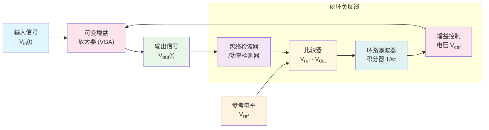
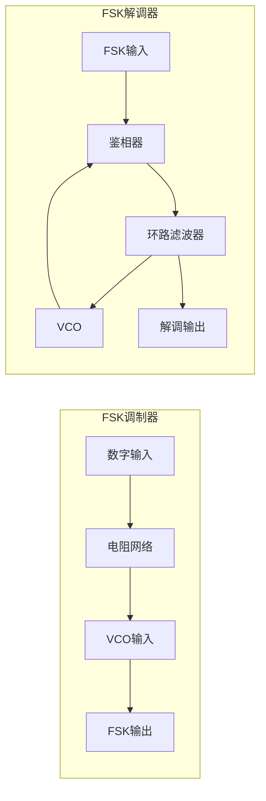
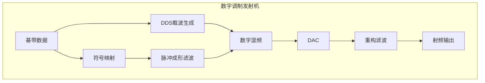
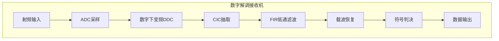
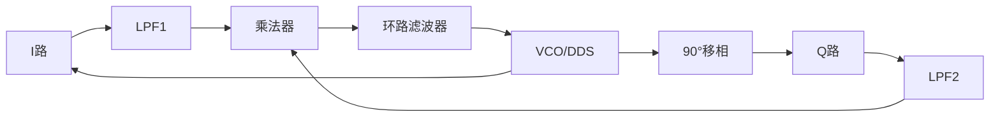
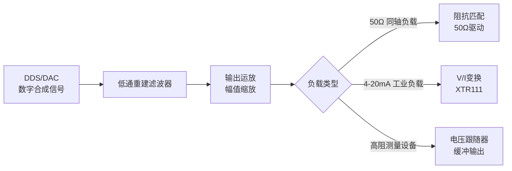
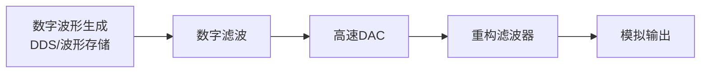

# 电赛信号类学习笔记

[TOC]

## 前言


## 第1章 信号与系统要点

### 1.1 信号的分类与数学描述

#### 1.1.1 连续时间信号与离散时间信号
- **连续时间信号**：自变量 $t$ 在实数域 $\mathbb{R}$ 上连续取值，记为 $x(t)$。
- **离散时间信号**：自变量仅在整数点 $n\in\mathbb{Z}$ 上定义，记为 $x[n]$，通常由连续信号采样得到：$x[n]=x(nT_s)$，$T_s$ 为采样周期。

#### 1.1.2 基本信号
- **单位冲激信号** $\delta(t)$：满足

$$
\int_{-\infty}^{\infty}\delta(t)dt=1,\quad \delta(t)=0\;(t\neq0)
$$

- **单位阶跃信号** $u(t)$：

$$
u(t)=\begin{cases}1,&t\geq0\\0,&t<0\end{cases}
$$

- **矩形脉冲**：

$$
\operatorname{rect}\!\left(\frac{t}{T}\right)=\begin{cases}1,&|t|\leq T/2\\0,&|t|>T/2\end{cases}
$$

- **离散单位样值信号** $\delta[n]$：

$$
\delta[n]=\begin{cases}1,&n=0\\0,&n\neq0\end{cases}
$$


### 1.2 傅里叶变换与频谱分析

#### 1.2.1 周期信号的傅里叶级数

周期为 $T_0$ 的信号 $x(t)$ 可展开为傅里叶级数：

$$
x(t)=a_0+\sum_{n=1}^{\infty}\big[a_n\cos(n\omega_0 t)+b_n\sin(n\omega_0 t)\big],\quad \omega_0=\frac{2\pi}{T_0}
$$

其中系数：

$$
a_0=\frac1{T_0}\int_{T_0}x(t)dt,\quad a_n=\frac2{T_0}\int_{T_0}x(t)\cos(n\omega_0 t)dt,\quad b_n=\frac2{T_0}\int_{T_0}x(t)\sin(n\omega_0 t)dt
$$

也可写为幅度-相位形式：

$$
x(t)=A_0+\sum_{n=1}^{\infty}A_n\cos(n\omega_0 t+\phi_n)
$$

此时**频谱为离散谱**（线状谱），谱线间隔 $f_0=1/T_0$。

#### 1.2.2 非周期信号的傅里叶变换
非周期信号 $x(t)$ 的傅里叶变换对为：

$$
X(f)=\int_{-\infty}^{\infty}x(t)e^{-j2\pi ft}dt,\quad x(t)=\int_{-\infty}^{\infty}X(f)e^{j2\pi ft}df
$$

或采用角频率 $\omega=2\pi f$：

$$
X(\omega)=\int_{-\infty}^{\infty}x(t)e^{-j\omega t}dt,\quad x(t)=\frac1{2\pi}\int_{-\infty}^{\infty}X(\omega)e^{j\omega t}d\omega
$$

频谱为**连续谱**，单位是幅度/Hz（频谱密度）。

**常用傅里叶变换对**：
| 时域 $x(t)$                                     | 频域 $X(f)$                                            |
| ----------------------------------------------- | ------------------------------------------------------ |
| $\operatorname{rect}\!\left(\frac{t}{T}\right)$ | $T\operatorname{sinc}(fT)=\dfrac{\sin(\pi fT)}{\pi f}$ |
| $\delta(t)$                                     | $1$                                                    |
| $e^{j2\pi f_0t}$                                | $\delta(f-f_0)$                                        |
| $\cos(2\pi f_0t)$                               | $\frac12[\delta(f-f_0)+\delta(f+f_0)]$                 |
| $u(t)$                                          | $\dfrac1{j2\pi f}+\dfrac12\delta(f)$                   |

#### 1.2.3 频谱的物理意义
- **幅度谱** $|X(f)|$：表示信号在各个频率上的相对强度。
- **相位谱** $\angle X(f)$：表示各频率分量在时间上的相对位移。
- **带宽** 的三种常见定义：
  1. **-3 dB带宽**：幅度降至最大值的 $1/\sqrt2\approx0.707$（功率减半）的频率宽度。
  2. **等效噪声带宽**：将实际滤波器等效为理想矩形滤波器时的带宽（见第2章）。
  3. **奈奎斯特带宽**：等于 $f_s/2$，是采样系统能无混叠处理的最高频率。


### 1.3 线性系统与卷积

#### 1.3.1 线性时不变（LTI）系统
若系统算子为 $T$，则：
- **线性**：$T\{ax_1+bx_2\}=aT\{x_1\}+bT\{x_2\}$。
- **时不变**：若 $y(t)=T\{x(t)\}$，则 $T\{x(t-t_0)\}=y(t-t_0)$。

#### 1.3.2 冲激响应与卷积
系统对 $\delta(t)$ 的零状态响应称为**冲激响应** $h(t)$。任意输入 $x(t)$ 引起的零状态响应为二者的卷积：

$$
y(t)=x(t)*h(t)=\int_{-\infty}^{\infty}x(\tau)h(t-\tau)d\tau
$$

离散情况：

$$
y[n]=x[n]*h[n]=\sum_{k=-\infty}^{\infty}x[k]h[n-k]
$$

**卷积性质**：交换律、结合律、分配律，且时域卷积对应频域相乘：

$$
\mathcal{F}\{x(t)*h(t)\}=X(f)H(f)
$$


### 1.4 传递函数与频率响应

#### 1.4.1 传递函数
LTI系统的传递函数是冲激响应的拉普拉斯变换（连续）或Z变换（离散）：

$$
H(s)=\int_{-\infty}^{\infty}h(t)e^{-st}dt,\quad H(z)=\sum_{n=-\infty}^{\infty}h[n]z^{-n}
$$

#### 1.4.2 频率响应
令 $s=j\omega$（或 $z=e^{j\omega}$），得到频率响应：

$$
H(j\omega)=|H(j\omega)|\,e^{j\varphi(\omega)}
$$

- **幅频特性**：$20\log_{10}|H(j\omega)|$ (dB)，描述各频率分量的增益。
- **相频特性**：$\varphi(\omega)$，描述各频率分量的相移。

**一阶RC低通滤波器**：

$$
H(j\omega)=\frac{1}{1+j\omega RC},\quad f_{-3\text{dB}}=\frac{1}{2\pi RC}
$$

**运放增益带宽积**：对于电压反馈运放，闭环增益 $\times$ 带宽 ≈ 常数（GBW），选型时务必满足：GBW $\geq$ 所需增益 $\times$ 信号最高频率 $\times$ 安全系数。


### 1.5 采样定理与抗混叠

#### 1.5.1 理想采样模型
连续信号 $x(t)$ 以周期 $T_s$ 采样，等效为与冲激串相乘：

$$
x_s(t)=x(t)\sum_{n=-\infty}^{\infty}\delta(t-nT_s)
$$

频域表现为频谱的周期延拓：

$$
X_s(f)=f_s\sum_{k=-\infty}^{\infty}X(f-kf_s)
$$

#### 1.5.2 奈奎斯特采样定理
**定理**：若 $x(t)$ 的最高频率为 $f_{\max}$，则当采样频率

$$
f_s>2f_{\max}
$$

时，可从 $x_s(t)$ 无失真恢复 $x(t)$。
- **奈奎斯特频率** $f_s/2$ 是采样系统能处理的最高频率。
- **混叠**：当 $f_s\leq2f_{\max}$ 时，高频分量会折叠到低频，产生虚假信号。混叠后的频率为：

$$
f_{\text{alias}}=|f_a - kf_s|\quad(k\text{ 为整数，使结果在 }[0,f_s/2]\text{ 内})
$$

#### 1.5.3 抗混叠滤波器
在ADC之前必须放置**低通滤波器**，滤除高于 $f_s/2$ 的频率成分。通常选用巴特沃斯或切比雪夫滤波器，其阻带衰减应大于ADC的量化噪声水平。

**实用原则**：**先滤波，后采样；宁可多滤，不可混叠。**

#### 1.5.4 信号重建
理想重建使用sinc函数内插：

$$
x(t)=\sum_{n=-\infty}^{\infty}x(nT_s)\,\operatorname{sinc}\!\left(f_s(t-nT_s)\right)
$$

实际DAC多采用零阶保持（ZOH），其频率响应为：

$$
H_{\text{ZOH}}(f)=T_s\operatorname{sinc}(fT_s)e^{-j\pi fT_s}
$$

需要在模拟输出端增加补偿滤波器，以校正 $\operatorname{sinc}$ 滚降。


## 第2章 噪声与失真基础

### 2.1 噪声的基本数学模型

噪声是限制信号测量精度的根本因素。电子系统中的主要噪声源可分为三类：热噪声、散粒噪声和闪烁噪声。

### 2.2 热噪声（Johnson-Nyquist噪声）

导体中电子的随机热运动产生热噪声，其功率谱密度在极宽频带内为常数，属于**白噪声**。
阻值为 $R$ 的电阻，在温度 $T$、带宽 $B$ 内产生的等效噪声电压有效值为：
$$
v_{n,\text{rms}}=\sqrt{4kTRB}
$$

其中 $k=1.38\times10^{-23}\,\text{J/K}$，常温 $T=300\,\text{K}$ 时 $4kT\approx1.66\times10^{-20}$。

**例题**：$R=1\,\text{k}\Omega$，$B=1\,\text{MHz}$，则

$$
v_{n,\text{rms}}=\sqrt{4\times1.38\times10^{-23}\times300\times10^3\times10^6}\approx4.07\,\mu\text{V}_{\text{rms}}
$$

### 2.3 散粒噪声

载流子越过势垒（如PN结）的离散性引起散粒噪声，其大小与直流电流 $I_{\text{DC}}$ 成正比，亦为白噪声：

$$
i_{\text{shot,rms}}=\sqrt{2qI_{\text{DC}}B}
$$

$q=1.6\times10^{-19}\,\text{C}$。

### 2.4 闪烁噪声（1/f噪声）

功率谱密度与频率成反比，主要在低频段（$<1\,\text{kHz}$）显著。其成因与半导体器件的表面态、缺陷等有关。运放数据手册中常给出**1/f噪声拐点频率**，低于此频率时1/f噪声将超过白噪声成为主要噪声源。

### 2.5 动态性能指标

#### 2.5.1 信噪比（SNR）

$$
\text{SNR(dB)}=10\log_{10}\frac{P_{\text{signal}}}{P_{\text{noise}}}=20\log_{10}\frac{V_{\text{sig,rms}}}{V_{\text{noise,rms}}}
$$

噪声项通常不包含谐波失真。对于理想 $N$ 位ADC，量化噪声主导时：

$$
\text{SNR}\approx6.02N+1.76\;\text{dB}
$$

#### 2.5.2 总谐波失真（THD） 

$$
\text{THD}=\frac{\sqrt{V_2^2+V_3^2+\cdots+V_k^2}}{V_1}\times100\%
$$

其中 $V_1$ 为基波有效值，$V_k$ 为第 $k$ 次谐波有效值。常用分贝表示：$\text{THD(dB)}=20\log_{10}(\text{THD}/100)$。

#### 2.5.3 无杂散动态范围（SFDR）

$$
\text{SFDR(dBc)}=10\log_{10}\frac{P_{\text{fund}}}{P_{\max\_\text{spur}}}
$$

表征系统在有强信号时仍能分辨出的小信号能力，是ADC和射频前端的关键指标。

### 2.6 等效噪声带宽（ENB）

实际滤波器的输出噪声总功率可等效为一个增益为 $H_0$、带宽为 $B_N$ 的理想矩形滤波器，其中：

$$
B_N=\frac{1}{H_0^2}\int_0^\infty|H(f)|^2df
$$

常见滤波器的 $B_N$ 与 -3 dB带宽 $B_{-3\text{dB}}$ 的关系：
| 滤波器类型       | 阶数 | $B_N/B_{-3\text{dB}}$ |
| ---------------- | :--: | :-------------------: |
| 一阶RC低通       |  1   |    1.571 ($\pi/2$)    |
| 二阶巴特沃斯低通 |  2   |         1.110         |
| 二阶贝塞尔低通   |  2   |         1.154         |

实际计算输出热噪声电压时，只需将 $B_N$ 代入 $v_{n,\text{rms}}=\sqrt{4kTRB_N}$ 即可。


## 第3章 常用单位换算与功率计算

### 3.1 分贝（dB）体系

#### 3.1.1 比值定义
- **功率比**：$L_P(\text{dB})=10\log_{10}(P_2/P_1)$
- **电压比**（相同阻抗下）：$L_V(\text{dB})=20\log_{10}(V_2/V_1)$

#### 3.1.2 绝对功率电平
- **dBm**：以 $1\,\text{mW}$ 为参考，

$$
P(\text{dBm})=10\log_{10}(P/0.001)
$$

- **dBV**：以 $1\,\text{V}_{\text{rms}}$ 为参考，

$$
V(\text{dBV})=20\log_{10}(V_{\text{rms}}/1\text{V})
$$

- **dBu**：以 $0.775\,\text{V}_{\text{rms}}$ 为参考，

$$
V(\text{dBu})=20\log_{10}(V_{\text{rms}}/0.775)
$$

（源于 $600\,\Omega$ 负载上 $1\,\text{mW}$ 对应的电压 $\sqrt{0.001\times600}\approx0.775\,\text{V}$）

**换算关系**：
- $0\,\text{dBV} \approx +2.218\,\text{dBu}$（因为 $20\log_{10}(1/0.775)\approx2.22$）
- **dBm与dBV/dBu的转换必须指定阻抗**：
  - 在 $50\,\Omega$ 系统中：$\text{dBm}=\text{dBV}+13.01$  
    例：$0\,\text{dBm}\approx0.2236\,\text{V}_{\text{rms}}\approx-13\,\text{dBV}\approx-10.8\,\text{dBu}$
  - 在 $600\,\Omega$ 系统中：$\text{dBm}\approx\text{dBu}$

### 3.2 Vpp、Vrms与功率

#### 3.2.1 正弦波

$$
V_{\text{rms}}=\frac{V_{\text{pp}}}{2\sqrt{2}}\approx\frac{V_{\text{pp}}}{2.828},\qquad V_{\text{pp}}=V_{\text{rms}}\times2\sqrt{2}\approx2.828\,V_{\text{rms}}
$$

#### 3.2.2 任意波形
真有效值由积分定义：

$$
V_{\text{rms}}=\sqrt{\frac{1}{T}\int_0^T v^2(t)dt}
$$

测量时需使用真有效值芯片（如AD637）或通过ADC采样后数字计算。

#### 3.2.3 功率计算
纯阻性负载 $R$ 上消耗的功率：

$$
P=\frac{V_{\text{rms}}^2}{R}\quad\text{（通用公式）}
$$

对于正弦波，还可用峰值表示：

$$
P=\frac{V_{\text{pp}}^2}{8R}\quad\text{（仅正弦波）}
$$

**50 Ω系统速算公式**（正弦波）：

$$
P(\text{dBm})=20\log_{10}V_{\text{pp}}+4.0
$$

记忆锚点：$V_{\text{pp}}=1\,\text{V}$ 时 $P\approx4\,\text{dBm}$；电压翻倍功率加6 dB。

### 3.3 50 Ω系统常用换算表

以下表格基于正弦波、负载 $R=50\,\Omega$：

| 功率 (dBm) | $V_{\text{rms}}$ | $V_{\text{pp}}$ | 电压 (dBV) |
| :--------: | :--------------: | :-------------: | :--------: |
|    -20     |     22.4 mV      |     63.2 mV     |    -33     |
|    -10     |     70.7 mV      |     200 mV      |    -23     |
|     0      |     0.224 V      |     0.632 V     |    -13     |
|   **+4**   |   **0.354 V**    |    **1.0 V**    |   **-9**   |
|    +10     |     0.707 V      |      2.0 V      |     -3     |
|    +20     |     2.236 V      |     6.32 V      |     +7     |

**现场快速估算**：示波器探头置于×1档，直接读取 $50\,\Omega$ 负载上的 $V_{\text{pp}}$，按 $1\,\text{V}_{\text{pp}}\approx4\,\text{dBm}$ 线性外推，即可免查表。

## 第4章 放大器基础与应用

电赛信号题的典型信号链：
**传感器/信号源 → 前置放大（低噪声）→ 程控增益 → 滤波 → 输出驱动 → 负载/采集**

因此放大器承担的任务：

- **阻抗匹配与低噪声放大**（第一级决定系统噪声）
- **大动态范围增益调节**（程控，适应不同输入幅度）
- **高频信号无失真放大**（宽带、平坦度、线性度）
- **驱动低阻负载**（如50Ω同轴电缆、ADC输入）

### 4.1 放大器的性能指标

运放参数中，输入失调电流 $I_{OS}$、输入失调电压 $V_{OS}$、单位增益带宽 GBW 和转换速率 SR 是比较难以理解但对电路设计影响最大的几个概念。以下按静态指标和动态指标分类介绍。

#### 4.1.1 静态指标

**输入失调电压** $V_{OS}$：当运放输入为零时，为使输出为零而在输入端所需施加的补偿电压。单位通常为μV或mV。失调电压越小，直流放大精度越高。

**输入失调电压温漂**：$V_{OS}$ 随温度的变化率，单位μV/°C。对于需要在宽温度范围内工作的直流精密放大器，这是关键指标。

**输入偏置电流** $I_B$：运放两个输入端流进（或流出）的直流电流的平均值。单位pA至μA。对于高阻抗信号源（如光电二极管），偏置电流会在源阻抗上产生额外压降，引入误差。

**输入失调电流** $I_{OS}$：两个输入端偏置电流之差。

**共模抑制比** CMRR：差模增益与共模增益之比，常用分贝表示：

$$
\text{CMRR(dB)}=20\log_{10}\frac{A_d}{A_c}
$$

CMRR值越大，放大器抑制共模信号（如工频干扰、直流偏置）的能力越强。一般差分放大器的共模抑制比约为几十分贝，性能高的可达一百分贝以上。

**电源抑制比** PSRR：电源电压变化引起输出电压变化的抑制能力，反映了放大器对电源噪声的免疫力。

#### 4.1.2 动态指标

**差模电压放大倍数** $A_{vd}$：差模输出电压与差模输入电压之比。

**-3dB带宽** $f_{-3\text{dB}}$：放大器增益比中频增益下降3dB时所对应的频率。这是衡量放大器频率响应的基本指标。

**单位增益带宽** GBW：当放大器接成单位增益（电压跟随器）时，-3dB带宽与增益的乘积。对于电压反馈型运放，GBW近似为常数，闭环增益每增加10倍，带宽缩小为原来的1/10。因此选型时需满足：

$$
\text{GBW} \geq A_v \times f_{\max} \times \text{安全系数}
$$

**增益带宽积** GBWP：与GBW同义，有时特指开环增益与带宽的乘积。

**转换速率** SR：在额定负载下，运放输出电压的最大变化率，单位V/μs：

$$
\text{SR}=\left.\frac{dV_o}{dt}\right|_{\max}
$$

当输入为大信号时，若信号变化斜率超过SR，输出波形将产生失真（压摆率限制）。对于输出正弦波峰值为 $V_p$、频率为 $f$ 的信号，要求：

$$
\text{SR} \geq 2\pi f V_p
$$

**增益平坦度**：在通带内，最高增益与最低增益之差（dB）。多级放大器级联时，增益平坦度会因前后级驻波比不一致而变坏。

### 4.2 宽带放大器

#### 4.2.1 概念与特点

宽带放大器是指工作频带范围很宽（相对带宽大）的放大器。电赛中常见的宽带放大器要求覆盖从直流（或低频）到数十MHz甚至GHz的频率范围。例如2013年电赛射频宽带放大器题目要求增益≥20dB、输入有效值≤20mV。

宽带放大器设计的主要障碍是有源器件的**增益带宽积制约**——有源器件的增益在频率高端随频率增加以6dB/倍频程下降。

#### 4.2.2 设计方法与关键指标

**增益平坦度**是宽带放大器的核心指标。多倍频程放大器的增益平坦度一般要求±1～±3dB。如果选择放大器合适，1dB的带内起伏基本可以满足要求。

**常用设计方法**：

- **负反馈式放大器**：降低电路对晶体管自身性能变化的敏感度，获得较好的输入阻抗匹配和较低的噪声系数，增大工作频带内放大器的稳定性，增加线性度。这是最常用的宽带设计方法。
- **平衡结构式放大器**
- **有源匹配电路**
- **分布式放大器**

**运放选型要点**：

对于高频宽带应用，**电流反馈型运放**比电压反馈型更具优势——它没有固定的增益带宽积限制，在高频电路中对波形失真较小。例如THS3092电流反馈型放大器就常用于高频宽带电路。设计时需根据带宽和增益要求选择GBW足够高的运放：若要求3dB带宽为90MHz、放大倍数10V/V，应选择GBW高于900MHz的运放。

### 4.3 差分放大器

#### 4.3.1 概念与基本原理

差分放大器（Differential Amplifier）的核心功能是**放大两个输入端之间的电压差（差模信号），同时抑制两个输入端上共有的电压（共模信号）**。

任意两个输入电压 $v_1$ 和 $v_2$ 可分解为：

- **共模电压**：$v_{cm} = \dfrac{v_1+v_2}{2}$
- **差模电压**：$v_d = v_1 - v_2$

理想差分放大器只放大差模电压，完全抑制共模电压。

#### 4.3.2 共模抑制比（CMRR）

CMRR是衡量差分放大器性能的最关键指标：

$$
\text{CMRR} = \frac{A_d}{A_c}
$$

其中 $A_d$ 为差模增益，$A_c$ 为共模增益。CMRR值越大，表明电路抑制共模信号的性能越好。

实际差分放大器的CMRR不仅取决于运放本身，还在很大程度上依赖于**外部电阻的匹配程度**。电阻容差或匹配比率容差会直接影响CMRR。

#### 4.3.3 典型应用

差分放大器广泛应用于抑制共模干扰的场景：

- **传感器信号调理**：桥式传感器（如应变片、压力传感器）输出微小差分信号，需差分放大后采集。
- **长线传输信号接收**：抑制传输过程中耦合的共模噪声。
- **生物电信号测量**：心电、脑电等微弱信号常淹没在共模干扰中。

**仪表放大器**（如INA118）是差分放大器的一种精密实现，内部集成了3个运放组成的经典差分电路，体积小、使用方便。它在高增益条件下（G=100时）仍能提供较宽的带宽。

### 4.4 功率放大器

#### 4.4.1 概念与分类

功率放大器（Power Amplifier，PA）的核心使命是**将输入信号的功率高效、线性地提升到所需水平**——将直流电源的能量转换为输出信号的能量。其核心设计权衡在于**效率、失真、散热和稳定性**之间的平衡。

根据晶体管在输入信号一个完整周期内的导通状态不同，功率放大器可分为以下类别：

| 类别     | 导通角         | 理论效率 | 特点                                           |
| -------- | -------------- | -------- | ---------------------------------------------- |
| **A类**  | 360°（全周期） | ≤50%     | 线性度最佳，但效率最低，大量功率转化为热能     |
| **B类**  | 180°（半周期） | 78.5%    | 效率高，但存在**交越失真**                     |
| **AB类** | 180°~360°      | 50~60%   | A类和B类的折中，兼顾线性与效率，音频功放最常见 |
| **D类**  | 开关状态       | 接近100% | 效率极高，但线性度差，需复杂线性化技术         |

#### 4.4.2 关键性能指标

**输出功率**：通常以饱和输出功率和**1dB压缩点输出功率**（$P_{1\text{dB}}$）描述。1dB压缩点指实际输出功率比理想线性放大时低1dB所对应的输出功率，是衡量线性度的常用参考点。

**效率**：通常以**功率附加效率**（PAE）表征，定义为（射频输出功率 - 输入功率）与直流功耗之比。效率低意味着能源浪费和严重发热。

**线性度**：描述输出信号随输入信号比例变化的忠实程度。非线性会导致**频谱再生**（干扰其他信道）和**信号失真**（恶化调制精度）。

#### 4.4.3 电赛中的功率放大器

电赛功率放大器题目（如1995年实用低频功率放大器、高效率音频功率放大器等）通常要求：

- 额定输出功率 ≥ 10W（负载8Ω）
- 带宽 ≥ 50Hz ~ 10000Hz
- 非线性失真系数 ≤ 3%
- 效率 ≥ 55%

设计时需在输出功率、效率和失真之间做出权衡，通常选用**AB类**推挽结构作为兼顾性能的方案。

### 4.5 低噪声放大器（LNA）

#### 4.5.1 概念与地位

低噪声放大器是通信、雷达、电子对抗及遥控遥测系统中**必不可少的关键部件**。它位于射频接收系统的最前端，主要功能是对天线接收到的微弱射频信号进行线性放大，同时抑制各种噪声干扰，**提高系统的灵敏度**。

#### 4.5.2 噪声系数

**噪声系数**（Noise Figure, NF）是LNA最重要的指标，定义为：

$$
\text{NF(dB)} = 10\log_{10}\frac{\text{输入信噪比}}{\text{输出信噪比}}
$$

它量化了放大器自身引入的噪声对信号质量的恶化程度。一个具有20dB增益的低噪声放大器就足够抑制后一级电路的噪声系数影响。

LNA设计时在兼顾其他指标的同时，**主要考虑噪声系数**。设计良好的LNA噪声系数可做到1.6~2.1dB甚至更低。

#### 4.5.3 设计要点

**噪声匹配**：为使放大器达到最低噪声系数，需要信号源内阻 $R_s$ 与放大器的最佳噪声源阻抗匹配。

**负反馈技术**：负反馈式LNA可以获得较好的输入阻抗匹配和较低的噪声系数。

**器件选择**：微波低噪声晶体管需满足：噪声系数足够小、工作频段足够高（$f_T$ 比工作频率高4倍以上）、增益足够大、动态范围足够大。

**宽带LNA**的设计还需解决宽频带内的增益平坦度问题。

### 4.6 直流偏置放大器

#### 4.6.1 概念与作用

**直流偏置放大器**（DC Offset Amplifier）并非一种独立的放大器类型，而是一类用于**在放大信号的同时，为输出信号叠加一个可控的直流偏置电压**的电路结构。其核心功能是实现**电平搬移**（Level Shifting），将输入信号的直流电平调整到后级电路（如ADC、比较器）所需的参考电平范围。

在单电源供电系统中，许多模拟信号是双极性的（如交流信号围绕0V变化），而ADC的输入范围通常为0~$V_{\text{ref}}$。直流偏置放大器可将双极性信号抬升到单极性范围，同时保留信号波形。

#### 4.6.2 典型实现电路

**反相加法器**  
输入信号 $v_i$ 与一个直流参考电压 $V_{\text{ref}}$ 分别通过电阻 $R_1$、$R_2$ 接入反相端，同相端接地。输出为：

$$
v_o = -\left( \frac{R_f}{R_1}v_i + \frac{R_f}{R_2}V_{\text{ref}} \right)
$$

通过调整 $R_2$ 即可改变偏置量。该电路结构简单，但输出反相，且输入阻抗较低。

**同相加法器**  
信号与参考电压分别通过电阻接入同相端，反相端接反馈。输出为两者加权和（无反相），但需注意输入共模电压范围限制。

**差分放大器加参考端**  
许多仪表放大器（如INA118）具有参考引脚（REF），将该引脚接一个直流电压 $V_{\text{ref}}$，输出以该参考电压为基准：

$$
v_o = A_d(v_+ - v_-) + V_{\text{ref}}
$$

这是最便捷的实现方式，偏置精度仅取决于参考源的精度。

**电平移位电路**  
使用运放和稳压源构成精密加法器，可将交流信号叠加一个低噪声、高精度的直流电平。

#### 4.6.3 关键性能指标

**偏置电压精度**  
输出直流偏置与设定值的偏差，受电阻精度、运放失调电压和参考源精度影响。对于高精度应用，建议使用0.1%或更高精度的电阻，并选用低失调运放（如OPA277）。

**偏置温漂**  
偏置电压随温度的变化率，通常由参考源（如TL431）和电阻的温度系数决定。低温漂设计需选用50ppm/°C或更低温度系数的元件。

**输入共模范围**  
对于同相结构，输入信号叠加参考电压后的共模电压必须在运放允许的输入共模范围内，否则将产生非线性失真。

**输出摆幅**  
在叠加偏置后，输出信号的正负峰值不能超过运放的最大输出范围（通常比电源轨低1~2V）。

**增益与偏置的相互影响**  
在增益放大时，偏置电压可能也被放大或保持恒定，取决于电路拓扑。设计时需明确是否需要偏置电压随增益变化。

#### 4.6.4 电赛中的典型应用

- **ADC驱动**：将双极性传感器信号（如振动传感器输出±5V）偏置到单极性ADC输入（0~5V）范围。
- **音频信号处理**：将交流音频信号加入直流偏置，以便在单电源供电的功放或滤波器中正常工作。
- **自动调零**：在测量电路中，通过数字电位器或DAC调整偏置，抵消传感器初始失调。
- **比较器阈值设定**：为比较器提供一个可调的直流参考电平，用于幅度检测或过零检测。

#### 4.6.5 设计注意事项

- **低噪声偏置**：偏置电压上的任何噪声都会直接叠加到输出信号上，降低信噪比。建议使用低噪声基准源（如REF50xx系列），并加入RC滤波。
- **电源去耦**：偏置参考源和运放电源引脚需就近添加0.1μF和10μF电容，以抑制电源噪声耦合。
- **布局布线**：偏置电压走线应远离高频或大电流信号线，避免串扰。
- **温度补偿**：若系统需宽温工作，可选用低温漂电阻（如金属膜电阻）和低漂移基准源，或加入温度补偿电路。

## 第5章 滤波器基础与设计

### 5.1 滤波器的基本分类与数学描述

#### 5.1.1 滤波器的频率响应特性

滤波器根据其频率响应幅度的特性可分为四类基本形式。设滤波器的频率响应函数为$H(\omega)$，其中$\omega=2\pi f$为角频率。

**低通滤波器**的幅度响应满足：

$$
|H(\omega)| \approx 
\begin{cases}
1, & \text{当 } \omega < \omega_c \\
0, & \text{当 } \omega > \omega_c
\end{cases}
$$

其中$\omega_c$为截止角频率。

**高通滤波器**的幅度响应满足：

$$
|H(\omega)| \approx 
\begin{cases}
0, & \text{当 } \omega < \omega_c \\
1, & \text{当 } \omega > \omega_c
\end{cases}
$$

**带通滤波器**的幅度响应在频带$[\omega_1, \omega_2]$内近似为1，在此频带外近似为0，其中$\omega_1$为下截止频率，$\omega_2$为上截止频率，中心频率$\omega_0 = \sqrt{\omega_1\omega_2}$，带宽$BW = \omega_2 - \omega_1$。

**带阻滤波器**的幅度响应在频带$[\omega_1, \omega_2]$内近似为0，在此频带外近似为1。

#### 5.1.2 滤波器的性能参数

**通带**定义为幅度响应满足$|H(\omega)| \geq 1/\sqrt{2} \approx 0.707$的频率范围，对应衰减不超过3 dB。**阻带**定义为幅度响应低于规定衰减值$A_{\min}$的频率范围，通常$A_{\min}$取20 dB、40 dB或更高。

**截止频率**$\omega_c$通常指幅度响应下降至通带最大值$1/\sqrt{2}$时的频率，即-3 dB点。对于具有纹波的滤波器，截止频率可定义为纹波带宽的边缘频率。

**纹波参数**$\delta_p$和$\delta_s$分别表示通带和阻带内幅度响应的最大偏差。通带纹波通常表示为：

$$
1 - \delta_p \leq |H(\omega)| \leq 1 + \delta_p, \quad \omega \in \text{通带}
$$

或以分贝表示：$R_p = -20\log_{10}(1 - \delta_p)$ dB

阻带衰减表示为：

$$
|H(\omega)| \leq \delta_s, \quad \omega \in \text{阻带}
$$

或以分贝表示：$A_s = -20\log_{10}(\delta_s)$ dB

**过渡带**为通带边缘频率$\omega_p$与阻带起始频率$\omega_s$之间的区域，即$\omega_p < \omega < \omega_s$。过渡带宽度$\Delta\omega = \omega_s - \omega_p$。

**滤波器阶数**n决定了幅度响应在过渡带的陡峭程度。对于无传输零点的滤波器，阻带衰减渐近线斜率为$-20n$ dB/十倍频程。

### 5.2 经典滤波器逼近函数 

#### 5.2.1 巴特沃斯逼近

巴特沃斯滤波器在$\omega=0$处具有最大平坦幅度特性，其幅度平方函数为：

$$
|H(j\omega)|^2 = \frac{1}{1 + (\omega/\omega_c)^{2n}}
$$

其中$n$为滤波器阶数。

在$s$复平面，巴特沃斯滤波器的传递函数极点位于半径为$\omega_c$的圆上，角度间隔为$\pi/n$，且全部位于左半平面。第$k$个极点位置为：

$$
s_k = \omega_c \exp\left[j\left(\frac{\pi}{2} + \frac{(2k-1)\pi}{2n}\right)\right], \quad k=1,2,\ldots,n
$$

归一化($\omega_c=1$ rad/s)巴特沃斯多项式的系数可通过递推公式计算或查表获得。

#### 5.2.2 切比雪夫逼近

切比雪夫I型滤波器在通带具有等波纹特性，阻带单调衰减。其幅度平方函数为：

$$
|H(j\omega)|^2 = \frac{1}{1 + \varepsilon^2 C_n^2(\omega/\omega_p)}
$$

其中$C_n(x)$为第一类切比雪夫多项式：$C_n(x)=\cos(n \arccos(x)), |x|\leq 1$；$C_n(x)=\cosh(n \operatorname{arccosh}(x)), |x|>1$。$\varepsilon$为纹波系数，与通带纹波$R_p$的关系为：$\varepsilon = \sqrt{10^{R_p/10} - 1}$。

切比雪夫II型滤波器在通带单调，阻带具有等波纹特性，其幅度平方函数为：

$$
|H(j\omega)|^2 = \frac{1}{1 + \varepsilon^2 / C_n^2(\omega_s/\omega)}
$$

切比雪夫滤波器的极点位于椭圆上，椭圆方程由纹波参数决定。

#### 5.2.3 椭圆逼近

椭圆滤波器在通带和阻带均具有等波纹特性，提供了给定阶数下的最陡过渡带。其幅度平方函数为：

$$
|H(j\omega)|^2 = \frac{1}{1 + \varepsilon^2 R_n^2(\omega, L)}
$$

其中$R_n$为雅可比椭圆函数，$L$为选择性因子，定义为阻带起始频率与通带截止频率之比。

椭圆滤波器的传递函数包含传输零点，位于阻带内$j\omega$轴上，这使其在过渡带边缘具有极高的斜率。

#### 5.2.4 贝塞尔逼近

贝塞尔滤波器具有最大平坦群延迟特性，其传递函数由反向贝塞尔多项式构成：

$$
B_n(s) = \sum_{k=0}^{n} a_k s^k, \quad \text{其中 } a_k = \frac{(2n-k)!}{2^{n-k} k! (n-k)!}
$$

贝塞尔滤波器的相位响应近似线性，群延迟在通带内接近常数，但幅度响应选择性较差。

### 5.3 滤波器设计方法

#### 5.3.1 归一化低通原型

滤波器设计通常从归一化低通原型开始，其截止频率$\omega_c'=1$ rad/s，参考阻抗$R'=1\Omega$。原型滤波器的传递函数$H_p(s')$确定后，通过频率变换和阻抗缩放得到实际滤波器。

对于无源LC滤波器，常用梯形结构实现。元件值可通过网络综合法或查表获得。例如，$n$阶巴特沃斯低通原型的元件值($g$值)为：

$$
g_k = 2 \sin\left[\frac{(2k-1)\pi}{2n}\right], \quad k=1,2,\ldots,n
$$

#### 5.3.2 频率变换

**低通到低通变换**：将原型频率$s'$映射为实际频率$s$，变换关系为$s' = s/\omega_c$。原型电感$L'$变换为实际电感$L = (R/\omega_c)L'$，原型电容$C'$变换为实际电容$C = C'/(R\omega_c)$。

**低通到高通变换**：变换关系为$s' = \omega_c/s$。原型电感$L'$变换为实际电容$C = 1/(R\omega_cL')$，原型电容$C'$变换为实际电感$L = R/(\omega_cC')$。

**低通到带通变换**：变换关系为$s' = \dfrac{s^2 + \omega_0^2}{BW \cdot s}$，其中$\omega_0=\sqrt{\omega_1\omega_2}$为中心频率，$BW=\omega_2-\omega_1$为带宽。原型电感$L'$变换为串联LC谐振电路：$L_s = \dfrac{R \cdot BW \cdot L'}{\omega_0^2}$，$C_s = \dfrac{1}{\omega_0^2 L_s}$。原型电容$C'$变换为并联LC谐振电路：$C_p = \dfrac{BW \cdot C'}{R\omega_0^2}$，$L_p = \dfrac{1}{\omega_0^2 C_p}$。

**低通到带阻变换**：变换关系为$s' = \dfrac{BW \cdot s}{s^2 + \omega_0^2}$。这是带通变换的逆变换。

#### 5.3.3 滤波器阶数确定

给定通带截止频率$\omega_p$、阻带起始频率$\omega_s$、通带最大衰减$A_p$(dB)、阻带最小衰减$A_s$(dB)，可计算所需滤波器阶数。

对于巴特沃斯滤波器：

$$
n \geq \frac{\log\left[(10^{A_s/10}-1)/(10^{A_p/10}-1)\right]}{2 \log(\omega_s/\omega_p)}
$$

对于切比雪夫I型滤波器：

$$
n \geq \frac{\operatorname{arccosh}\left[\sqrt{(10^{A_s/10}-1)/(10^{A_p/10}-1)}\right]}{\operatorname{arccosh}(\omega_s/\omega_p)}
$$

### 5.4 无源滤波器实现

#### 5.4.1 LC梯形网络

无源滤波器通常采用梯形网络结构，有T型和π型两种基本形式。综合方法包括影像参数法和插入损耗法。

对于双端接载的LC梯形网络（源电阻$R_s$，负载电阻$R_L$），其传递函数可通过达林顿综合法获得。该方法将给定的传递函数$H(s)$实现为无损LC网络，两端接电阻。

具体步骤：

- 由$|H(j\omega)|^2$确定反射系数$\rho(s)\rho(-s) = 1 - H(s)H(-s)$
- 选择左半平面零点构成$\rho(s)$
- 计算输入阻抗$Z_{in}(s) = R_s[1+\rho(s)]/[1-\rho(s)]$
- 通过连分式展开实现LC梯形网络

#### 5.4.2 元件灵敏度

灵敏度$S_x^y = (\partial y/\partial x)(x/y)$表示参数$y$对元件$x$变化的敏感程度。对于滤波器，重要的灵敏度包括：

- 极点频率灵敏度：$S_{L,C}^{\omega_0} = -1/2$
- 品质因数Q灵敏度：$S_{L,C}^{Q} = \pm 1/2$（取决于电路拓扑）

无源LC滤波器的灵敏度较低，巴特沃斯逼近的灵敏度最低，椭圆逼近的灵敏度最高。

#### 5.4.3 实际元件非理想性

实际电感包含串联电阻$R_L$，导致品质因数$Q_L = \omega L/R_L$有限。电容存在等效串联电阻ESR和寄生电感。这些非理想性影响滤波器的插入损耗和频率响应。

设计时需考虑元件值容差、温度系数和长期稳定性。通常需要容差分析，使用蒙特卡洛方法评估性能变化范围。

### 5.5 有源滤波器

#### 5.5.1 有源滤波器基本结构

有源滤波器使用运算放大器、电阻和电容实现滤波功能，无需电感。基本二阶节结构包括：

**Sallen-Key结构**：电压控制电压源(VCVS)型，传递函数为：

$$
H(s) = \frac{K}{s^2RC_1C_2 + s(RC_1+RC_2-C_1R(1-K)) + 1}
$$

其中$K$为同相放大器增益（通常$K=1$为单位增益）。

**多重反馈(MFB)结构**：电流反馈型，传递函数为：

$$
H(s) = -\frac{R_2/R_1}{s^2R_2R_3C_1C_2 + sC_1(R_2+R_3+R_2R_3/R_1) + 1}
$$

**状态变量滤波器**：由积分器和加法器组成，可同时实现低通、高通和带通输出。传递函数为：

$$
H_{LP}(s) = -\frac{R_6/R_5}{s^2(R_1R_3C_1C_2)/(R_2R_4) + s(R_1C_1)/(R_2) + 1}
$$

#### 5.5.2 运算放大器限制

有源滤波器的性能受运放参数限制：
- 增益带宽积GBW：滤波器截止频率$f_c$应满足$f_c < GBW/(10Q_{\max})$，其中$Q_{\max}$为最高品质因数
- 压摆率SR：处理大信号时，SR应满足$SR > 2\pi f_{\max} V_p$，其中$f_{\max}$为最高信号频率，$V_p$为峰值电压
- 输入阻抗和偏置电流：影响低频精度
- 噪声：决定滤波器的最小可检测信号

#### 5.5.3 高阶有源滤波器实现

高阶滤波器通过二阶节和一阶节级联实现。$n$阶滤波器需要$\lfloor n/2 \rfloor$个二阶节，若$n$为奇数则再加一个一阶节。

级联设计步骤：
- 将高阶传递函数分解为二阶因式乘积
- 为每个二阶节分配极点和零点
- 设计各二阶节电路，通常从高Q节开始
- 确定各级增益分配以满足动态范围要求
- 级联时考虑节间阻抗匹配

### 5.6 滤波器设计流程

#### 5.6.1 设计规范

给定以下滤波器规格：
- 类型：带通滤波器
- 通带：900-1100 Hz通带纹波：$\leq 0.5$ dB
- 阻带：$\leq 800$ Hz 和 $\geq 1200$ Hz
- 阻带衰减：$\geq 40$ dB
- 阻抗：600 $\Omega$

通带边缘频率：$\omega_{p1}=2\pi\times 900$，$\omega_{p2}=2\pi\times 1100$

阻带边缘频率：$\omega_{s1}=2\pi\times 800$，$\omega_{s2}=2\pi\times 1200$

中心频率：$\omega_0 = \sqrt{\omega_{p1}\omega_{p2}} \approx 2\pi\times 995$

带宽：$BW = \omega_{p2} - \omega_{p1} = 2\pi\times 200$

选择性：$\omega_{s2}/\omega_{p2} = 1200/1100 \approx 1.091$，$\omega_{p1}/\omega_{s1} = 900/800 = 1.125$

计算低通原型要求：$\Omega_s = \min(\omega_{s2}/\omega_{p2}, \omega_{p1}/\omega_{s1}) = 1.091$

对于切比雪夫I型（通带纹波0.5 dB）：

$$
n \geq \frac{\operatorname{arccosh}\left[\sqrt{(10^{40/10}-1)/(10^{0.5/10}-1)}\right]}{\operatorname{arccosh}(1.091)} \approx 7.2
$$

故选择$n=8$。

查表得8阶0.5 dB纹波切比雪夫低通原型元件值（对于π型结构）：

$$
\begin{aligned}
&g_1=1.6703, \quad g_2=1.1926, \quad g_3=2.3661, \quad g_4=0.8419, \\
&g_5=2.2404, \quad g_6=0.6555, \quad g_7=1.9841, \quad g_8=0.8140
\end{aligned}
$$


将低通原型变换为带通滤波器：
对于原型电感$L_k'$，变换为串联LC电路：

$$
\begin{aligned}
L_{sk} &= \frac{R \cdot BW \cdot L_k'}{\omega_0^2} \\
C_{sk} &= \frac{1}{\omega_0^2 L_{sk}}
\end{aligned}
$$

对于原型电容$C_k'$，变换为并联LC电路：

$$
\begin{aligned}
C_{pk} &= \frac{BW \cdot C_k'}{R\omega_0^2} \\
L_{pk} &= \frac{1}{\omega_0^2 C_{pk}}
\end{aligned}
$$

代入数值计算实际元件值：

$$
\begin{aligned}
\omega_0 &= 2\pi\times 995 \approx 6251.3 \text{ rad/s} \\
BW &= 2\pi\times 200 \approx 1256.6 \text{ rad/s} \\
R &= 600 \Omega
\end{aligned}
$$

例如，对于$g_1=1.6703$（串联电感）：

$$
\begin{aligned}
L_{s1} &= \frac{600\times 1256.6\times 1.6703}{6251.3^2} \approx 0.0322 \text{ H} = 32.2 \text{ mH} \\
C_{s1} &= \frac{1}{6251.3^2\times 0.0322} \approx 7.94\times 10^{-7} \text{ F} = 0.794 \mu\text{F}
\end{aligned}
$$

重复计算所有元件值。

作为替代方案，可采用有源滤波器实现。将8阶滤波器分解为4个二阶节级联。每个二阶节的传递函数为：

$$
H_i(s) = \frac{K_i \omega_{0i}^2}{s^2 + (\omega_{0i}/Q_i)s + \omega_{0i}^2}
$$

使用状态变量结构实现各二阶节，可独立调整中心频率和Q值。节间使用缓冲器隔离。

计算各元件对中心频率和带宽的灵敏度。对于LC谐振电路：

$$
\begin{aligned}
S_L^{\omega_0} &= S_C^{\omega_0} = -\frac{1}{2} \\
S_L^{Q} &= S_C^{Q} = \frac{1}{2}
\end{aligned}
$$

这表明元件值变化1\%会导致中心频率变化0.5\%，Q值变化0.5\%。

通过容差分析，确定元件精度要求。若要求中心频率变化小于1\%，则电感和电容容差应小于2\%。使用温度补偿电容（如NPO陶瓷）可改善温度稳定性。

#### 5.6.2 滤波器实现中的实际问题

在较高频率下（$>10$ MHz），寄生参数影响显著：
- 电感自谐振频率：由分布电容引起，限制最大工作频率
- 电容串联电感：由引线电感引起，影响高频特性
- 印刷电路板走线电感：约1 nH/mm，在GHz范围不可忽略

滤波器的动态范围定义为最大不失真输出与等效输入噪声之比。对于有源滤波器，噪声主要来自：
- 电阻热噪声：$e_n = \sqrt{4kTRB}$，其中$k$为玻尔兹曼常数，$T$为绝对温度，$B$为带宽
- 运放电压噪声和电流噪声
- 电源噪声耦合

最小化噪声措施包括：使用低噪声运放;优化电阻值（降低热噪声但增加电流噪声）;良好的电源去耦;屏蔽和接地技术

#### 5.6.3 现代滤波器技术

**开关电容滤波器**使用开关和电容模拟电阻，其等效电阻$R_{eq} = 1/(f_{clk} C)$，其中$f_{clk}$为时钟频率。截止频率与时钟频率成比例，易于精确控制。传递函数由电容比值决定，与绝对电容值无关，适合集成电路实现。限制包括：时钟馈通和电荷注入;有限开关速度限制最高工作频率;混叠效应需要抗混叠滤波器

**自适应滤波器**系数可实时调整，以最小化误差信号$e(n)$。最常用算法为最小均方(LMS)算法：

$$
w(n+1) = w(n) + \mu e(n) x(n)
$$

其中$w(n)$为系数向量，$\mu$为步长参数，$x(n)$为输入向量。

### 5.7 数字滤波器

#### 5.7.1 数字频率与模拟频率的根本关系

要理解数字频率，必须从连续时间信号的离散化过程开始。一个模拟信号 $x_a(t)$ 经过理想采样后，得到数字序列 $x[n] = x_a(nT)$，其中 $T$ 为采样周期，其倒数 $f_s = 1/T$ 称为采样频率。

一个模拟复指数信号 $e^{j\Omega t}$ 的角频率为 $\Omega$（单位：弧度/秒）。采样后，该信号变为 $e^{j\Omega nT} = e^{j(\Omega T)n}$。我们定义 **数字频率** $\omega = \Omega T$，其单位为 **弧度/样本**。因此，数字序列可表示为 $e^{j\omega n}$。

这个关系 $\omega = \Omega T = 2\pi f / f_s$ 是连接模拟与数字领域的桥梁。它指出，数字频率 $\omega$ 本质上是模拟频率 $\Omega$ 相对于采样频率 $f_s$ 的归一化值。

由于离散时间傅里叶变换（DTFT）的周期性，数字频率 $\omega$ 通常只考虑一个 $2\pi$ 周期，例如 $[-\pi, \pi]$ 或 $[0, 2\pi]$。根据奈奎斯特-香农采样定理，为了避免混叠，模拟信号的最高频率分量必须小于 $f_s/2$。对应地，在数字频率域，有意义的最高频率为 $\omega = \pi$（对应 $\Omega = \pi f_s$）。当模拟频率超过 $f_s/2$（即 $\omega$ 超过 $\pi$）时，会产生混叠，即高频分量会被错误地映射到 $[- \pi, \pi]$ 区间内的某个低频上。

#### 5.7.2 无限脉冲响应（IIR）滤波器

##### 5.7.2.1 概念与数学模型

IIR滤波器的系统函数是一个有理分式：

$$
H(z) = \frac{\sum_{k=0}^{M} b_k z^{-k}}{1 - \sum_{k=1}^{N} a_k z^{-k}} = \frac{B(z)}{A(z)}
$$

其对应的差分方程为：

$$
y[n] = \sum_{k=0}^{M} b_k x[n-k] + \sum_{k=1}^{N} a_k y[n-k]
$$

该方程的特点是，当前输出 $y[n]$ 不仅依赖于当前和过去的输入 $x[n-k]$，还依赖于过去的输出 $y[n-k]$，这称为 **反馈**。正是由于反馈的存在，其单位脉冲响应 $h[n]$（即系统函数 $H(z)$ 的逆Z变换）在理论上是无限长的，故得名"无限脉冲响应"。

IIR滤波器的主要优势在于，它能够利用反馈以较低的阶数（即较少的系数）实现非常陡峭的频率选择性，计算效率较高。其主要缺点是，由于存在反馈，滤波器可能不稳定（所有极点必须在单位圆内），且通常不具有线性相位特性（除全通网络外）。

##### 5.7.2.2 从模拟滤波器转换

IIR滤波器通常基于成熟的模拟滤波器原型（如巴特沃斯、切比雪夫、椭圆滤波器）进行设计，通过某种映射将模拟系统函数 $H_a(s)$ 转换为数字系统函数 $H(z)$。

###### 5.7.2.2.1 冲激响应不变法

该方法的核心是保持模拟滤波器单位冲激响应的形状，即令数字滤波器的单位脉冲响应等于模拟冲激响应的等间隔采样：$h[n] = T \cdot h_a(nT)$。这里因子 $T$ 用于补偿采样带来的幅度缩放。

设模拟滤波器的系统函数为部分分式形式：$H_a(s) = \sum_{i=1}^{N} \frac{A_i}{s - p_i}$。则其冲激响应为 $h_a(t) = \sum_{i=1}^{N} A_i e^{p_i t} u(t)$。采样后得到数字脉冲响应 $h[n] = T \sum_{i=1}^{N} A_i e^{p_i nT} u[n]$。对其取Z变换，得到数字系统函数：

$$
H(z) = T \sum_{i=1}^{N} \frac{A_i}{1 - e^{p_i T} z^{-1}}
$$

由此可见，模拟极点 $s = p_i$ 被映射为数字极点 $z = e^{p_i T}$。这种方法保持了时域响应的形态，但s平面到z平面的映射关系为 $z = e^{sT}$，它将s平面虚轴（$s=j\Omega$）映射到z平面的单位圆上（$z=e^{j\Omega T}$），频率是线性对应的 $\omega = \Omega T$。然而，由于 $e^{j(\Omega + 2\pi k/T)T} = e^{j\Omega T}$，任何模拟频率 $\Omega + 2\pi k/T$ 都会映射到同一个数字频率 $\omega$，这导致了 **频率混叠**。因此，冲激响应不变法仅适用于带限的模拟滤波器（通常是低通和带通）。

###### 5.7.2.2.2 双线性变换法

为了完全消除混叠，双线性变换采用了一种非线性的频率压缩映射。其变换公式为：

$$
s = \frac{2}{T} \cdot \frac{1 - z^{-1}}{1 + z^{-1}} \quad \text{或等价地} \quad z = \frac{1 + (T/2)s}{1 - (T/2)s}
$$

将 $s = j\Omega$ 和 $z = e^{j\omega}$ 代入上式，可以得到模拟频率 $\Omega$ 与数字频率 $\omega$ 之间的关系：

$$
j\Omega = \frac{2}{T} \cdot \frac{1 - e^{-j\omega}}{1 + e^{-j\omega}} = j \frac{2}{T} \tan\left(\frac{\omega}{2}\right)
$$

即：

$$
\Omega = \frac{2}{T} \tan\left(\frac{\omega}{2}\right) \quad \text{或} \quad \omega = 2 \arctan\left(\frac{\Omega T}{2}\right)
$$

这个正切关系表明，整个模拟频率轴 $-\infty < \Omega < \infty$ 被一一对应地、非线性地压缩到了数字频率的主值区间 $-\pi < \omega < \pi$ 内。这种非线性压缩被称为 **频率畸变**。在低频处（$\omega \ll 1$），$\tan(\omega/2) \approx \omega/2$，近似有线性关系 $\Omega \approx \omega / T$；但在高频处，畸变严重。

###### 5.7.2.2.3 预畸变

为了补偿双线性变换带来的频率畸变，需要在设计模拟原型滤波器之前，对数字频率指标进行 **预畸变**。具体步骤是：给定数字滤波器的期望截止频率 $\omega_d$，首先通过下式计算出对应的模拟原型滤波器的截止频率 $\Omega_a$：

$$
\Omega_a = \frac{2}{T} \tan\left(\frac{\omega_d}{2}\right)
$$

然后，以 $\Omega_a$ 作为技术指标去设计模拟滤波器 $H_a(s)$。最后，对此 $H_a(s)$ 应用双线性变换 $s = \frac{2}{T} \cdot \frac{1 - z^{-1}}{1 + z^{-1}}$，得到数字滤波器 $H(z)$。此时，$H(e^{j\omega})$ 在 $\omega_d$ 处将精确满足预设的衰减要求。

##### 5.7.2.3 实现结构

一个给定的系统函数 $H(z)$ 可以通过不同的计算结构来实现。

###### 5.7.2.3.1 直接型

直接根据差分方程 $y[n] = \sum_{k=0}^{M} b_k x[n-k] + \sum_{k=1}^{N} a_k y[n-k]$ 实现的结构称为直接I型。通过交换分子分母的次序并共用延迟单元，可以得到所需延迟单元最少（$\max(M, N)$个）的 **直接II型（典范型）** 结构。直接型结构简单直观，但对系数量化误差非常敏感，容易导致极点位置发生较大偏移，影响稳定性。

###### 5.7.2.3.2 级联型

将系统函数 $H(z)$ 的分子和分母多项式进行因式分解，通常分解为一阶或二阶实系数因子的乘积：

$$
H(z) = K \prod_{i=1}^{L} \frac{1 + \beta_{1i}z^{-1} + \beta_{2i}z^{-2}}{1 - \alpha_{1i}z^{-1} - \alpha_{2i}z^{-2}}
$$

每个二阶节 $H_i(z) = \frac{1 + \beta_{1i}z^{-1} + \beta_{2i}z^{-2}}{1 - \alpha_{1i}z^{-1} - \alpha_{2i}z^{-2}}$ 可以用一个直接II型子滤波器实现，然后将这些子滤波器级联。级联型的优点是每一节的零极点对是独立的，便于控制滤波器的特性，并且对系数量化的敏感度低于直接型。

###### 5.7.2.3.3 并联型

将系统函数 $H(z)$ 展开成部分分式之和：

$$
H(z) = C + \sum_{i=1}^{L} \frac{\gamma_{0i} + \gamma_{1i}z^{-1}}{1 - \alpha_{1i}z^{-1} - \alpha_{2i}z^{-2}}
$$

每个二阶节（或一阶节）并行运算，最后将各支路输出相加。并联型的优点是各支路误差独立，不会相互影响，运算速度较快，且对系数量化误差的敏感度也较低。

#### 5.7.3 有限脉冲响应（FIR）滤波器

##### 5.7.3.1 概念与数学模型

FIR滤波器的系统函数仅包含零点（除原点处的极点外）：

$$
H(z) = \sum_{n=0}^{N-1} h[n] z^{-n}
$$

其差分方程为：

$$
y[n] = \sum_{k=0}^{N-1} h[k] x[n-k]
$$

这是一个输入信号 $x[n]$ 与有限长单位脉冲响应 $h[n]$ 的卷积和。由于没有反馈项，FIR滤波器总是稳定的。其设计焦点在于如何求取这N个系数 $h[n]$，以满足频率响应要求。FIR滤波器的主要优点是能够实现严格的线性相位，缺点是对于相同的频率选择性，其所需阶数通常远高于IIR滤波器。

##### 5.7.3.2 线性相位条件

线性相位意味着滤波器的频率响应可以表示为 $H(e^{j\omega}) = A(\omega)e^{-j(\alpha\omega + \beta)}$，其中 $A(\omega)$ 是实值幅度函数，相位是频率的线性函数 $-\alpha\omega - \beta$。可以证明，当且仅当单位脉冲响应 $h[n]$ 满足某种对称性时，FIR滤波器才具有线性相位。具体分为四种类型：

**类型I**：$h[n]$ 偶对称，长度 $N$ 为奇数。即 $h[n] = h[N-1-n]$， $n=0,1,...,N-1$。其相位响应为 $\theta(\omega) = -\omega (N-1)/2$，群延迟为常数 $(N-1)/2$。它能设计所有类型的滤波器（低通、高通、带通、带阻）。

**类型II**：$h[n]$ 偶对称，长度 $N$ 为偶数。相位响应与类型I相同，但幅度响应在 $\omega=\pi$ 处必为零（$H(e^{j\pi})=0$），因此不能用于设计高通或带阻滤波器。

**类型III**：$h[n]$ 奇对称，长度 $N$ 为奇数。即 $h[n] = -h[N-1-n]$。其相位响应为 $\theta(\omega) = -\omega (N-1)/2 + \pi/2$，在零频和Nyquist频率 ($\omega=\pi$) 处幅度响应为零。适用于设计希尔伯特变换器和微分器。

**类型IV**：$h[n]$ 奇对称，长度 $N$ 为偶数。相位响应与类型III相同，在零频处幅度响应为零。适用于设计高通滤波器、希尔伯特变换器和微分器。

##### 5.7.3.3 设计方法

###### 5.7.3.3.1 窗函数法

窗函数法是一种时域设计方法。首先给定一个理想的频率响应 $H_d(e^{j\omega})$，其对应的理想无限长脉冲响应为 $h_d[n] = \frac{1}{2\pi} \int_{-\pi}^{\pi} H_d(e^{j\omega}) e^{j\omega n} d\omega$。为了得到一个长度为 $N$ 的因果FIR滤波器，需要用一有限长的窗序列 $w[n]$ 来截断 $h_d[n]$：$h[n] = h_d[n] w[n]， n=0,1,...,N-1$。不同的窗函数在频域具有不同的特性，主要是主瓣宽度和旁瓣衰减的权衡。常见窗函数包括：

**矩形窗**：主瓣最窄，但旁瓣最高，阻带最小衰减约21dB。

**汉宁窗**：$w[n] = 0.5 - 0.5\cos(2\pi n/(N-1))$

**汉明窗**：$w[n] = 0.54 - 0.46\cos(2\pi n/(N-1))$，旁瓣较低且等波纹。

**布莱克曼窗**：$w[n] = 0.42 - 0.5\cos(2\pi n/(N-1)) + 0.08\cos(4\pi n/(N-1))$，旁瓣最低，但主瓣最宽。

###### 5.7.3.3.2 频率采样法

频率采样法的核心思想是在频域对期望的频率响应进行均匀采样，然后通过离散傅里叶逆变换（IDFT）得到有限长的单位脉冲响应。这一方法建立在离散傅里叶变换（DFT）理论的基础上，其数学依据是频域采样定理。

设期望的频率响应为 $H_d(e^{j\omega})$，我们希望在单位圆上均匀分布的 $N$ 个频率点 $\omega_k = \frac{2\pi}{N}k$（$k=0,1,\dots,N-1$）上，使设计的滤波器频率响应精确等于采样值：

$$
H_d[k] = H_d(e^{j\frac{2\pi}{N}k})
$$

通过 $N$ 点IDFT得到单位脉冲响应：

$$
h[n] = \frac{1}{N} \sum_{k=0}^{N-1} H_d[k] e^{j\frac{2\pi}{N}kn}, \quad n=0,1,\dots,N-1
$$

得到的系统函数为：

$$
H(z) = \sum_{n=0}^{N-1} h[n] z^{-n}
$$

根据频域采样定理，实际滤波器的频率响应是采样值的频域内插：

$$
H(e^{j\omega}) = \sum_{k=0}^{N-1} H_d[k] \Phi\left(\omega - \frac{2\pi}{N}k\right)
$$

其中内插函数为：

$$
\Phi(\omega) = \frac{1}{N} \frac{\sin(N\omega/2)}{\sin(\omega/2)} e^{-j\omega(N-1)/2}
$$


为保证设计的FIR滤波器具有线性相位，频率采样值 $H_d[k]$ 必须满足特定的对称条件。对于四种线性相位FIR滤波器类型：

**类型I（N为奇数，偶对称）**：

幅度响应满足 $A(\omega) = A(2\pi-\omega)$，对应的频域采样值为：
$$
H_d[k] = A\left(\frac{2\pi}{N}k\right) e^{-j\frac{2\pi}{N}k\frac{N-1}{2}}
$$

且满足 $H_d[k] = H_d[N-k]^*$（共轭对称），$k=1,2,\dots,N-1$。

**类型II（N为偶数，偶对称）**：

幅度响应在 $\omega=\pi$ 处为零，采样值满足：
$$
H_d[k] = -H_d[N-k]^*
$$

且 $H_d[N/2] = 0$。

**类型III（N为奇数，奇对称）**：

幅度响应在 $\omega=0$ 和 $\omega=\pi$ 处为零，采样值满足：
$$
H_d[k] = -H_d[N-k]^*
$$

且 $H_d[0] = 0$。

**类型IV（N为偶数，奇对称）**：

幅度响应在 $\omega=0$ 处为零，采样值满足：
$$
H_d[k] = -H_d[N-k]^*
$$

且 $H_d[0] = 0$。


在理想滤波器的设计中，通带到阻带是突变的，即截止频率处 $H_d(e^{j\omega})$ 从1跳变到0。这种突变会导致实际滤波器在阻带内产生较大的旁瓣，阻带衰减不足。为改善这一状况，可以在过渡带（通常为1到3个采样点）设置非0非1的采样值，这些采样值作为可调参数进行优化。

设过渡带包含 $M$ 个采样点，其位置为 $k_1, k_2, \dots, k_M$，对应的采样值为 $T_1, T_2, \dots, T_M$。优化目标通常是最小化阻带最大旁瓣电平：

$$
\min_{T_1,\dots,T_M} \max_{\omega \in \text{阻带}} |H(e^{j\omega})|
$$

或最小化最大相对误差：

$$
\min_{T_1,\dots,T_M} \max_{\omega} \left| \frac{H(e^{j\omega}) - H_d(e^{j\omega})}{H_d(e^{j\omega})} \right|
$$

优化方法可采用梯度下降法、线性规划或直接搜索等方法。通过优化过渡带采样值，通常可将阻带衰减提高10-30dB。

设计步骤可以总结如下:

1. **确定滤波器规格**：包括通带截止频率 $\omega_p$、阻带起始频率 $\omega_s$、通带最大衰减 $\alpha_p$、阻带最小衰减 $\alpha_s$。

2. **选择滤波器长度 $N$**：根据过渡带宽度 $\Delta\omega = \omega_s - \omega_p$ 初步估计 $N \approx \frac{2\pi}{\Delta\omega}$，并确定线性相位类型。

3. **设置频域采样值**：
   - 通带内：$H_d[k] = e^{-j\frac{2\pi}{N}k\frac{N-1}{2}}$
   - 阻带内：$H_d[k] = 0$
   - 过渡带：设置1-3个优化变量 $T_i$

4. **应用对称性约束**：根据所选类型，对 $H_d[k]$ 施加相应的对称条件。

5. **优化过渡带采样值**：使用优化算法调整 $T_i$，使阻带衰减最大化或误差最小化。

6. **计算单位脉冲响应**：对优化后的 $H_d[k]$ 进行IDFT得到 $h[n]$。

7. **验证设计结果**：计算实际频率响应，检查是否满足指标要求。

频率采样法的优势在于可以直接在频域进行设计，特别适合于需要精确控制特定频率点响应的应用，如频率采样滤波器组、信道化滤波器等。其缺点是需要优化过渡带采样值才能获得良好的阻带性能，且对滤波器长度的选择较为敏感。

###### 5.7.3.3.3 最优等波纹设计（Parks-McClellan算法）

Parks-McClellan算法是基于切比雪夫逼近理论的最优化FIR滤波器设计方法，由Thomas Parks和James McClellan于1972年提出。该算法利用雷米兹（Remez）交换算法迭代求解，得到在切比雪夫意义下最优的滤波器，即在通带和阻带内具有等波纹特性。

设需要设计一个线性相位FIR滤波器，其单位脉冲响应 $h[n]$ 长度为 $N$，具有对称性。频率响应可表示为：

$$
H(e^{j\omega}) = A(\omega) e^{-j\omega(N-1)/2}
$$

其中 $A(\omega)$ 为实值幅度响应。对于不同类型的线性相位滤波器，$A(\omega)$ 有不同的表达形式：

**类型I（N为奇数，偶对称）**：

$$
A(\omega) = \sum_{k=0}^{(N-1)/2} a[k] \cos(k\omega)
$$

其中 $a[0] = h[(N-1)/2]$，$a[k] = 2h[(N-1)/2 - k]$，$k=1,2,\dots,(N-1)/2$。

**类型II（N为偶数，偶对称）**：

$$
A(\omega) = \sum_{k=1}^{N/2} b[k] \cos\left[(k-\frac{1}{2})\omega\right]
$$

其中 $b[k] = 2h[N/2 - k]$，$k=1,2,\dots,N/2$。

其余类型也有类似表达式。

定义期望的幅度响应 $D(\omega)$，对于低通滤波器：

$$
D(\omega) = 
\begin{cases}
1, & 0 \leq \omega \leq \omega_p \quad (\text{通带}) \\
0, & \omega_s \leq \omega \leq \pi \quad (\text{阻带})
\end{cases}
$$

定义加权函数 $W(\omega)$，用于控制不同频带的误差权重：

$$
W(\omega) = 
\begin{cases}
\frac{1}{\delta_p}, & 0 \leq \omega \leq \omega_p \\
\frac{1}{\delta_s}, & \omega_s \leq \omega \leq \pi
\end{cases}
$$

其中 $\delta_p$ 和 $\delta_s$ 分别为通带和阻带允许的最大纹波（波纹幅度）。

加权误差函数定义为：

$$
E(\omega) = W(\omega)[A(\omega) - D(\omega)]
$$

设计目标是寻找一组系数 $a[k]$ 或 $b[k]$，使得最大加权误差最小化：

$$
\min \max_{\omega \in \Omega} |E(\omega)|
$$

其中 $\Omega$ 为感兴趣的频带集合，包括通带和阻带。


交替定理是Parks-McClellan算法的理论基础，它给出了最优切比雪夫逼近的充要条件。

**定理**：设 $P(\omega)$ 是 $r$ 个余弦函数的线性组合（对应于类型I的 $A(\omega)$），$D(\omega)$ 是 $[0,\pi]$ 上的分段常数函数，$W(\omega)$ 是正的分段常数加权函数，$\Omega$ 是 $[0,\pi]$ 的闭子集。则 $P(\omega)$ 是 $D(\omega)$ 的唯一最优加权切比雪夫逼近的充要条件是，误差函数 $E(\omega) = W(\omega)[P(\omega) - D(\omega)]$ 在 $\Omega$ 上至少有 $r+1$ 个极值频率点 $\omega_0 < \omega_1 < \cdots < \omega_r$，使得：

$$
E(\omega_i) = -E(\omega_{i+1}), \quad i=0,1,\dots,r-1
$$

且

$$
|E(\omega_i)| = \max_{\omega \in \Omega} |E(\omega)|, \quad i=0,1,\dots,r
$$

对于类型I滤波器，$r = (N-1)/2$；类型II，$r = N/2$；类型III，$r = (N-1)/2$；类型IV，$r = N/2$。


Parks-McClellan算法实现交替定理的具体步骤如下：

1. **初始化极值频率点集**：选择 $r+1$ 个初始极值频率点 $\omega_0, \omega_1, \dots, \omega_r$，通常均匀分布在通带和阻带上，并包括边界频率 $\omega_p$ 和 $\omega_s$。

2. **求解线性方程组**：在极值点处，误差满足：
   
$$
   W(\omega_i)[P(\omega_i) - D(\omega_i)] = (-1)^i \delta, \quad i=0,1,\dots,r
$$

其中 $\delta$ 是极值点处的误差绝对值。这构成 $r+1$ 个线性方程，包含 $r+1$ 个未知数：$r$ 个滤波器系数和 $\delta$。

   对于类型I，方程可写为：

$$
   \sum_{k=0}^{r-1} a[k] \cos(k\omega_i) - \frac{(-1)^i \delta}{W(\omega_i)} = D(\omega_i), \quad i=0,1,\dots,r
$$

   其中 $r = (N-1)/2$。

3. **求解系数和 $\delta$**：通过求解上述线性方程组得到滤波器系数 $a[k]$ 和纹波值 $\delta$。可使用高效算法（如高斯消元法）求解。

4. **计算误差函数**：利用求得的系数计算整个频带上的误差函数 $E(\omega)$：
   
$$
   E(\omega) = W(\omega)\left[\sum_{k=0}^{r-1} a[k] \cos(k\omega) - D(\omega)\right]
$$

5. **寻找新的极值点**：在频带 $\Omega$ 上寻找 $E(\omega)$ 的所有局部极值点（包括边界），选择其中使 $|E(\omega)|$ 最大的 $r+1$ 个点作为新的极值频率点集。

6. **检查收敛**：如果新的极值点集与旧的相同，或者纹波值 $\delta$ 的变化小于预设容差，则算法收敛；否则返回步骤2。

7. **计算单位脉冲响应**：从最优系数 $a[k]$ 或 $b[k]$ 反推得到单位脉冲响应 $h[n]$。


在开始设计前，需要估计满足指标所需的最小滤波器阶数 $N$。Kaiser给出了一个经验公式：

$$
N \approx \frac{-10\log_{10}(\delta_p \delta_s) - 13}{2.324 \Delta\omega} + 1
$$

其中 $\Delta\omega = \omega_s - \omega_p$ 是过渡带宽度。实际应用中可能需要微调 $N$ 以满足指标。

##### 5.7.3.4 实现结构

###### 5.7.3.4.1 直接型（横截型）

直接实现卷积和 $y[n] = \sum_{k=0}^{N-1} h[k] x[n-k]$，需要 $N$ 个乘法器和 $N-1$ 个加法器。

###### 5.7.3.4.2 线性相位型

利用 $h[n]$ 的对称性（如 $h[n] = h[N-1-n]$），可以将卷积和改写为 $y[n] = \sum_{k=0}^{(N/2)-1} h[k] (x[n-k] + x[n-N+1+k])$（当 $N$ 为偶数时）。这种结构大约只需要原来一半数量的乘法器，显著提高了计算效率。

#### 5.7.4 滤波器性能分析

##### 5.7.4.1 系数量化效应

在实际的数字系统中，滤波器系数必须以有限字长（如16位定点数）存储。系数量化会改变零点 $z_q$ 和极点 $p_q$ 的位置。

对于IIR滤波器，极点的位置对反馈系数 $a_k$ 的量化非常敏感，尤其是当极点靠近单位圆或滤波器阶数较高时。极点的微小移动可能导致其跑到单位圆外，从而造成系统不稳定。此外，量化也会改变滤波器的频率响应特性。

对于FIR滤波器，由于没有极点，系数量化不会导致不稳定，但会使幅度响应和相位响应偏离设计值，可能破坏严格的线性相位条件（如果系数不再精确对称）。

##### 5.7.4.2 舍入噪声分析

在定点运算中，乘法结果必须舍入或截断到指定位宽，这引入了非线性误差。为了分析，通常将每次舍入操作建模为一个加性白噪声源 $e[n]$，其均值为0，方差为 $\sigma_e^2 = \Delta^2/12$，其中 $\Delta = 2^{-B}$ 是量化步长，$B$ 是小数部分的位数。每个噪声源通过其后的滤波器部分传播到输出端。输出噪声的总方差等于所有独立噪声源方差乘以各自噪声传递函数 $G_i(z)$ 的平方 $l_2$ 范数（$\frac{1}{2\pi} \int_{-\pi}^{\pi} |G_i(e^{j\omega})|^2 d\omega$）后的和。

为了防止信号在级联的滤波器节点处因累加而溢出，需要在关键节点处引入缩放因子 $s_i$。常用的缩放准则有：

$L_1$ 范数缩放：$s_i = 1 / \sum_{n} |g_i[n]|$，保证节点信号绝对值有界。

$L_2$ 范数缩放：$s_i = 1 / \sqrt{\sum_{n} |g_i[n]|^2}$。

$L_\infty$ 范数缩放：$s_i = 1 / \max_{\omega} |G_i(e^{j\omega})|$。

##### 5.7.4.3 IIR滤波器稳定性判断

理论上的稳定性判据是：因果IIR滤波器的所有极点必须位于Z平面的单位圆内，即 $|p_k| < 1$。在系数量化后，必须检验量化后的极点是否仍然满足此条件。

除了直接计算多项式 $A(z) = 1 - \sum_{k=1}^{N} a_k z^{-k}$ 的根之外，还可以使用 **朱里（Jury）稳定性判据** 或 **舒尔-科恩（Schur-Cohn）判据**。朱里判据通过构造一个系数表格，检查表格首列元素是否全为正，从而判断所有根是否在单位圆内，而无需显式求根。

在实践中，使用 **二阶节（Biquad）的级联或并联型** 是实现高阶IIR滤波器的稳健选择，因为每个二阶节的极点对系数量化的敏感度远低于直接型的高阶多项式。此外，需要警惕由有限字长效应引起的 **极限环振荡**，即输入为零或为常数时，输出仍存在小幅振荡，这包括由舍入非线性引起的 **粒度极限环** 和由溢出非线性引起的 **溢出极限环**。

### 5.8 滤波器软件设计

这里我们主要介绍使用FilterPro这个工具,我们将会设计一个通用滤波器,这里可以参考[滤波器设计](https://www.bilibili.com/video/BV1ad4y1j7jr/)。

“Filter Type”（滤波器类型）右侧面板上需要从“Lowpass”（低通）、“Highpass”（高通）、“Bandpass”（带通）、“Bandstop / Notch”（带阻 / 陷波）以及“Allpass (Time Delay)”（全通时延）这五个单选按钮中，选定你需要的基础滤波器类型。


“Filter Specifications”（滤波器规格）需要输入具体的电路指标，包括“Gain (Ao)”（增益）、“Passband Frequency (fc)”（通带频率）、“Allowable Passband Ripple (Rp)”（允许通带纹波）、“Stopband Frequency (fs)”（阻带频率）以及“Stopband Attenuation (Asb)”（阻带衰减）。面板下方还有一项“Optional - Filter Order”（可选 - 滤波器阶数），并带有“Set Fixed”（设置固定）的勾选框和数字下拉菜单，用于强制指定阶数。为了方便通用滤波器设计直接强制2即可


“Filter Response”（滤波器响应）下方表格中列出了可供选择的“Response Type”（响应类型）及其对应的“Order”（阶数）、“No. of Stages”（级数）和“Max. C”（最大品质因数）。表格中常见的响应选项包括“Butterworth”（巴特沃斯）、“Chebyshev”（切比雪夫）、“Bessel”（贝塞尔）和“Linear Phase”（线性相位），这里需根据前面设定的规格选取对应的响应方案。通用滤波器设计中使用的是Butterworh。


“Filter Topology”（滤波器拓扑）左侧的列表供你选择具体的电路实现架构，包括“Multiple-Feedback (Single ended)”（多重反馈单端）、“Sallen-Key”（萨伦-基）以及“Multiple-Feedback (Fully differential)”（多重反馈全差分），右侧则会根据你的选择同步显示对应的电路原理图。通用滤波器使用的是中间的Sallen-Key


最后我们即可得到一个滤波器的网络托盘和对应的电阻电容阻值。


经过研究可以判断低通高低带通可以使用下面这一套方案实现:


## 第6章 AGC与VCA

### 6.1 概念界定

#### 6.1.1 可变增益放大器（VGA, Variable Gain Amplifier）

**VGA** 是一种增益可由外部控制电压（或电流）进行连续或离散调节的放大器。其核心特征为**开环系统属性**：增益仅由外部施加的控制信号决定，与输出信号的实际幅度无关。VGA 的核心使命是**提供可控的增益调节能力**，使系统设计者能够根据先验知识或外部指令手动/预设地调整信号链增益。

VGA 的增益 $G$ 与控制电压 $V_C$ 的关系可表征为：

$$
G(V_C) = G_0 \cdot f(V_C)
$$

其中 $G_0$ 为基准增益，$f(V_C)$ 为控制函数（线性或对数关系）。对于线性 dB 控制型 VGA（如 ADI X-AMP® 架构器件），增益常用 dB 表示：

$$
G_{dB}(V_C) = G_{max} + k \cdot V_C
$$

其中 $k$ 为增益控制斜率（单位：dB/V）。例如，AD8367 的 $k = 20\,\text{mV/dB}$，即 $50\,\text{dB/V}$。

#### 6.1.2 自动增益控制（AGC, Automatic Gain Control）

**AGC** 是一种**闭环负反馈系统**，其通过实时检测输出信号电平，与预设参考电平比较后生成误差信号，经环路滤波器处理后反馈至可变增益单元，从而自动将输出信号幅度稳定于目标值。AGC 的核心使命是**维持恒定的输出电平**，以应对输入信号幅度的大范围动态变化。

AGC 系统的本质是一个伺服控制系统，其控制逻辑遵循"检测—比较—调节"的闭环范式。


### 6.2 数学分析

#### 6.2.1 VGA 开环系统模型

VGA 系统的输入-输出关系可简化为：

$$
V_{out}(t) = G(V_C) \cdot V_{in}(t)
$$

对于线性 dB 控制型 VGA，增益常用 dB 表示：

$$
G_{dB}(V_C) = G_{max} + k \cdot V_C
$$

其中 $k$ 为增益控制斜率（单位：dB/V）。

#### 6.2.2 AGC 闭环系统传递函数

典型 AGC 环路包含以下功能模块：

- **可变增益放大器（VGA）**：增益 $G$ 受控于电压 $V_{ctrl}$
- **包络检波器/功率检测器**：提取输出信号幅度 

$$
V_{det} = \eta \cdot |V_{out}|
$$

- **比较器**：生成误差信号 

$$
V_{err} = V_{ref} - V_{det}
$$

- **环路滤波器（积分器）**：

$$
H(s) = \frac{1}{s\tau}
$$

- **增益控制接口**：

$$
G_{dB} = k \cdot V_{ctrl}
$$

线性化小信号模型下，设检波器增益为 $K_d$（V/V），VGA 控制灵敏度为 $K_v$（dB/V 或 V/V），则环路开环传递函数为：

$$
L(s) = K_d \cdot H(s) \cdot K_v
$$

对于采用积分器的 AGC 环路：

$$
L(s) = \frac{K_d K_v}{s\tau}
$$

闭环传递函数为：

$$
T(s) = \frac{L(s)}{1 + L(s)} = \frac{K_d K_v / \tau}{s + K_d K_v / \tau}
$$

该系统为一阶低通特性，时间常数为：

$$
\tau_{loop} = \frac{\tau}{K_d K_v}
$$

#### 6.2.3 积分器对稳态误差的消除

AGC 环路中采用积分器（而非比例放大器）的根本原因在于**消除稳态误差**。根据终值定理，对于阶跃型输入幅度变化 $A_{in}(t) = A_0 \cdot u(t)$：

若环路滤波器为纯比例环节 $H(s) = K_p$：

$$
e_{ss} = \lim_{s \to 0} s \cdot \frac{1}{1 + L(s)} \cdot \frac{A_0}{s} = \frac{A_0}{1 + K_p K_d K_v} \neq 0
$$

若环路滤波器为积分环节 $H(s) = \frac{K_i}{s}$：

$$
e_{ss} = \lim_{s \to 0} s \cdot \frac{1}{1 + \frac{K_i K_d K_v}{s}} \cdot \frac{A_0}{s} = 0
$$

**结论**：积分器在 AGC 环路中不可或缺，其提供了无限直流增益，确保在稳态时输出电平精确收敛至参考值，实现零稳态误差。

### 6.3 架构图解

#### 6.3.1 VGA 开环系统信号流图



**关键节点说明**：

- $V_{in}(t)$：输入信号（幅度可能大范围变化）
- $V_C$：外部预设控制电压，与输出无关
- VGA：压控增益核心单元，增益 $G = f(V_C)$
- $V_{out}(t)$：输出信号，$V_{out} = G(V_C) \cdot V_{in}$

#### 6.3.2 AGC 闭环系统结构框图



**关键节点说明**：

- **VGA**：增益受 $V_{ctrl}$ 控制，通常具有线性 dB 特性
- **检波器**：提取输出信号包络或 RMS 值，常用平方律检波器或对数检波器
- **比较器**：生成误差信号 $V_{err} = V_{ref} - V_{det}$
- **积分器**：消除稳态误差，决定环路动态响应
- $V_{ctrl}$：反馈控制电压，$V_{ctrl} = \frac{1}{\tau} \int V_{err}\, dt$

### 6.4 核心技术剖析

#### 6.4.1 积分器在 AGC 环路中的必要性

AGC 环路的根本目标是使输出信号电平 $V_{out}$ 的某种度量（峰值、RMS 或平均功率）等于预设参考值 $V_{ref}$。从控制理论角度，这属于**调节器问题（Regulator Problem）**。

**若采用比例控制（P 控制）**：

- 环路存在有限直流增益
- 输入幅度变化时，输出电平将偏离参考值，产生与环路增益成反比的稳态误差
- 提高比例增益可减小误差，但会牺牲相位裕度，可能导致环路不稳定

**若采用积分控制（I 控制）**：

- 积分器提供 $1/s$ 传递函数，在 $s \to 0$ 时增益趋于无穷大
- 只要存在非零误差，积分器输出将持续变化，直至误差归零
- 稳态时 $V_{det} = V_{ref}$，实现精确电平控制

工程实践中，常采用**比例-积分（PI）控制**以兼顾响应速度与稳态精度：

$$
H(s) = K_p + \frac{K_i}{s}
$$

其中 $K_p$ 决定瞬态响应速度，$K_i$ 决定稳态精度。

#### 6.4.2 AGC 动态指标：起控时间与释放时间

AGC 环路的动态性能由两个互补指标表征：

##### 6.4.2.1 起控时间（Attack Time, $t_{attack}$）

定义为输入信号幅度**突增**时，AGC 环路将输出电平从过冲状态调节回参考值所需的时间。起控时间决定了系统对信号幅度突然增大的响应速度。

对于一阶 AGC 环路，起控时间常数近似为：

$$
t_{attack} \approx \tau_{loop} = \frac{\tau}{K_d K_v}
$$

其中 $\tau$ 为积分器时间常数（RC 或数字等效）。**减小 $\tau$ 或增大环路增益可缩短起控时间**，但过快的响应可能导致信号包络失真（尤其对调制信号）。

##### 6.4.2.2 释放时间（Release Time, $t_{release}$）

定义为输入信号幅度**突降**后，AGC 环路将增益恢复、使输出电平重新达到参考值所需的时间。释放时间决定了系统对信号幅度突然减小的响应速度。

在模拟 AGC 实现中，常通过对积分电容的**不对称充放电**实现不同的起控/释放时间：

- 快速放电（小电阻通路）→ 短起控时间（应对强信号快速压制）
- 慢速充电（大电阻通路）→ 长释放时间（避免信号衰落时增益抖动）

##### 6.4.2.3 与环路滤波器参数的关系

环路滤波器通常采用以下拓扑：

$$
H(s) = \frac{1 + s\tau_z}{s\tau_i}
$$

其中：

- $\tau_i$ 决定积分器增益，直接影响环路带宽与稳态精度
- $\tau_z$ 提供相位超前补偿，改善环路稳定性

环路带宽 $BW_{loop}$ 与动态指标的关系：

$$
BW_{loop} \approx \frac{K_d K_v}{2\pi \tau_i}
$$

**设计准则**：

- $BW_{loop} \ll$ 信号最低调制频率，避免包络失真
- $BW_{loop} \gg$ 信号幅度变化速率，确保有效跟踪
- 对于突发通信（Burst），起控时间应小于保护时隙长度

| 对比维度         | VGA（可变增益放大器）                          | AGC（自动增益控制）                                          |
| ---------------- | ---------------------------------------------- | ------------------------------------------------------------ |
| **系统类型**     | 开环系统                                       | 闭环负反馈系统                                               |
| **稳态误差**     | 无误差概念（增益直接由外部设定）               | 积分器确保零稳态误差                                         |
| **控制来源**     | 外部预设电压、DAC 输出、MCU 指令               | 输出信号幅度反馈（包络/RMS）                                 |
| **响应特性**     | 即时响应控制信号变化                           | 受环路带宽限制，存在起控/释放时间                            |
| **设计复杂度**   | 低：仅需 VGA 器件及控制源                      | 高：需检波器、比较器、积分器、稳定性分析                     |
| **稳定性考量**   | 无（开环无稳定性问题）                         | 必须考虑相位裕度、环路增益、振荡风险                         |
| **典型应用场景** | 手动增益调节、校准补偿、前端预选增益、测试仪器 | 接收机动态范围压缩、发射机功率稳定、音频电平压缩、雷达回波处理 |
## 第7章 锁相环的设计

> 官方参考:https://www.analog.com/cn/resources/analog-dialogue/articles/phase-locked-loop-pll-fundamentals.html

锁相环是一个相位负反馈控制系统，它的根本功能是让**压控振荡器**（VCO）的输出信号，在频率和相位上自动跟踪输入参考信号。具体而言就是鉴相器比较输入信号与反馈信号的相位差，输出一个误差电压。环路滤波器滤除高频噪声，得到平滑的控制电压。控制电压调整VCO的频率。只要相位差不等于某个恒定值，控制电压就不断改变VCO频率，直到两个信号频率完全相等、相位差锁定在一个固定值（或零）为止。


| 模块    | 名称       | 功能                                | 关键参数          |
| ------- | ---------- | ----------------------------------- | ----------------- |
| **PFD** | 鉴频鉴相器 | 比较参考信号与反馈信号的相位/频率差 | 产生 Up/Down 脉冲 |
| **CP**  | 电荷泵     | 将 PFD 的相位差转换为电流脉冲       | 电流源 I_CP       |
| **LPF** | 环路滤波器 | 滤除高频分量，提取直流控制电压      | 带宽、阶数        |
| **VCO** | 压控振荡器 | 根据控制电压产生对应频率            | 调谐灵敏度 Kᵥ     |

锁相环（PLL）是一种负反馈控制系统，由鉴频鉴相器（PFD）、电荷泵（CP）、环路滤波器（LPF）、压控振荡器（VCO）和反馈分频器（÷N）组成。

PFD 对参考输入信号和经分频后的反馈信号进行相位与频率比较。当反馈信号相位滞后于参考信号时，PFD 输出 Up 脉冲，电荷泵注入电流；当反馈信号相位超前时，PFD 输出 Down 脉冲，电荷泵抽取电流。该电流经环路滤波器积分后转换为直流控制电压，施加于 VCO 的调谐端。VCO 的输出频率随控制电压变化，经 N 分频后反馈至 PFD 输入端，形成闭环控制。

在锁定状态下，参考信号与反馈信号的相位差收敛至零或恒定值，PFD 输出的 Up 与 Down 脉冲宽度相等，电荷泵平均输出电流为零，VCO 控制电压保持恒定，系统输出频率稳定在 $F_{OUT} = N \times F_{PFD}$。环路滤波器的带宽决定了系统的噪声抑制能力与锁定速度之间的权衡关系。

PLL可用于实现一下功能:

| 功能                  | 核心原理                                                    | 典型实现            |
| --------------------- | ----------------------------------------------------------- | ------------------- |
| **频率合成**          | $F_{OUT} = N \times F_{REF}$，通过改变分频比 N 生成任意频率 | 整数 N / 小数 N PLL |
| **时钟净化/抖动清除** | 窄带 LPF 滤除参考时钟的相位噪声和抖动                       | 时钟净化 PLL（N=1） |
| **时钟倍频**          | 利用反馈分频器 N>1，输出频率为参考的 N 倍                   | 倍频器 PLL          |
| **时钟恢复（CDR）**   | 从数据流中提取嵌入的时钟信号                                | 时钟数据恢复电路    |
| **频率调制/解调**     | VCO 调谐电压携带调制信息                                    | FM 发射机/接收机    |
| **相位调制/解调**     | 直接调制 PLL 的相位或解调输入相位变化                       | PSK 调制系统        |
| **频率跟踪/锁定**     | 负反馈使输出频率锁定到参考频率                              | 所有 PLL 的基础功能 |

### PLL FPGA配置


Clocking Features内容

- `Frequency Synthesis` (频率合成)：**必选**。这是时钟 IP 存在的意义，允许由输入频率生成自定义的输出频率。
- `Phase Alignment` (相位对齐)：勾选表示强制 MMCM/PLL 保持输出时钟与输入参考时钟相位上的固定关系。

- `Minimize Power` (最小功耗)：如果勾选，IP 会牺牲部分时钟质量（增加抖动）来降低功耗。未勾选意味着优先保证性能。
- `Spread Spectrum` (扩频)：这是为降低系统 EMI（电磁干扰）设计的，会将时钟能量分散到一定频率带宽上。除非您在做电磁兼容（EMC）认证测试，否则一般不需要勾选。
- `Dynamic Reconfig` (动态重配置)：这个是底层的逻辑开关。**注意：虽然这里没勾选，但在下方您又选了 AXI4Lite 接口。** 这意味着即使这里的硬件开关没开，您依然可以通过 AXI 总线访问底层的配置空间（详见第5点）。
- `Dynamic Phase Shift` (动态相移)：允许在运行过程中调整输出时钟的相位。如果不需要在运行时动态移相，就不勾选。
- `Safe Clock Startup` (安全时钟启动)：如果勾选，FPGA 内部逻辑会在时钟输出完全稳定（`locked` 信号拉高）之后才开始复位释放。**不勾选**的话，上电时逻辑可能在时钟不稳定时就开始工作（存在潜在的毛刺风险，但在大多数常规设计中可以接受）。

Jitter Optimization (抖动优化)内容

- `Minimize Output Jitter`：最激进，内部电路全开，输出时钟最干净（抖动最小），但功耗最高。适用于 PCIe、10G 以太网等高精度接口。
- `Balanced`：折中方案（当前配置），功耗和抖动处于比较平均的水平，适用于大多数普通的处理器或逻辑计算。
- `Maximize Input Jitter filtering`：侧重于输入端的抖动滤除，如果您输入的外部晶振质量一般，可考虑选这个。


- **Single ended clock capable pin** : 外部时钟源为单端信号（单根信号线，如普通有源晶振或板载晶振），Vivado 会为其添加专用输入缓冲器（IBUF）连接到全局时钟网络。这是最常见、最基础且最适合中低频（如您设置中的 100MHz）场景的选项。
- **Differential clock capable pin** : 外部时钟源为差分信号（两根信号线，如 LVDS 或 LVPECL），Vivado 会为其添加差分输入缓冲器（IBUFDS）并映射到专用的差分时钟输入引脚上。抗干扰能力强，通常用于超过 200MHz 的高频时钟或远距离传输场景。
- **Global buffer** : 输入的时钟信号已经在 FPGA 内部存在，并且已经经过了全局时钟缓冲器（BUFG）的驱动。选择此项后，IP 核不会生成从外部引入的输入引脚，直接使用内部网络信号，常用于多个时钟 IP 的级联（前一级的输出作为后一级的输入）。
- **No buffer** : 不添加任何物理或全局时钟缓冲器，将外部或内部信号直接硬连至 MMCM/PLL 的输入端。**强烈不建议在普通设计中选用此项**，极易引起逻辑约束失败、时序不收敛或 IO 物理引脚错误。


驱动资源:

- **BUFG** : **全局时钟缓冲器**。这是最常用的选项（也是您当前选择的）。它可以将时钟信号驱动到 FPGA 内部**所有**的逻辑区域（Slice、BRAM、DSP 等），保证时钟在整个芯片内拥有最低的偏斜（Skew）和最强的驱动能力，适用于大部分主系统时钟。
- **BUFH** : **水平时钟缓冲器**。它只能驱动 FPGA 内部的**特定水平半区**（即特定的 HROW 区域）。相比 BUFG，它的功耗更低，延迟也更小。当您的逻辑只集中在芯片的局部区域，不需要覆盖全局时，选它可以节省少许功耗。
- **BUFGCE** : **带使能的全局时钟缓冲器**。它具备 BUFG 的全局驱动能力，但多了一个**时钟使能（CE）**控制引脚。当使能信号为低时，时钟输出会被直接关断（门控）。**注意**：在 FPGA 内部随意使用门控时钟容易导致毛刺，通常必须配合专门的无毛刺时钟切换电路使用。建议只在做低功耗休眠管理时使用。
- **BUFHCE** : **带使能的水平时钟缓冲器**。它是 BUFH 和 BUFGCE 的结合体。既限制在水平半区局部驱动，又带有时钟使能（CE）引脚。
- **No buffer** : **无缓冲器**。直接不使用任何专用的时钟缓冲资源，将信号硬连到内部走线。**强烈不建议在常规设计中选用此项**。一旦不经过缓冲器，时钟的扇出能力将非常差，时钟偏斜（Skew）会极大增加，极大概率导致 Vivado 在时序收敛阶段报出严重的时序违规。


Enable Optional Inputs / Outputs for MMCM/PLL (启用可选管脚)这是控制这个 MMCM 硬件**状态信号**的开关列表：

- **reset**：这会在 IP 外部暴露一个 `reset` 管脚。当该管脚有效时，MMCM 会停止工作并复位内部逻辑，您必须重新等待时钟锁定（耗时约几十微秒）。**建议**：如果不确定如何处理复位，可以勾选，但务必在顶层模块中将其连接到系统的全局复位，或将其接地（如果是低电平有效）。
- **locked**：这是极重要的状态输出信号。当 MMCM/PLL 成功锁定输入频率，且内部反馈稳定，内部输出时钟质量达标时，这个管脚会输出高电平（或低电平）。**建议**：强烈建议勾选此管脚，您的 FPGA 应用逻辑（如 CPU 或状态机）**应该在检测到 `locked` 为高电平后，才开始正式运行**，否则上电初期容易因时钟不稳而出错。
- **power_down**：未勾选。如果勾选，您可以通过外部控制让 MMCM 进入极低功耗休眠模式。
- **input_clk_stopped / clkfbstopped**：未勾选。如果勾选，会额外暴露两个管脚，用于通知外部“输入时钟已停止”或“反馈时钟已停止”，一般只在极高可靠性安全设计中才会用到。


Port Renaming（端口重命名）选项这个界面主要处理 IP 核**对外暴露的端口名字**。

- **VCO Frequency（VCO 频率）**：显示内部压控振荡器的频率为 **1200.000 MHz**。这个频率是由您的**输入时钟频率**（图2中显示为 50 MHz）乘以 **24** 倍（即 `Mult Counter`）得到的。VCO 频率越高，通常意味着分频组合更灵活，但也越容易产生抖动。
- **Optional Port Names（可选端口名）**：这里允许您定制 IP 在输出到 Verilog/VHDL 顶层文件时的信号名称。
  - 表格中展示了 `Other Pins`（其他引脚）下的 `locked` 信号，其 **Port Name** 被设置为了 `locked`。这意味着当您在代码中实例化这个 IP 核时，锁定信号的端口名就叫 `locked`。如果这里改成 `clk_locked_ok`，那么生成的端口名也会随之改变。

Summary（汇总总结）这个界面是配置完成的**最终报告单**，汇总了所有输入参数、底层计算公式以及预估的时钟质量。

- **Primary Input Clock Attributes（输入时钟属性）**：

  - 展示了您的输入参考时钟情况：**输入频率为 50.000 MHz**（*注：这与您第一张截图里的 100MHz 不同，说明配置已经被修改过*）。
  - `Clock Source` 为单端时钟输入引脚。
  - `Jitter` 输入的预期抖动设置为 0.010。

- **Clocking Primitive Attributes（底层属性参数）**：

  - 明确了底层实例化的是 **MMCM** 原语。
  - 内部核心公式：**分频器 (Divide Counter) = 1**，**倍频器 (Mult Counter) = 24.000**。也就是 50MHz × 24 = 1200 MHz VCO 频率。

- **底部表格（时钟输出汇总列表）**：

  - **Clock Wiz O/p Pins**：您生成的具体时钟通道名，从 `clk_out1` 到 `clk_out7`。
  - **Source**：输出通道在 MMCM 底层物理端口中的来源（如 `clk_out1` 对应 `MMCM CLKOUT0`）。
  - **Divider Value（分频系数）**：最终产生该时钟的除法系数。比如 `clk_out1` 的分频系数是 **12.000**（得出 1200 MHz ÷ 12 = **100 MHz**，所以在这个 50MHz 输入的配置下，`clk_out1` 实际上会输出 100MHz）。
  - **Jitter / Phase Error（抖动与相位误差）**：虽然您设定了 100MHz 的时钟，但 MMCM 的物理限制会引入一定的误差。表格清晰地列出了每个时钟输出通道的 **Pk-to-Pk Jitter（峰峰值抖动，单位为 ps 皮秒）** 和 **Phase Error（相位误差）**。您可以看到 `clk_out1` 的抖动约为 **139 ps**。

  

## 第8章 调制与解调设计

### 8.1 调制的本质与数学描述

#### 8.1.1 为什么要调制

在通信系统中，基带信号（如语音、视频、数据）往往具有以下特征：频率低、频谱重叠、天线辐射效率差。调制的核心使命是将基带信号的频谱搬移到更高的载波频率上，同时赋予其适合信道传输的物理形态。

从工程实践角度看，调制的必要性体现在三个维度：

| 维度     | 问题                                         | 调制解决方式                          |
| -------- | -------------------------------------------- | ------------------------------------- |
| 天线尺寸 | 低频信号需要巨型天线（如1kHz信号需75km天线） | 搬移到MHz/GHz频段，天线尺寸降至厘米级 |
| 频分复用 | 多路基带信号频谱重叠                         | 不同载波频率隔离各路信号              |
| 信道适配 | 基带信号不适合某些信道特性                   | 选择匹配信道特性的调制方式            |

#### 8.1.2 调制的通用数学模型

任何调制过程都可抽象为载波信号 $c(t)$ 被基带信号 $m(t)$ 控制的过程：


$$
s(t) = A(t) \cdot \cos\left[2\pi f_c t + \phi(t)\right]
$$

其中 $A(t)$ 为瞬时幅度，$f_c$ 为载波频率，$\phi(t)$ 为瞬时相位。根据被控参数的不同，调制分为三大类：

| 调制类型       | 被控参数  | 数学特征                   | 典型应用         |
| -------------- | --------- | -------------------------- | ---------------- |
| 幅度调制（AM） | $A(t)$    | $A(t) = A_c[1 + k_a m(t)]$ | 广播AM、包络检波 |
| 频率调制（FM） | $f(t)$    | $f(t) = f_c + k_f m(t)$    | 广播FM、蓝牙     |
| 相位调制（PM） | $\phi(t)$ | $\phi(t) = k_p m(t)$       | 数字通信、雷达   |

> 调制本质上是一种频谱搬移操作。时域的乘积对应频域的卷积，这正是调制将基带频谱搬移到载频两侧的数学根源。

---

### 8.2 模拟调制（AM / DSB / SSB / FM / PM）

#### 8.2.1 幅度调制（AM）

AM 是最古老的调制方式，其核心思想是用基带信号控制载波的幅度。

**时域表达式**：


$$
s_{AM}(t) = A_c \left[1 + m_a \cdot m(t)\right] \cos(2\pi f_c t)
$$

其中 $A_c$ 为载波幅度，$m_a$ 为调幅度（调制指数），$m(t)$ 为归一化基带信号（$|m(t)| \leq 1$）。

**调幅度定义**：


$$
m_a = \frac{V_{max} - V_{min}}{V_{max} + V_{min}}
$$

其中 $V_{max}$ 为已调波包络最大值，$V_{min}$ 为包络最小值。工程实践中要求 $m_a \leq 1$（欠调制），否则会出现过调制失真。

**频域特征**：AM 信号频谱由载波分量 $f_c$ 和上下边带 $f_c \pm f_m$ 组成：


$$
S_{AM}(f) = \frac{A_c}{2}\left[\delta(f-f_c) + \delta(f+f_c)\right] + \frac{A_c m_a}{4}\left[M(f-f_c) + M(f+f_c)\right]
$$

其中 $M(f)$ 为基带信号频谱。AM 的频谱效率较低——载波分量不携带信息却消耗了 2/3 以上的发射功率。

**包络检波解调**：最简单的 AM 解调方式是包络检波，由二极管整流器 + RC 低通滤波器组成。ADI 官方 Wiki 提供了基于 ADALM1000 的完整实验教程，电路结构为：


包络检波的条件是 $RC \gg 1/f_c$ 且 $RC \ll 1/f_m$，即滤波器时间常数需介于载波周期与基带信号周期之间。


#### 8.2.2 抑制载波双边带（DSB-SC）

DSB-SC 通过抑制不携带信息的载波分量提升功率效率：


$$
s_{DSB}(t) = A_c \cdot m(t) \cdot \cos(2\pi f_c t)
$$

DSB-SC 无法使用包络检波，必须采用**同步检波**（相干解调）。同步检波需要一个与发射载波同频同相的本地载波，这正是 AD630 的核心应用场景——作为高精度平衡调制器/解调器，AD630 的激光修调薄膜电阻提供 0.05% 增益精度，2MHz 通道带宽，串扰低至 -120dB@1kHz，非常适合精密同步检波和锁相放大应用。


#### 8.2.3 单边带调制（SSB）

SSB 进一步只保留一个边带，将带宽压缩一半：


$$
s_{SSB}(t) = \frac{A_c}{2}\left[m(t)\cos(2\pi f_c t) \mp \hat{m}(t)\sin(2\pi f_c t)\right]
$$

其中 $\hat{m}(t)$ 为 $m(t)$ 的希尔伯特变换。SSB 的频谱效率最高，但实现复杂度也最大，需要精确的 90° 相移网络或 Weaver 方法。


#### 8.2.4 频率调制（FM）

FM 用基带信号控制载波的瞬时频率：


$$
s_{FM}(t) = A_c \cos\left[2\pi f_c t + 2\pi k_f \int_{0}^{t} m(\tau) d\tau\right]
$$

其中 $k_f$ 为频偏常数，瞬时频率为：


$$
f_i(t) = f_c + k_f \cdot m(t)
$$

**最大频偏**：$\Delta f_{max} = k_f \cdot |m(t)|_{max}$

**卡森带宽公式**（Carson's Rule）给出了 FM 信号的有效带宽估计：


$$
B_{FM} = 2(\Delta f_{max} + f_m) = 2(\beta + 1)f_m
$$

其中 $\beta = \Delta f_{max} / f_m$ 为调制指数，$f_m$ 为基带信号最高频率。卡森带宽覆盖了约 98% 的信号功率。

**FM 解调的核心器件——NE564**：Philips/NXP 的 NE564 是一款单片锁相环，工作频率最高 50MHz，内部集成 VCO、限幅器、鉴相器和后检测处理器。其特别适合 FSK 解调，内置电压比较器提供 TTL 兼容输入输出，可解调 1.0M baud 以上的高速 FSK 数据。NE564 也可用作调制器——通过环路滤波器端口注入调制信号即可实现 FM 调制。


#### 8.2.5 相位调制（PM）

PM 用基带信号直接控制载波的瞬时相位，与 FM 存在密切的数学联系：

$$s_{PM}(t) = A_c \cos\left[2\pi f_c t + k_p \cdot m(t)\right]$$

其中 $k_p$ 为相移常数，单位为 rad/V。PM 的瞬时相位偏移为 $\Delta\phi(t) = k_p \cdot m(t)$，最大相位偏移为 $\Delta\phi_{max} = k_p \cdot |m(t)|_{max}$。

**PM 与 FM 的关系**：对 PM 信号求导可得频率变化，对 FM 信号积分可得相位变化。若将基带信号 $m(t)$ 先积分再送入相位调制器，输出即为 FM 信号；反之，若将 $m(t)$ 先微分再送入频率调制器，输出即为 PM 信号。工程实践中，这种"间接调频"方法（阿姆斯特朗法）被广泛用于生成宽带 FM 信号——先产生窄带 PM，再通过倍频器扩展频偏。

**PM 解调**：PM 解调器本质上是一个微分器后接 FM 解调器。NE564 等 PLL 解调器同样适用于 PM 解调，只需在环路输出端增加微分电路即可恢复原始基带信号。

**典型应用**：PM 在数字通信中应用广泛（如 PSK 可视为离散化的 PM），模拟 PM 则主要用于雷达系统和某些专用通信链路。


### 8.3 数字调制（ASK / FSK / PSK / QAM）

数字调制的核心使命是将比特流映射为模拟波形的参数变化。与模拟调制相比，数字调制具有抗干扰能力强、便于加密、易于集成 DSP 处理等优势。

#### 8.3.1 幅移键控（ASK）

ASK 用载波幅度的离散变化表示数字信息：


$$
s_{ASK}(t) = A(t) \cos(2\pi f_c t), \quad A(t) \in \{0, A_1\}
$$

2-ASK（OOK）最简单，但抗噪性能差。多电平 ASK（如 4-ASK）可提升频谱效率，但对信道线性度要求更高。


#### 8.3.2 频移键控（FSK）

FSK 用载波频率的离散跳变表示数字信息：


$$
s_{FSK}(t) = A_c \cos\left[2\pi \left(f_c + \Delta f \cdot d(t)\right) t\right]
$$

其中 $d(t) \in \{-1, +1\}$ 为双极性基带数据，$\Delta f$ 为频偏。

**连续相位 FSK（CP-FSK）**避免了相位跳变导致的频谱扩展，是蓝牙等系统的选择。

**FSK 调制解调的工程实现——CD4046 / HC4046A**：TI 的 CD74HC4046A 是一款高速 CMOS 锁相环，内部含 VCO 和三种鉴相器。其实现 FSK 调制解调的原理如下：

**调制器模式**：仅用 VCO 部分，数字输入信号通过电阻网络注入 VCO 输入端（Pin 9）。逻辑高/低电平分别对应两个不同的 VCO 输出频率，无需使用鉴相器。

**解调器模式**：完整 PLL 闭环工作。输入 FSK 信号 → 鉴相器 → 环路滤波器 → VCO。PLL 锁定输入频率后，VCO 输入端（Pin 9）的电压即为解调输出，从 DEMOUT（Pin 10）提取。TI 应用笔记 SLAA618 提供了完整的设计参数：R1=3kΩ, C1=47pF, R3=36kΩ, C2=120pF，可实现 ~8.2MHz 到 ~28MHz 的 FSK 收发。




#### 8.3.3 相移键控（PSK）

PSK 用载波相位的离散变化表示数字信息。BPSK 是最简单的形式：


$$
s_{BPSK}(t) = A_c \cos\left(2\pi f_c t + \pi \cdot d(t)\right), \quad d(t) \in \{0, 1\}
$$

BPSK 的频谱效率为 1 bit/s/Hz，抗噪性能优于 ASK 和 FSK。

QPSK 每个符号传输 2 比特，将相位空间划分为四个象限：


$$
s_{QPSK}(t) = A_c \cos\left(2\pi f_c t + \frac{\pi}{4}(2n+1)\right), \quad n = 0,1,2,3
$$


#### 8.3.4 正交幅度调制（QAM）

QAM 同时调制载波的幅度和相位，是正交调制的集大成者：


$$
s_{QAM}(t) = I(t)\cos(2\pi f_c t) - Q(t)\sin(2\pi f_c t)
$$

其中 $I(t)$ 为同相分量（In-phase），$Q(t)$ 为正交分量（Quadrature）。QAM 将二维信号空间（I-Q 平面）划分为网格，每个星座点对应一个符号。

16-QAM 每个符号传输 4 比特，64-QAM 传输 6 比特，256-QAM 传输 8 比特。QAM 的频谱效率极高，但对信道信噪比和线性度要求苛刻。

**I/Q 调制解调的核心器件——ADL5380**：ADI 的 ADL5380 是一款宽带正交 I/Q 解调器，RF 输入频率覆盖 400 MHz ~ 6 GHz，解调带宽 390 MHz，相位误差仅 0.2°，幅度误差 0.07 dB。其内部 LO 缓冲器可接受单端或差分输入，基带输出为差分对，每路具有 50 Ω 输出阻抗。ADL5380 是零中频接收机的核心器件，可直接将射频信号下变频为 I/Q 基带信号，省去了中频滤波器和镜像抑制滤波器。


#### 8.3.5 数字调制方式对比

| 调制方式 | 每符号比特数 | 频谱效率 | 抗噪性能 | 实现复杂度 | 典型应用       |
| -------- | ------------ | -------- | -------- | ---------- | -------------- |
| ASK/OOK  | 1            | 低       | 差       | 低         | 遥控、RFID     |
| FSK      | 1            | 低       | 中       | 低         | 蓝牙经典、寻呼 |
| BPSK     | 1            | 中       | 好       | 中         | GPS、深空通信  |
| QPSK     | 2            | 中       | 好       | 中         | 卫星通信、3G   |
| 16-QAM   | 4            | 高       | 中       | 高         | Wi-Fi、LTE     |
| 64-QAM   | 6            | 很高     | 中       | 很高       | 5G NR、Cable   |

---

### 8.4 调制解调的工程实现

#### 8.4.1 模拟芯片方案

| 芯片           | 功能              | 关键参数                                    | 典型应用                            |
| -------------- | ----------------- | ------------------------------------------- | ----------------------------------- |
| AD630          | 平衡调制器/解调器 | 带宽 2MHz，增益精度 0.05%，串扰 -120dB      | AM/DSB 同步检波、锁相放大、精密乘法 |
| NE564          | PLL FM 解调器     | 最高 50MHz，内置 VCO/鉴相器，TTL I/O        | FM/FSK 解调、频率合成               |
| CD4046/HC4046A | 通用 PLL          | VCO 频率由 R/C 设定，三种鉴相器可选         | FSK 调制解调、频率合成、时钟恢复    |
| ADL5380        | I/Q 解调器        | 400MHz~6GHz，相位误差 0.2°，幅度误差 0.07dB | 零中频接收机、QAM 解调              |

#### 8.4.2 FPGA 数字调制方案

FPGA 实现数字调制的典型信号链如下：



**AM 数字实现**：基带数据直接与 DDS 生成的载波样本相乘：


$$
s_{AM}[n] = \left(1 + m_a \cdot m[n]\right) \cdot \cos\left(2\pi \frac{f_c}{f_s} n\right)
$$

其中 $f_s$ 为 DDS 采样率，$f_c$ 为载波频率，$m[n]$ 为数字基带信号。

**FM 数字实现**：通过 DDS 的频率调谐字（FTW）实时改变输出频率：


$$
FTW[n] = FTW_{carrier} + k \cdot m[n]
$$

其中 $FTW_{carrier} = \frac{f_c \cdot 2^N}{f_s}$，$N$ 为 DDS 相位累加器位宽，$k$ 为频偏比例系数。

**QAM 数字实现**：分别生成 I 路和 Q 路载波，与成形后的基带数据相乘后相加：


$$
s_{QAM}[n] = I[n] \cdot \cos\left(2\pi \frac{f_c}{f_s} n\right) - Q[n] \cdot \sin\left(2\pi \frac{f_c}{f_s} n\right)
$$

#### 8.4.3 FPGA 数字解调方案



**数字下变频（DDC）**：ADC 采样后的中频信号与 DDS 生成的正交本振相乘：


$$
I[n] = x[n] \cdot \cos(2\pi f_{LO} n / f_s)
$$

$$
Q[n] = x[n] \cdot \sin(2\pi f_{LO} n / f_s)
$$

**CIC 抽取滤波器**：级联积分梳状滤波器实现高效抽取，降低后续 FIR 滤波器的运算量。CIC 无需乘法器，仅由延迟、加法和减法构成，非常适合 FPGA 实现。

**FIR 低通滤波**：CIC 抽取后，FIR 滤波器完成最终的信道选择和抗混叠。第5章中讨论的 FIR 设计方法（窗函数法、等波纹法）可直接应用于此。

**数字 Costas 环（PSK 载波恢复）**：对于 PSK 信号，载波恢复是解调的关键。Costas 环利用锁相原理提取载波相位：



Costas 环通过 I 路和 Q 路的乘积产生误差信号，驱动 VCO/DDS 跟踪输入信号的载波相位。环路滤波器的带宽决定了跟踪速度和噪声抑制能力的权衡——带宽越宽，跟踪越快但相位噪声越大；带宽越窄，相位噪声越小但锁定时间越长。

#### 8.4.4 超外差与零中频架构

第13章详细讨论了接收机架构。在调制解调场景中：

- **超外差架构**：通过多级变频将信号搬移到固定中频，镜像抑制和信道选择在中频完成。TI 的 AFE7950 射频采样收发器在 K 波段（18-40GHz）超外差方案中展现了优异性能——4 发 6 收，TX DAC 12GSPS，RX ADC 3GSPS，支持 1200MHz 信号带宽。

- **零中频架构**：RF 信号直接下变频到基带（I/Q），省去中频滤波器，但需要解决 I/Q 不平衡和 DC 偏移问题。ADL5380 等 I/Q 解调器是零中频接收机的核心。

---

### 8.5 调制参数测量

调制参数测量是电赛信号类题目的高频考点，也是通信系统调试的必备技能。

#### 8.5.1 调幅度 $m_a$ 的测量

**时域测量法**：直接用示波器观测已调波波形，读取包络最大值 $V_{max}$ 和最小值 $V_{min}$：


$$
m_a = \frac{V_{max} - V_{min}}{V_{max} + V_{min}}
$$

工程实践中，$m_a$ 的典型值为 30%~80%。$m_a > 1$ 时出现过调制，频谱会出现失真分量。

**频域测量法**：用频谱仪测量载波幅度 $A_c$ 和边带幅度 $A_{SB}$：


$$
m_a = \frac{2 A_{SB}}{A_c}
$$

频域法精度更高，不受示波器垂直分辨率限制。

#### 8.5.2 最大频偏 $\Delta f_{max}$ 的测量

**贝塞尔零点法**：对于单音 FM 信号，当调制指数 $\beta$ 满足某些特定值时，载波分量幅度为零（贝塞尔函数 $J_0(\beta) = 0$）。通过找到第一个载波零点对应的调制频率 $f_m$，可计算：


$$
\Delta f_{max} = 2.4048 \cdot f_m
$$

**频谱仪直接测量法**：现代频谱仪可直接读取 FM 信号的频偏。对于宽带 FM，卡森带宽 $B_{FM} = 2(\Delta f_{max} + f_m)$ 也可用于估算。

#### 8.5.3 调制方式自动识别

电赛 2023 年国赛题目要求识别 AM/FM/ASK/FSK/PSK 等多种调制方式。自动识别的核心思路：

| 特征     | AM          | FM         | ASK           | FSK    | PSK    |
| -------- | ----------- | ---------- | ------------- | ------ | ------ |
| 幅度变化 | 有          | 无         | 有            | 无     | 无     |
| 频率变化 | 无          | 有         | 无            | 有     | 无     |
| 相位变化 | 无          | 有（间接） | 无            | 无     | 有     |
| 频谱特征 | 载波+双边带 | 多对边带   | 载波+离散谱线 | 双峰谱 | 连续谱 |

工程实现上，可通过 FFT 分析频谱特征、瞬时幅度/频率/相位统计、高阶累积量等方法实现自动识别。

## 第9章 信号变换电路

### 9.1 信号变换的概念与分类

#### 9.1.1 什么是信号变换

在电子系统中，信号并非总能以理想的形式直接传递。传感器输出的电流信号需要变成电压才能被运放处理；双极性信号需要叠加直流偏置才能进入单电源 ADC；高速差分 ADC 需要单端信号经过巴伦或差分放大器转换；频率信号需要变成电压才能被单片机读取……这些"翻译"工作，就是**信号变换（Signal Conditioning / Signal Conversion）**的核心使命。

信号变换的本质，是在**不改变信号所携带信息**的前提下，改变信号的**某种表征属性**，使其适应下一级电路的输入要求。

#### 9.1.2 信号变换的四大维度

工程实践中，信号变换可从四个维度进行分类：

| 变换维度          | 典型场景                                | 核心电路/器件                                |
| :---------------- | :-------------------------------------- | :------------------------------------------- |
| **电平/幅值变换** | 双极性→单极性、小信号放大、信号衰减     | 运放反相/同相放大、电阻分压、程控增益 PGA    |
| **阻抗变换**      | 高阻源驱动低阻负载、单端↔差分、长线传输 | 电压跟随器、巴伦、差分放大器、缓冲器         |
| **信号类型变换**  | 电压↔电流、频率↔电压、交流↔直流         | V/I 转换器、F/V 芯片、精密整流、真有效值芯片 |
| **模/数接口变换** | ADC 前端驱动、DAC 输出放大、过压保护    | 全差分 ADC 驱动器、输出运放、钳位/TVS 保护   |

### 9.2 电平变换与幅值变换

#### 9.2.1 电平搬移（直流偏置叠加）

许多传感器输出双极性信号（如驻极体话筒、热电偶），而单电源供电的 ADC（如 STM32 内置 ADC）只能接收 $0 \sim 3.3\,	ext{V}$ 或 $0 \sim 5\,	ext{V}$ 的单极性输入。此时必须进行**电平搬移（Level Shifting）**，将双极性信号整体抬升，使其零电平对应 ADC 量程的中点。

更精确的电平搬移方案采用**加法器电路**：

$$
V_{out} = -\frac{R_f}{R_1}V_{in} - \frac{R_f}{R_2}V_{bias}
$$

其中 $R_f$ 为反馈电阻，$R_1$ 为信号输入电阻，$R_2$ 为偏置电压输入电阻，$V_{bias}$ 为直流偏置电压。若取 $R_f = R_1 = R_2$，则 $V_{out} = -(V_{in} + V_{bias})$，再经一级反相器即可得到同相输出。

#### 9.2.2 幅值缩放（衰减/放大/程控增益）

幅值缩放是最基础的信号变换，核心器件为运算放大器。

**反相放大器**：

$$
A_v = -\frac{R_f}{R_1}
$$

其中 $R_f$ 为反馈电阻，$R_1$ 为输入电阻。负号表示输出与输入反相。

**同相放大器**：

$$
A_v = 1 + \frac{R_f}{R_1}
$$

其中 $R_f$ 为反馈电阻，$R_1$ 为接地电阻。输出与输入同相，增益恒大于 1。

**程控增益放大器（PGA）**：电赛中常遇到需要动态调整增益的场景（如宽范围输入信号），此时可使用**程控增益放大器（PGA, Programmable Gain Amplifier）**，如 PGA280、AD8250 等。通过数字接口（SPI/I²C）切换内部电阻网络，实现增益的数控调节。

| 放大器类型 | 增益公式          | 输入阻抗             | 适用场景               |
| :--------- | :---------------- | :------------------- | :--------------------- |
| 反相放大   | $A_v = -R_f/R_1$  | 低（≈$R_1$）         | 需要反相、阻抗匹配固定 |
| 同相放大   | $A_v = 1+R_f/R_1$ | 极高（运放输入阻抗） | 高阻源信号放大         |
| 差分放大   | $A_v = R_f/R_g$   | 由 $R_g$ 决定        | 抑制共模噪声           |

#### 9.2.3 极性变换（反相/同相/绝对值）

- **反相/同相**：由上述反相或同相放大器实现。
- **绝对值变换**：将双极性信号转为单极性信号，即**精密全波整流**（详见 9.4.3 节）。

### 9.3 阻抗变换

#### 9.3.1 电压跟随与缓冲

当信号源内阻较高（如传感器、高阻探头），而负载阻抗较低（如 ADC 输入、长线传输）时，直接连接会导致信号衰减和失真。**电压跟随器（Voltage Follower / Buffer）**是解决这一问题的最简方案。

电压跟随器本质上是一个增益为 1 的同相放大器：

$$
V_{out} = V_{in}
$$

运放的输出阻抗极低（通常 $< 1\,\Omega$），输入阻抗极高（通常 $> 10^{12}\,\Omega$ for FET 输入型），因此能够完美实现**阻抗隔离**。

#### 9.3.2 单端↔差分转换（巴伦/变压器/差分放大器）

高速、高精度 ADC（如 ADS8860、ADS131M04）通常采用差分输入，以抑制共模噪声、提高动态范围。但信号源（如传感器、函数发生器）多为单端输出，因此必须进行**单端转差分（SE-to-Differential）**变换。

##### 方案一：差分放大器（有源方案）

**AD8138 / AD8139** 是 Analog Devices 推出的高速差分放大器，专为驱动差分 ADC 设计。

增益由外部电阻设定：

$$
A_v = \frac{R_f}{R_g}
$$

其中 $R_f$ 为反馈电阻，$R_g$ 为输入电阻。AD8138 的共模输出电压可通过 VOCM 引脚设定，灵活匹配 ADC 的共模输入要求。

##### 方案二：巴伦（Balun，无源方案）

在射频段（通常 $> 10\,	ext{MHz}$），有源差分放大器的噪声和带宽可能无法满足要求，此时采用**巴伦（Balun, Balanced-to-Unbalanced Transformer）**。

巴伦是一种无源变压器，实现单端信号与差分信号之间的阻抗变换和平衡转换。典型产品如 **Mini-Circuits 的 TC 系列**（如 TC1-1-13M+、TC4-1W+ 等），覆盖从 kHz 到 GHz 的频段。

| 方案                  | 类型           | 带宽      | 噪声             | 增益               | 适用场景               |
| :-------------------- | :------------- | :-------- | :--------------- | :----------------- | :--------------------- |
| AD8138/AD8139         | 有源差分放大器 | ~350 MHz  | 较高（有源器件） | 可编程             | 中频/基带差分 ADC 驱动 |
| Mini-Circuits TC 系列 | 无源巴伦       | kHz ~ GHz | 极低             | 固定（变压器匝比） | 射频前端、混频器接口   |

#### 9.3.3 高阻↔低阻匹配

长线传输或射频电路中，阻抗匹配直接影响信号完整性和功率传输效率。

- **高阻→低阻**：使用电压跟随器或功率放大器驱动低阻负载。
- **低阻→高阻**：使用电阻分压或运放缓冲。
- **射频阻抗匹配**：采用 L 型、$\pi$ 型、T 型匹配网络（详见 Smith 圆图工具），实现最大功率传输。

### 9.4 信号类型变换

#### 9.4.1 电压→电流（V/I）与电流→电压（I/V）

##### I/V 变换：光电二极管前置放大

光电二极管（Photodiode）工作在光伏模式或光导模式时，输出为微弱电流信号（nA ~ $\mu$A 级），必须转换为电压信号才能被后续电路处理。

**跨阻放大器（TIA, Transimpedance Amplifier）**是最常用的 I/V 变换电路：

$$
V_{out} = -I_{in} \cdot R_f
$$

其中 $I_{in}$ 为光电二极管输出电流，$R_f$ 为反馈电阻（跨阻）。

**稳定性考虑**：光电二极管存在结电容 $C_j$，与反馈电阻 $R_f$ 构成一个极点，可能导致运放自激。必须在反馈电阻上并联补偿电容 $C_f$：

$$
C_f = \sqrt{\frac{C_j}{2\pi R_f \cdot f_{GBW}}}
$$

其中 $C_j$ 为光电二极管结电容，$R_f$ 为反馈电阻，$f_{GBW}$ 为运放的增益带宽积。$C_f$ 的取值需要在带宽和稳定性之间权衡——过小则相位裕度不足，过大则带宽受限。

##### V/I 变换：4-20 mA 电流环

工业传感器远传标准采用 **4-20 mA 电流环**，其优点在于电流信号对线路电阻不敏感，且可叠加 HART 数字通信。

**XTR111 / XTR117**（TI）是电赛中常用的 V/I 变换器芯片：

$$
I_{out} = \frac{V_{in}}{R_{sense}} \cdot k
$$

其中 $V_{in}$ 为输入电压，$R_{sense}$ 为电流采样电阻，$k$ 为芯片内部增益系数。XTR111 支持 0-5 V 输入到 4-20 mA 输出的直接转换，内置电压基准和环路电源，外围电路极简。

| 芯片型号 | 输出范围 | 供电电压   | 非线性度 | 电赛应用场景             |
| :------- | :------- | :--------- | :------- | :----------------------- |
| XTR111   | 4-20 mA  | 7.5 ~ 40 V | 0.002%   | 传感器远传、工业信号模拟 |
| XTR117   | 4-20 mA  | 7.5 ~ 40 V | 0.015%   | 低功耗、电池供电场景     |

#### 9.4.2 频率→电压（F/V）与电压→频率（V/F）

V/F（Voltage-to-Frequency）和 F/V（Frequency-to-Voltage）转换器是模数/数模转换的低成本替代方案，特别适用于信号远传和隔离传输场景。

##### LM331 / AD650

**LM331** 是经典的 V/F 和 F/V 转换器，非线性度典型值为 **0.01%**，温漂低，外围电路简单。

**F/V 转换公式**（以 LM331 为例）：

$$
V_{\text{out}} = f_{\text{in}} \cdot R_L \cdot C_t \cdot V_{\text{ref}} \cdot 1.1
$$

其中 $f_{in}$ 为输入频率，$R_L$ 为负载电阻，$C_{ref}$ 为参考电容，$V_{ref}$ 为内部基准电压（典型 1.9 V）。

**V/F 转换公式**：
$$
f_{\text{out}} = \frac{V_{\text{in}}}{R_{\text{in}} \cdot C_t \cdot V_{\text{ref}} \cdot 2.09}
$$

其中 $V_{in}$ 为输入电压，$R_{in}$ 为输入电阻，$C_{ref}$ 为定时电容，$V_{ref}$ 为基准电压。

**AD650** 是更高精度的替代方案，非线性度可达 **0.005%**，带宽更宽（最高 1 MHz），适合高精度频率测量。

##### VFC32（Burr-Brown/TI）

VFC32 是一款**双向通用**的 V/F 和 F/V 转换器，通过不同的外围连接即可实现两种功能切换。其输出频率范围宽（0 ~ 500 kHz），线性度 0.05%，适合需要灵活配置的场景。

| 芯片型号 | 功能           | 非线性度 | 满量程频率 | 电赛应用场景                  |
| :------- | :------------- | :------- | :--------- | :---------------------------- |
| LM331    | V/F 或 F/V     | 0.01%    | 100 kHz    | 频率信号远传、隔离式 ADC 替代 |
| AD650    | V/F 或 F/V     | 0.005%   | 1 MHz      | 高精度频率测量、频压转换      |
| VFC32    | V/F + F/V 双向 | 0.05%    | 500 kHz    | 灵活配置、教学实验            |

#### 9.4.3 交流→直流（精密整流/真有效值变换）

电赛中经常需要测量交流信号的幅值或有效值，而单片机 ADC 只能采样瞬时值。将交流信号转换为直流电压，是信号变换的另一大主题。

##### 精密全波整流电路

普通二极管整流存在约 0.7 V 的死区电压，无法处理小信号（$< 1\,	ext{V}$）。**精密整流电路**利用运放的虚短特性，将死区电压压缩到 $\mu$V 级。

双运放精密全波整流电路由**半波整流级**和**加法器级**组成。第一级运放配合二极管实现半波整流，第二级运放将原始信号与半波整流信号相加，得到全波整流输出。

整流精度直接取决于电阻匹配精度。若四个电阻（$R_1, R_2, R_3, R_f$）不匹配，会导致正负半周增益不一致，产生输出纹波。建议使用 0.1% 精度电阻或精密电阻网络。

##### 真有效值变换（True RMS-to-DC）

对于非正弦波或失真信号，平均值整流会产生显著误差。**真有效值（True RMS）**定义为：

$$
V_{rms} = \sqrt{\frac{1}{T}\int_0^T v^2(t)\,dt}
$$

其中 $T$ 为信号周期，$v(t)$ 为瞬时电压。

**AD637 / AD8436** 是 Analog Devices 的真有效值芯片：

- **AD637**：带宽 **8 MHz**，支持直流至高频信号的真有效值计算，直接输出直流电压，比例系数为 $V_{rms} = V_{out}/1$。
- **AD8436**：低功耗版本，带宽 300 kHz，适合电池供电设备。

**工程近似计算方法**：若信号为正弦波，可用平均值整流后乘以波形因数 $k_f = 1.11$ 近似；若信号为方波，$k_f = 1$；若为三角波，$k_f = 1.15$。但对于未知波形或失真信号，必须使用真有效值芯片或数字算法。

### 9.5 模/数接口的变换电路

#### 9.5.1 ADC 前端驱动与电平匹配

ADC 的前端驱动电路需要解决三个问题：**阻抗匹配**、**电平匹配**、**抗混叠滤波**。

**全差分 ADC 驱动器**：如 THS4503、ADA4938 等，专为驱动差分输入 ADC 设计，具备低失真、低噪声、可调共模输出等特性。

**单端 ADC 驱动**：对于单端输入 ADC，通常采用同相放大器 + 低通滤波器（抗混叠）作为前端。增益设定需确保信号峰峰值不超过 ADC 满量程：

$$
A_v \leq \frac{V_{FS}}{V_{in(max)}}
$$

其中 $V_{FS}$ 为 ADC 满量程电压，$V_{in(max)}$ 为输入信号最大幅值。

#### 9.5.2 DAC 输出放大与负载驱动

DAC（如 DAC8830、AD5689）输出通常为电流或弱电压信号，无法直接驱动负载。需要后级运放进行**I/V 转换**和**电压放大**。

**典型信号链**：DAC 电流输出 → 运放 I/V 转换 → 低通滤波（重建滤波器）→ 输出缓冲/功率放大 → 负载。

#### 9.5.3 过压保护与钳位电路

ADC 输入极为脆弱，过压（超过 $V_{DD}+0.3\,	ext{V}$ 或低于 $V_{SS}-0.3\,	ext{V}$）可能导致永久性损坏。

**二极管钳位保护**：使用肖特基二极管（如 BAV99，正向压降仅 0.3 V）将 ADC 输入钳位在 $0 \sim V_{DD}$ 范围内。

**TVS 管保护**：对于可能遭受静电放电（ESD）或浪涌的端口，在钳位二极管前并联 TVS 管（如 SMBJ 系列），将瞬态高压泄放到地。  


### 9.6 电赛中的信号变换典型应用

#### 9.6.1 传感器信号调理链

以电赛常见传感器——**光电二极管**为例，展示完整的信号变换链路：


**链路解析**：
1. **I/V 变换**：光电二极管输出 nA 级电流，经跨阻放大器（OPA657，$R_f = 100\,	ext{k}\Omega$，$C_f = 2\,	ext{pF}$）转换为 mV 级电压。
2. **幅值缩放**：同相放大器（$A_v = 10$）将信号放大到 V 级。
3. **电平搬移**：加法器叠加 $1.65\,	ext{V}$ 偏置，使双极性信号适配 $0 \sim 3.3\,	ext{V}$ ADC 量程。
4. **抗混叠滤波**：二阶巴特沃斯低通，截止频率设为采样率的一半以下。
5. **ADC 驱动**：AD8138 单端转差分，设定共模电平 $1.65\,	ext{V}$，驱动 ADS8860。

#### 9.6.2 信号发生器输出驱动

DDS 芯片（如 AD9834）或 DAC 产生信号后，需要经过变换电路驱动实际负载：



---

### 9.7 设计注意事项

#### 9.7.1 模拟域 vs 数字域的信号变换

| 变换类型   | 模拟域方案      | 数字域方案       | 优劣对比                                       |
| :--------- | :-------------- | :--------------- | :--------------------------------------------- |
| 幅值缩放   | 运放增益调节    | 数字乘法/移位    | 模拟：实时、无量化噪声；数字：灵活、温漂小     |
| 电平搬移   | 电阻分压+加法器 | 数字直流偏置叠加 | 模拟：零延迟；数字：可编程、精度高             |
| 有效值计算 | AD637 芯片      | RMS 数字算法     | 模拟：响应快；数字：可处理任意波形、无带宽限制 |
| 阻抗匹配   | 巴伦/变压器     | 数字预失真       | 模拟：射频必需；数字：基带可行                 |

#### 9.7.2 接地与屏蔽

信号变换电路往往涉及微弱信号（如光电二极管 nA 级电流），接地环路和电磁干扰是主要噪声源。

- **单点接地**：所有模拟地在一个点汇合，避免地环路电流。
- **屏蔽电缆**：对于长线传输的模拟信号，使用屏蔽双绞线，屏蔽层单端接地。
- **电源去耦**：每个运放/芯片的电源引脚就近放置 $0.1\,\mu	ext{F}$ 陶瓷电容 + $10\,\mu	ext{F}$ 电解电容。

#### 9.7.3 精度与速度的权衡

- **高精度变换**（如 16-bit ADC 驱动）：选用精密运放（OPA211、ADA4522），注意电阻匹配和温漂。
- **高速变换**（如射频巴伦）：关注带宽、插入损耗、回波损耗等射频参数。
- **低功耗变换**（如电池供电）：选用低功耗芯片（AD8436、LMP7721），必要时关闭未使用通道。

## 第10章 信号产生与测量

信号产生与测量是电子测量系统的两个基本操作。**信号产生**依赖数模转换器（DAC）将数字域预置的波形序列转换为模拟信号；**信号测量**依赖模数转换器（ADC）将待测模拟信号转换为数字域数据，供后级处理与显示。两者共同构成了“激励-响应”测试系统的闭环。

本章聚焦三个核心器件：
- **DDS（Direct Digital Synthesizer）**：数字域波形生成算法，配合DAC输出高质量模拟信号；
- **DAC（数模转换器）**：将数字码转换为模拟电压/电流；
- **ADC（模数转换器）**：将模拟电压/电流转换为数字码。

### 10.1 直接数字频率合成（DDS）

#### 10.1.1 基本原理

DDS是一种从相位概念出发、全数字实现的频率合成技术。其核心思想是：**以固定时钟频率 $f_{clk}$ 对相位进行线性累加，用累加结果作为地址查找波形表（通常为正弦查找表），得到对应的幅度数字值，再经DAC输出模拟波形。**

DDS系统的典型结构如下图所示（文字描述）：


- **频率控制字（Frequency Tuning Word, FTW）**：一个 N 位二进制数，决定相位累加器每次增加的步长。
- **相位累加器**：每个时钟周期将当前相位累加值与FTW相加，产生 N 位相位值。其溢出周期决定了输出频率。
- **相位截断**：为减小查找表规模，通常只取相位累加器的高 M 位（M<N）作为查表地址。截断会引入相位截断杂散。
- **波形查找表**：存储一个周期的正弦波幅度值（或其他波形），地址对应相位。
- **DAC**：将数字幅度值转换为模拟电压。
- **低通滤波器**：滤除DAC输出中的采样镜像频率，重建平滑模拟波形。

**输出频率计算公式**：

$$
f_{out} = \frac{FTW}{2^N} \cdot f_{clk}
$$
其中 $N$ 为相位累加器位宽，$FTW$ 为频率控制字（$0 \le FTW < 2^N$）。当 $FTW = 2^{N-1}$ 时，输出 $f_{out} = f_{clk}/2$（理论奈奎斯特极限）；实际应用中通常限制 $f_{out} \le 0.4 f_{clk}$，以降低镜像滤波难度。

**频率分辨率**：

$$
\Delta f = \frac{f_{clk}}{2^N}
$$
增大 $N$ 或降低 $f_{clk}$ 可提高分辨率。例如 $f_{clk} = 100\text{ MHz}$，$N = 32$，则分辨率 $\Delta f \approx 0.0233\text{ Hz}$，远优于传统PLL合成器。

**相位累加器溢出周期**：当累加值超过 $2^N-1$ 时自然溢出，等效于相位以 $2\pi$ 为模进行循环，保证输出波形的连续性。

#### 10.1.2 杂散与噪声来源

DDS的输出频谱并非纯净正弦波，主要杂散来源包括：

**相位截断杂散**：仅取高 $M$ 位查表，丢弃低 $N-M$ 位，等效于在理想相位上叠加周期性锯齿波误差。该误差在频谱上表现为离散杂散线，其位置和幅度取决于 $FTW$ 和截断比。通常相位截断杂散的理论底限约为 $-6.02M$ dBc。

**幅度量化杂散**：波形查找表的幅度值经过有限位宽（$D$ 位）量化，产生量化噪声。理想情况下量化噪声均匀分布在 $[-\text{LSB}/2, \text{LSB}/2]$ 内，总功率为 $\text{LSB}^2/12$。但其频谱并非完全白噪声，会因波形的周期性产生离散谱线。

**DAC非理想性**：DAC的差分非线性（DNL）、积分非线性（INL）、建立时间、毛刺等都会引入额外杂散和谐波。

**时钟抖动**：采样时钟的相位噪声会转移为输出信号的相位噪声，且输出频率越高，抖动影响越大。时钟抖动 $t_j$（rms）引起的信噪比上限为：

$$
\text{SNR}_{\text{max}} = -20\log_{10}(2\pi f_{out} t_j) \quad \text{(dB)}
$$

#### 10.1.3 任意波形生成

DDS不限于正弦波。更换查找表内容即可输出方波、三角波、锯齿波以及任意自定义波形（如调制信号、多音信号）。对于任意波形，需要预先计算一个完整周期的幅度序列存入LUT，然后以相同DDS机制循环读出。此时输出频率与波形周期长度 $L$（点数）有关：

$$
f_{out} = \frac{FTW}{2^N} \cdot f_{clk} \cdot \frac{2^N}{L} = \frac{FTW \cdot f_{clk}}{L}
$$
但实际工程中，通常固定 $FTW=1$，通过改变采样时钟或读地址步进来控制频率。

**DDS与PLL的关系**：DDS提供精细的频率步进和快速跳频，但输出频率上限受限于DAC速度；PLL提供高频低相噪输出但频率步进较粗。两者常结合使用：DDS输出作为PLL的参考输入，利用PLL倍频获得高频输出，同时保留DDS的分辨率优势。

#### 10.1.3 FPGA DDS配置

使用[波形数据生成器](./Tool/波形数据生成器.exe)


接下来是每个配置界面的详细解释


总结页面:


生成后对应的驱动文件和testbench分别为:

```verilog
`timescale 1ns / 1ps

module dds_sin_gen (
    input  wire        clk,       // 系统时钟
    input  wire        rst_n,     // 低电平复位
    input  wire [11:0] fre_ctrl,  // 12位频率控制字
    output wire [7:0]  wave_out   // 8位波形数据输出
);

    // 12位相位累加器
    reg [11:0] phase_addr;

    // 累加器逻辑：每个时钟周期累加频率控制字
    always @(posedge clk or negedge rst_n) begin
        if (!rst_n)
            phase_addr <= 12'b0;
        else
            phase_addr <= phase_addr + fre_ctrl;
    end

    // 实例化 Block Memory Generator (ROM IP核)
    // 注意：Vivado中的真实工程需要先通过IP Catalog生成名为 "blk_mem_gen_0" 的IP
    // 深度: 4096, 位宽: 8, 初始化加载对应 .coe 文件
    blk_mem_gen_0 u_rom_sin (
        .clka  (clk),         // 输入时钟
        .addra (phase_addr),  // 12位输入地址
        .douta (wave_out)     // 8位数据输出
    );

endmodule
```

```verilog
`timescale 1ns / 1ps

module tb_dds_sin_gen();

    // 1. 输入信号定义
    reg        clk;
    reg        rst_n;
    reg [11:0] fre_ctrl;

    // 2. 输出信号定义
    wire [7:0] wave_out;

    // 3. 实例化 DUT（被测模块）
    dds_sin_gen u_dut (
        .clk      (clk),
        .rst_n    (rst_n),
        .fre_ctrl (fre_ctrl),
        .wave_out (wave_out)
    );

    // 4. 时钟生成：50MHz（周期 20ns）
    initial begin
        clk = 0;
        forever #10 clk = ~clk;  // 半周期 10ns
    end

    // 5. 激励行为逻辑
    initial begin
        // 初始化
        rst_n = 0;
        fre_ctrl = 12'd0;
        
        // 释放复位（保持复位 40ns，即 2 个时钟周期）
        #40 rst_n = 1;
        #40;

        // --- 测试阶段 1：低频率（fre_ctrl = 1）---
        // 输出频率 = 50MHz / 4096 ≈ 12.207 kHz
        $display(">> [50MHz] 低频率控制字 K=1（输出约 12.2 kHz）");
        fre_ctrl = 12'd1;
        #400_000; // 观察 400us

        // --- 测试阶段 2：中等频率（fre_ctrl = 500）---
        // 输出频率 = (50MHz * 500) / 4096 ≈ 6.103 MHz
        $display(">> [50MHz] 中等频率控制字 K=500（输出约 6.1 MHz）");
        fre_ctrl = 12'd500;
        #400_000;

        // --- 测试阶段 3：高频（fre_ctrl = 1024）---
        // 输出频率 = (50MHz * 1024) / 4096 = 12.5 MHz
        $display(">> [50MHz] 高频控制字 K=1024（输出 12.5 MHz）");
        fre_ctrl = 12'd1024;
        #400_000;

        // 测试完成
        $display(">> 测试完成");
        $stop;
    end

endmodule
```


### 10.2 数模转换器（DAC）

#### 10.2.1 静态特性

**分辨率**：DAC的位数 $N$，决定输出模拟量的最小变化步长。$N$ 位DAC可输出 $2^N$ 个不同电平。

**满量程（FSR, Full-Scale Range）**：输出模拟量最大与最小之差。通常最小输出为0或 $-V_{\text{ref}}$，最大为 $V_{\text{ref}}$ 或 $V_{\text{ref}} - 1\text{LSB}$。

**最低有效位（LSB）**：数字码变化1时对应的模拟量变化：

$$
\text{LSB} = \frac{\text{FSR}}{2^N}
$$
**失调误差（Offset Error）**：数字码全0时实际输出与理想输出之间的偏差。

**增益误差（Gain Error）**：满量程输出与理想值之间的偏差，通常用满量程百分比表示。

**微分非线性（DNL）**：实际步长与理想LSB之间的最大偏差。DNL > 1 LSB可能导致非单调性。

**积分非线性（INL）**：实际输出曲线与理想直线之间的最大偏差。

#### 10.2.2 动态特性

**建立时间（Settling Time）**：从数字码变化到输出稳定在最终值 ±1 LSB 范围内所需的时间。决定了DAC的最大更新速率。

**压摆率（Slew Rate）**：输出变化速率的最大值，单位 V/μs。与建立时间密切相关。

**毛刺能量（Glitch Energy）**：当数字码发生主要进位（如 0111… → 1000…）时，各开关切换延迟不一致导致输出出现短暂尖峰。毛刺能量用 nV·s 或 pV·s 衡量。

**无杂散动态范围（SFDR）**：输出信号基波幅度与最大杂波幅度之比，是DAC线性度的最重要动态指标。

**信噪比（SNR）**：基波功率与所有噪声（不含谐波和直流）功率之比。理论极限由量化噪声决定：
$$
\text{SNR}_{\text{理想}} = 6.02N + 1.76 \text{ dB}
$$
**有效位数（ENOB）**：根据实测SNR反推出的等效位数：

$$
\text{ENOB} = \frac{\text{SNR}_{\text{实测}} - 1.76}{6.02}
$$

#### 10.2.3 DAC输出滤波器

DAC输出是阶梯波形，频谱包含基波 $f_{out}$ 及其镜像频率 $k f_{clk} \pm f_{out}$（$k$ 为整数）。**重建低通滤波器**需滤除最低镜像 $f_{clk} - f_{out}$，通常选择截止频率略高于 $f_{out}$，且阻带衰减至少40dB。实际中若 $f_{out} \ll f_{clk}$，滤波器设计较为容易；若 $f_{out}$ 接近奈奎斯特频率，镜像距离近，需高阶滤波器。

常用**零阶保持（ZOH）**的幅度响应为：

$$
|H_{\text{ZOH}}(f)| = \left| \frac{\sin(\pi f / f_{clk})}{\pi f / f_{clk}} \right| = |\operatorname{sinc}(f/f_{clk})|
$$
该 $\operatorname{sinc}$ 滚降在 $f = f_{clk}/2$ 处约 -3.92 dB，导致高频信号幅度衰减，需要在数字域做 $\operatorname{sinc}$ 补偿预失真，或在模拟端使用补偿滤波器。

### 10.3 模数转换器（ADC）

#### 10.3.1 静态特性

ADC的静态指标与DAC对称，但观测角度相反：
- **分辨率** $N$ 位，量化台阶 $V_{\text{LSB}} = V_{\text{ref}} / 2^N$（假设输入范围为0 ~ $V_{\text{ref}}$）。
- **失调误差**：输入为零时输出数字码对应的偏差。
- **增益误差**：输出满量程时对应的输入电压偏差。
- **DNL与INL**：定义同DAC，但指的是各码宽度的均匀性。

#### 10.3.2 采样定理回顾

ADC的核心是**采样**。根据奈奎斯特采样定理，为无失真恢复带限信号，采样频率 $f_s$ 必须大于信号最高频率 $f_{\max}$ 的两倍：

$$
f_s > 2 f_{\max}
$$
若信号中存在高于 $f_s/2$ 的频率分量，它们会混叠到低频，产生虚假信号。混叠后的频率为：

$$
f_{\text{alias}} = |f_{\text{in}} - k f_s| \quad (k \text{为整数，使结果落在 } [0, f_s/2] \text{内})
$$
为防止混叠，ADC前端必须安装**抗混叠低通滤波器**（通常为截止频率略低于 $f_s/2$ 的高阶滤波器）。在电赛中，若信号频率已知且固定，可选用固定滤波器；若需覆盖宽频带，可采用可调谐滤波器或采用过采样技术放宽抗混叠要求。

#### 10.3.3 动态指标

**信噪比（SNR）**：ADC的SNR受量化噪声、热噪声、时钟抖动和孔径不确定性共同限制。理想量化信噪比：
$$
\text{SNR} = 6.02N + 1.76 \text{ dB}
$$
实际器件因非线性噪声，SNR低于理想值。

**信号与噪声加失真比（SINAD）**：包含所有噪声和谐波失真，是评估ADC综合性能的指标。

**有效位数（ENOB）**：由SINAD计算：

$$
\text{ENOB} = \frac{\text{SINAD} - 1.76}{6.02}
$$
**总谐波失真（THD）**：前若干次谐波功率之和与基波功率之比。

**无杂散动态范围（SFDR）**：基波与最大杂散（不含直流）的幅度差，单位为dBc（相对于载波）或dBFS（相对于满量程）。

**孔径抖动（Aperture Jitter）**：采样时刻的不确定性引起的幅度噪声。采样时钟抖动 $t_j$ 导致的SNR上限为：

$$\text{SNR}_{\text{clock}} = -20\log_{10}(2\pi f_{\text{in}} t_j)$$

对于高频输入，时钟抖动成为SNR的主要限制。

**孔径延迟（Aperture Delay）**：采样保持信号从发出采样命令到实际采样的时间差，通常在数据手册中给出。

#### 10.3.4 常见ADC架构对比

| 架构                   | 速度      | 分辨率     | 功耗 | 延迟 | 典型应用                 |
| ---------------------- | --------- | ---------- | ---- | ---- | ------------------------ |
| **逐次逼近（SAR）**    | 中速~高速 | 中~高      | 低   | 低   | 通用数据采集、工业控制   |
| **Σ-Δ**                | 低速      | 极高       | 中   | 高   | 音频、精密测量、地震检测 |
| **流水线（Pipeline）** | 高速      | 中高       | 高   | 中等 | 通信、雷达、示波器       |
| **闪速（Flash）**      | 超高速    | 低（≤8位） | 极高 | 极低 | 高速数字示波器、光纤通信 |
| **时间交织（TI）**     | 极高      | 中         | 极高 | 低   | 超高速采样（>1GSPS）     |

电赛信号题中常用的ADC为**SAR型**（如AD7663、ADS8320）和**Σ-Δ型**（如AD7175），兼顾速度和精度。对于高频信号，可选用**流水线型**（如AD9245）。

### 10.4 ADC驱动电路设计要点

#### 10.4.1 输入驱动放大器

ADC输入端的驱动电路需满足：
- **带宽足够**：驱动器闭环带宽至少为ADC满功率带宽的 3~5 倍。
- **低噪声**：驱动器输出噪声应低于ADC的1/3 LSB噪声，避免降低有效位数。
- **低失真**：驱动器的谐波失真应低于ADC本底失真。
- **建立时间短**：在采样周期内能够使输入电容充放电完全。

常用配置为**单位增益缓冲器**或**单端转差分放大器**（如AD8138），后者适用于差分输入ADC。

#### 10.4.2 输入保护与抗混叠滤波器

在ADC输入端，通常先接**抗混叠滤波器**（有源或无源RC），再接入驱动器。RC低通滤波器同时起到抗混叠和电荷注入缓冲作用。典型设计截止频率为 $f_s/2$ 的 0.5~0.8 倍。

#### 10.4.3 参考源与去耦

ADC的参考电压直接影响测量精度。应使用低噪声、低温漂基准源（如REF5040），并在Vref引脚附近放置10μF钽电容和0.1μF瓷片电容并联。电源引脚同样需去耦，数字电源和模拟电源建议分开，必要时使用磁珠隔离。

#### 10.4.4 采样时钟质量

采样时钟的相位抖动直接影响SNR。对于高频信号，建议使用低抖动的晶振或PLL生成的时钟，避免使用FPGA内部PLL产生的高抖动时钟直接驱动ADC。若必须使用，需在时钟路径加抖动清洁器或选用低抖动模式的PLL。

### 10.5 信号测量典型流程

一个完整的信号测量系统通常包括以下链：


**关键步骤**：

1. **输入程控衰减/放大**：使信号幅度适配ADC满量程，充分利用ADC动态范围。
2. **抗混叠低通**：滤除高于 $f_s/2$ 的频率成分。
3. **ADC采样**：以合适的采样率完成数字化。
4. **数字信号处理**：包括FFT求频谱、数字滤波、有效值计算、峰值检测等。
5. **结果显示**：由上位机或显示屏输出。

**测量频率、幅度、相位、波形参数**均可由数字域算法完成。例如：
- **频率**：过零计数法、FFT峰值法或等精度测频法。
- **有效值**：数字域平方求和再开方。
- **失真度**：FFT计算各谐波分量。

### 10.6 信号产生典型流程

信号产生系统通常包括：



**关键步骤**：
1. **数字波形生成**：DDS实时合成或从存储器读取预存波形数据。
2. **数字滤波**：对波形数据进行过采样内插和滤波，降低镜像电平。
3. **DAC转换**：将数字码转换为模拟量。
4. **重构低通**：滤除采样镜像，恢复平滑波形。
5. **输出放大/衰减**：适配负载阻抗（通常50Ω或高阻）。

**输出幅度控制**：可在数字域乘系数调整，也可使用模拟程控增益放大器（VGA）。数字衰减不会引入额外模拟非线性，但会降低信噪比；模拟衰减则保持信噪比但需额外硬件。

## 第11章 数模混合

### 11.1 数模混合设计概述

#### 11.1.1 混合信号系统的干扰来源（数字噪声耦合路径）

在混合信号系统中，数字电路是主要的噪声源，而模拟电路是主要的噪声受害者。数字噪声通过以下路径耦合到模拟域：

| 耦合路径         | 耦合机制                                                     | 典型表现                              | 抑制方法                         |
| ---------------- | ------------------------------------------------------------ | ------------------------------------- | -------------------------------- |
| **公共阻抗耦合** | 模拟地与数字地共享一段走线或平面，数字电流在地阻抗上产生压降，叠加到模拟信号上 | 50 Hz~几MHz的宽带噪声，与数字活动相关 | 单点接地、分区敷铜、降低地阻抗   |
| **容性耦合**     | 数字走线与模拟走线之间的寄生电容 $C_{par}$，高频数字边沿通过 $C_{par}$ 注入模拟线 | 与时钟频率及其谐波同步的尖刺          | 增加间距、包地屏蔽、缩短并行长度 |
| **感性耦合**     | 电流环路之间的互感 $M$，数字电流变化在模拟环路中感应出电压   | 与数字开关电流 di/dt 相关的脉冲噪声   | 减小环路面积、正交布局、磁屏蔽   |
| **电源耦合**     | 数字电路从电源抽取瞬态电流，电源纹波通过模拟电源传递到模拟电路 | 与数字负载变化同步的电源波动          | 独立LDO、磁珠隔离、去耦电容      |
| **辐射耦合**     | 高速数字信号作为天线辐射电磁能量，被模拟走线或器件接收       | 宽带噪声，与数字时钟频率相关          | 屏蔽罩、缩短高速走线、控制阻抗   |

#### 11.1.2 混合信号设计的核心原则（分区、隔离、去耦）

数模混合设计的三大核心原则可概括为：

1. **分区（Partitioning）**：在PCB上明确划分模拟区、数字区和接口区，模拟器件与数字器件物理分离
2. **隔离（Isolation）**：模拟电源/地与数字电源/地在电源入口处隔离，信号通过隔离器件或单点连接
3. **去耦（Decoupling）**：每个电源引脚就近配置去耦电容，为瞬态电流提供低阻抗本地回路


### 11.2 混合信号接地技术

#### 11.2.1 模拟地（AGND）与数字地（DGND）的分离与连接

模拟地（AGND, Analog Ground）和数字地（DGND, Digital Ground）的分离是数模混合设计的首要原则。两者的分离理由在于：

- **AGND** 承载模拟信号的返回电流，要求低噪声、低阻抗、电位稳定
- **DGND** 承载数字开关电流，存在高频噪声和地弹（Ground Bounce），电位波动大

若AGND与DGND在PCB上大面积混用，数字开关电流会在共享地阻抗上产生压降，直接叠加到模拟信号上，形成"地噪声"。

**连接原则**：AGND与DGND应在**芯片下方或电源入口处单点连接**，形成"星型接地"。禁止在PCB上分开敷铜后再在远端短接——这会在两个地平面之间形成大面积环路，引入磁耦合噪声。

#### 11.2.2 单点接地、多点接地与大面积接地

| 接地方式     | 结构特点                       | 适用频率 | 适用场景                       |
| ------------ | ------------------------------ | -------- | ------------------------------ |
| **单点接地** | 所有地线汇聚于一点，无地环路   | <1 MHz   | 低频精密模拟电路、电赛常见场景 |
| **多点接地** | 各模块就近接地，地平面阻抗低   | >10 MHz  | 高速数字电路、射频电路         |
| **混合接地** | 低频单点、高频多点（电容耦合） | 宽频带   | 数模混合系统（推荐）           |

电赛中的混合信号系统通常采用**混合接地策略**：
- 模拟部分采用单点接地，确保AGND电位一致
- 数字部分采用大面积地平面，降低DGND阻抗
- AGND与DGND之间通过0Ω电阻或磁珠在单点连接，低频直流连通、高频隔离

#### 11.2.3 接地回路（Ground Loop）的产生与消除

**接地回路**是指地电流存在两条或多条并行路径，形成闭合环路。环路中的磁通变化会感应出噪声电压（法拉第电磁感应定律）。

常见接地回路场景：
- 屏蔽层两端接地，形成屏蔽层-地线环路
- 多板系统通过不同接地点连接，形成板间地环路
- AGND与DGND在多处连接，形成地平面环路

**消除方法**：
1. 单点接地，消除并行路径
2. 屏蔽层单端接地（模拟侧），另一端通过电容接地（高频泄放）
3. 使用隔离变压器或光耦切断地环路
4. 采用差分信号传输，共模噪声在接收端抵消

#### 11.2.4 ADC/DAC 芯片中 AGND/DGND 引脚的实际处理（以常见 SAR ADC 为例）

以逐次逼近型ADC（SAR ADC, Successive Approximation Register ADC）如 **ADS8320** 为例，其数据手册中关于接地的典型建议为：

> "Analog ground (AGND) and digital ground (DGND) should be connected together at the ADC package. This connection should be made with a low-impedance path directly under the device."

**实际处理要点**：

1. **不在PCB上分开敷铜**：AGND和DGND在芯片外部应视为同一地平面，仅在芯片封装内部通过键合线区分
2. **芯片下方单点连接**：在ADC正下方的PCB上，通过短而宽的走线（或直接用铜皮）将AGND和DGND引脚连接，连接点尽量靠近芯片焊盘
3. **返回路径最短**：模拟输入信号的返回电流应直接流回AGND引脚，不经过DGND区域
4. **参考电压去耦**：VREF引脚的去耦电容应直接连接到AGND引脚，而非DGND

### 11.3 电源分配与去耦

#### 11.3.1 模拟电源与数字电源的分立（LDO 选型与磁珠隔离）

混合信号系统中，模拟电源（AVDD）和数字电源（DVDD）应独立供电，避免数字开关噪声通过电源耦合到模拟电路。

**电源架构推荐**：


**LDO选型要点**：

| 参数            | 模拟LDO要求                | 数字LDO要求        | 说明                        |
| --------------- | -------------------------- | ------------------ | --------------------------- |
| 噪声（Noise）   | <10 µVrms（10 Hz~100 kHz） | <100 µVrms 即可    | 模拟LDO噪声直接影响ADC SNR  |
| PSRR            | >60 dB @ 1 kHz             | >40 dB @ 1 kHz     | 抑制电源纹波                |
| 压差（Dropout） | 低（电池供电时重要）       | 适中               | TPS7A47 压差约200 mV@150 mA |
| 输出电流        | 按模拟部分总电流+50%裕量   | 按数字部分峰值电流 | 数字电流含瞬态分量          |

**磁珠（Ferrite Bead）隔离**：在AVDD和DVDD之间，或AGND和DGND之间，可串入磁珠实现高频隔离。

磁珠的阻抗与频率关系为：

$$
Z(f) = \sqrt{R^2 + (2\pi f L)^2}
$$

其中 $R$ 为直流电阻（通常<1 Ω），$L$ 为等效电感。磁珠在特定频率（通常为100 MHz附近）呈现高阻抗（数十至数百欧姆），将高频噪声转化为热能消耗。

**磁珠 vs 电感**：

| 特性     | 磁珠（Ferrite Bead）    | 电感（Inductor）     |
| -------- | ----------------------- | -------------------- |
| 阻抗特性 | 阻性为主（高频损耗）    | 感性为主（反射噪声） |
| 直流电阻 | 较高（0.1~1 Ω）         | 较低（<0.1 Ω）       |
| 饱和电流 | 较低                    | 较高                 |
| 适用场景 | 高频噪声抑制（>10 MHz） | 低频滤波、储能       |
| 典型应用 | 数字电源去耦、地隔离    | DC-DC输出滤波        |

推荐型号：**BLM31PG121SN1**（Murata），阻抗120 Ω @ 100 MHz，额定电流2 A，封装1206。选型时应确认磁珠的阻抗曲线覆盖目标噪声频段。

#### 11.3.2 去耦电容的选型与布局（高频小电容 + 低频大电容组合）

去耦电容的核心作用是为芯片的瞬态电流需求提供本地低阻抗路径，避免电流波动传递到电源线上。

**去耦电容的谐振频率**（选型核心公式）：

$$
f_{\text{res}} = \frac{1}{2\pi \sqrt{L_{\text{ESL}} \cdot C}}
$$

其中 $L_{\text{ESL}}$ 为电容的等效串联电感（Equivalent Series Inductance），典型贴片电容的ESL约1~2 nH（与封装尺寸相关，0402约0.5 nH，0603约1 nH，0805约1.5 nH）。

**典型去耦电容组合**：

| 电容值     | 封装        | 谐振频率（估算） | 作用频段              | 布局要求                            |
| ---------- | ----------- | ---------------- | --------------------- | ----------------------------------- |
| **100 nF** | 0402/0603   | ~11 MHz          | 高频（>1 MHz）        | **最靠近芯片电源引脚**，距引脚≤2 mm |
| **10 µF**  | 0603/0805   | ~1.1 MHz         | 中频（100 kHz~1 MHz） | 靠近芯片，距100 nF 5~10 mm          |
| **100 µF** | 1206/钽电容 | ~0.1 MHz         | 低频（<100 kHz）      | 电源入口处，作为体电容              |

**布局要点**：

1. **回路面积最小**：电容的一个焊盘直接连接到电源引脚，另一个焊盘通过过孔连接到地平面，形成最小回路
2. **避免共用过孔**：每个去耦电容应有独立的地过孔，多个电容共用会增加ESL
3. **电源走线先过电容再到芯片**：电源走线应先经过去耦电容，再连接到芯片引脚，确保瞬态电流优先从电容抽取

#### 11.3.3 电源平面与分割

在多层PCB中，电源层（Power Plane）和地层（Ground Plane）提供低阻抗的电源分配。

**分割原则**：
- 模拟电源层（AVDD Plane）和数字电源层（DVDD Plane）应物理分割，避免噪声耦合
- 若层数有限（如4层板），可采用统一电源层但在模拟区上方不铺铜，或采用"桥接"方式连接
- 分割间隙应≥1 mm，避免电场耦合

**不推荐的做法**：
- 在模拟区上方铺设数字电源平面，数字噪声通过平面电容耦合到模拟区
- 电源分割过于细碎，形成天线效应

#### 11.3.4 电源抑制比（PSRR）在数模混合中的意义

电源抑制比（PSRR, Power Supply Rejection Ratio）定义为：

$$
\text{PSRR} = 20\log_{10}\left(\frac{\Delta V_{\text{supply}}}{\Delta V_{\text{out}}}\right) \quad [\text{dB}]
$$

PSRR表示电路对电源纹波的抑制能力。对于ADC，PSRR不足意味着电源上的噪声会直接转化为输出码的波动。

**典型PSRR值**：
- 高精度ADC（如ADS1256）：PSRR > 80 dB @ 60 Hz，> 60 dB @ 1 kHz
- 一般SAR ADC（如ADS8320）：PSRR > 50 dB @ 1 kHz
- 运算放大器：PSRR随频率下降，1 MHz时可能仅20~30 dB

### 11.4 混合信号 PCB 布局布线

#### 11.4.1 分区布局原则（模拟区/数字区/接口区）

PCB布局应遵循"分区隔离"原则：


**分区要点**：

1. **模拟区**应位于PCB边缘或角落，远离数字开关噪声源
2. **数字区**应集中布置，高速时钟和数字总线尽量短
3. **接口区**（连接器、排针）作为缓冲区，避免数字信号穿越模拟区
4. **ADC/DAC芯片**位于模拟区与数字区的交界处，作为"桥梁"

#### 11.4.2 敏感模拟走线的防护（包地、短走线、避开时钟线）

**敏感模拟走线**包括：ADC模拟输入、参考电压输入、传感器信号线、小信号放大器输入等。

**防护策略**：

| 策略                   | 实现方式                             | 效果                   |
| ---------------------- | ------------------------------------ | ---------------------- |
| **包地（Guard Ring）** | 在敏感走线两侧布置地线，形成屏蔽     | 抑制容性耦合，降低串扰 |
| **短走线**             | 敏感走线长度<50 mm，避免天线效应     | 减少辐射接收和发射     |
| **避开时钟线**         | 敏感走线与时钟线间距≥3倍线宽         | 避免时钟谐波耦合       |
| **差分走线**           | 小信号采用差分对传输                 | 共模噪声抵消           |
| **底层不走线**         | 敏感走线所在层的正下方不铺设其他走线 | 避免层间耦合           |

#### 11.4.3 时钟信号的布线（包地、阻抗匹配、远离模拟输入）

时钟信号是数字系统中频率最高、边沿最陡的信号，也是模拟域最大的干扰源。

**时钟布线要点**：

1. **阻抗匹配**：高速时钟线（>50 MHz）应控制特性阻抗为50 Ω或100 Ω（差分），终端匹配防止反射
2. **包地处理**：时钟线两侧布置地线，上方和下方有完整地平面
3. **远离模拟区**：时钟源（晶振、有源晶振）距模拟输入端≥20 mm，时钟走线不穿越模拟区
4. **避免分支**：时钟信号采用点对点传输，避免T型分支导致的信号完整性问题
5. **屏蔽罩**：高精度系统中，晶振和时钟缓冲器可加装金属屏蔽罩

#### 11.4.4 数据总线（SPI/IIC/并行）在 PCB 上的串扰抑制

**SPI总线**：SCK（时钟）是最主要的噪声源，MOSI/MISO次之。SCK走线应包地，与模拟输入间距≥5 mm。

**IIC总线**：SCL和SDA为开漏输出，上升沿较慢，噪声相对较小。但总线电容需<400 pF，过长走线需降低速率。

**并行总线**：多位同时翻转产生较大的di/dt，地弹严重。应减小并行长度，增加地线间隔（每2~3根信号线插入1根地线）。

**串扰抑制措施**：

- 3W规则：相邻走线中心距≥3倍线宽
- 地线隔离：在敏感信号与数字信号之间插入地线
- 长度匹配：并行总线中各信号线长度差<5 mm，避免时序偏移

---

### 11.5 模数接口的抗混叠与重构

#### 11.5.1 ADC 前端抗混叠滤波器的有源/无源实现（衔接第5章）

抗混叠滤波器（Anti-Aliasing Filter）位于ADC之前，用于抑制高于奈奎斯特频率（$f_s/2$）的信号分量，防止频谱混叠。

**无源RC抗混叠滤波器**：

$$
H(s) = \frac{1}{1 + sRC}
$$

截止频率 $f_c = 1/(2\pi RC)$。简单、低成本，但滚降缓慢（-20 dB/dec），过渡带宽。

**有源抗混叠滤波器**：采用运放构建的多阶巴特沃斯或切比雪夫滤波器，滚降陡峭（-40 dB/dec或-60 dB/dec），适合高精度应用。

#### 11.5.2 DAC 后端重构滤波器的设计

DAC输出为阶梯波形，包含高频镜像分量（位于 $nf_s \pm f_{sig}$ 处）。重构滤波器（Reconstruction Filter）用于平滑阶梯，提取基带信号。

**无源LC重构滤波器**：适合高频应用（>1 MHz），但体积大、Q值敏感。

**有源低通重构滤波器**：采用运放构建的多阶滤波器，适合音频和低频应用。截止频率略高于信号最高频率，阻带从 $f_s - f_{max}$ 开始。

#### 11.5.3 驱动放大器与 ADC 输入之间的 RC 缓冲（电荷注入抑制）

SAR ADC在采样瞬间，采样电容从输入端抽取电荷，导致输入电压瞬间跌落（电荷注入效应）。为稳定输入电压，需在驱动放大器与ADC输入之间加入RC缓冲网络。

**RC缓冲设计**：

- **R**：隔离电阻，10~100 Ω，限制瞬态电流，保护运放
- **C**：电荷库电容，100 pF~10 nF，为采样电容提供电荷

RC时间常数应满足：$\tau = RC \ll T_{\text{acq}}$，其中 $T_{\text{acq}}$ 为ADC采样保持时间。例如ADS8320的采集时间为1 µs，取R=22 Ω、C=1 nF，$\tau = 22$ ns，远小于采集时间。

---

### 11.6 数字域补偿模拟域非理想性

#### 11.6.1 过采样与数字抽取（提高信噪比，降低抗混叠要求）

过采样（Oversampling）以远高于奈奎斯特率的频率采样信号，然后通过数字抽取（Decimation）降低采样率。

过采样的信噪比改善（衔接第10章 ADC理论）：

$$
\text{SNR}_{\text{OS}} = \text{SNR}_{\text{Nyquist}} + 10\log_{10}(\text{OSR})
$$

其中 OSR（Oversampling Ratio）为过采样率，定义为 $f_{s,\text{OS}} / (2f_{\text{max}})$。每提高4倍过采样，SNR改善约6 dB，等效于有效位数增加1位。

| OSR  | SNR改善 | 等效位数增加 | 应用场景     |
| ---- | ------- | ------------ | ------------ |
| 4    | 6 dB    | +1 bit       | 一般精度提升 |
| 16   | 12 dB   | +2 bit       | 中精度提升   |
| 64   | 18 dB   | +3 bit       | 高精度测量   |
| 256  | 24 dB   | +4 bit       | 精密仪器     |

#### 11.6.2 数字域失调/增益校准（消除 ADC/DAC 的静态误差）

ADC和DAC存在静态误差：失调误差（Offset Error）和增益误差（Gain Error）。这些误差可通过数字域校准消除。

**校准数学表达式**：

$$
V_{\text{actual}} = \frac{V_{\text{ref}}}{2^N} \times (D_{\text{raw}} - D_{\text{offset}}) \times G_{\text{cal}}
$$

其中：
- $D_{\text{raw}}$ 为ADC原始输出码
- $D_{\text{offset}}$ 为失调校准系数（短路输入时的输出码）
- $G_{\text{cal}}$ 为增益校准系数（$G_{\text{cal}} = D_{\text{full}}/D_{\text{actual}}$）
- $V_{\text{ref}}$ 为参考电压
- $N$ 为ADC位数

**校准流程**：

1. **失调校准**：将ADC输入短路（接AGND），读取输出码 $D_{\text{offset}}$
2. **增益校准**：将ADC输入接满量程基准电压 $V_{\text{ref}}$，读取输出码 $D_{\text{actual}}$，计算 $G_{\text{cal}} = (2^N - 1) / (D_{\text{actual}} - D_{\text{offset}})$
3. **实时修正**：每次采样后，用上述公式计算实际电压

#### 11.6.3 抖动（Dithering）改善 ADC 的微分非线性（DNL）

微分非线性（DNL, Differential Non-Linearity）描述ADC相邻码之间的步长不均匀性。若DNL < -1 LSB，会出现"丢码"现象。

**抖动技术**：在ADC输入端叠加小幅度随机噪声（通常为±0.5 LSB的三角波或白噪声），使输入信号在码边界附近"抖动"，平均后改善DNL。

抖动后的输出通过数字滤波（平均或低通）恢复原始信号。代价是信噪比轻微下降（约3 dB），但线性度显著改善。

---

### 11.7 数字隔离与电平变换

#### 11.7.1 数字隔离器（容耦/磁耦/光耦）在混合信号系统中的应用

当模拟侧与数字侧需要电气隔离时（如高压测量、长距离传输、安全要求），需使用数字隔离器。

| 隔离类型                | 原理           | 数据速率  | 传播延迟 | 隔离耐压 | 典型型号  |
| ----------------------- | -------------- | --------- | -------- | -------- | --------- |
| **光耦（Optocoupler）** | LED+光电二极管 | <10 Mbps  | 1~10 µs  | 2.5~5 kV | HCPL-063L |
| **磁耦（Magnetic）**    | 变压器耦合     | <150 Mbps | 10~30 ns | 2.5~5 kV | ADuM1401  |
| **容耦（Capacitive）**  | 电容耦合       | <100 Mbps | 10~20 ns | 3~5 kV   | ISO7741   |

**选型要点**：
- 数据速率：SPI时钟频率的2倍以上（考虑建立/保持时间）
- 传播延迟 $t_{\text{PD}}$：高速SPI中，$t_{\text{PD}}$ 过大会导致时序违例
- 隔离耐压：按系统安全标准选择（医疗级通常要求5 kV）
- 功耗：容耦和磁耦功耗远低于光耦

推荐型号：**ISO7741**（TI），4通道数字隔离器，数据速率100 Mbps，传播延迟10.7 ns，隔离耐压5.7 kV，适合SPI和IIC隔离。

#### 11.7.2 逻辑电平转换（3.3V ↔ 5V / 1.8V ↔ 3.3V）

混合信号系统中，不同器件可能使用不同的逻辑电平，需进行电平转换。

**双向电平转换**：

| 方案     | 型号     | 通道数 | 速率    | 应用场景       |
| -------- | -------- | ------ | ------- | -------------- |
| 自动方向 | TXS0108E | 8      | 20 Mbps | IIC、SPI、UART |
| 方向控制 | TXB0108  | 8      | 60 Mbps | 高速SPI        |

TXS0108E通过内部上拉电阻和开关实现自动方向检测，适合IIC等开漏总线。

**单向电平转换**：

| 方案   | 型号         | 方向     | 速率     | 应用场景   |
| ------ | ------------ | -------- | -------- | ---------- |
| 单通道 | SN74LVC1T45  | A→B或B→A | 100 Mbps | 单信号转换 |
| 多通道 | SN74LVC8T245 | A→B      | 100 Mbps | 并行总线   |

SN74LVC1T45通过DIR引脚控制方向，适合SPI的MOSI/MISO单向转换。

#### 11.7.3 数字信号传输的回流路径控制

数字信号的回流电流沿最低阻抗路径返回。若回流路径被分割或不连续，会形成辐射环路和信号完整性问题。

**回流路径控制要点**：
- 数字信号走线正下方应有完整地平面，提供低阻抗回流路径
- 避免在回流路径上放置分割槽或隔离间隙
- 高速信号换层时，应在换层过孔附近放置地过孔，确保回流路径连续

---

### 11.8 电赛中的数模混合典型问题与调试

#### 11.8.1 上电时序对 ADC/DAC 初始状态的影响

ADC和DAC对电源上电时序敏感。若数字电源先于模拟电源上电，或复位信号释放过早，可能导致：
- ADC内部寄存器处于不确定状态
- DAC输出出现毛刺或错误电平
- 参考电压缓冲器未稳定即开始转换

**上电时序要求**（典型）：
1. 模拟电源（AVDD）先上电并稳定
2. 数字电源（DVDD）后上电
3. 复位信号在电源稳定后至少保持 $t_{\text{RST}}$（通常10~100 µs）再释放
4. 参考电压（VREF）在AVDD稳定后建立

第15章 `Basic/System/rst_sys.v` 提供了同步复位释放模块，确保复位信号在时钟稳定后同步释放，避免亚稳态。

```verilog
// 同步复位释放（对应第15章 rst_sys.v）
module rst_sys (
    input  wire clk,
    input  wire rst_n_async,  // 外部异步复位
    output reg  rst_n_sync    // 同步释放的复位
);
    reg [3:0] rst_pipe;

    always @(posedge clk or negedge rst_n_async) begin
        if (!rst_n_async)
            rst_pipe <= 4'b0000;
        else
            rst_pipe <= {rst_pipe[2:0], 1'b1};
    end

    always @(posedge clk)
        rst_n_sync <= rst_pipe[3];
endmodule
```

#### 11.8.2 数字 I/O 翻转噪声耦合到模拟通道的排查方法

**排查步骤**：

1. **示波器AC耦合观察**：将示波器探头置于ADC模拟输入端，AC耦合模式下观察噪声波形。若噪声为与时钟同步的高频尖刺，说明数字耦合为主
2. **断开数字接口**：保持ADC数字接口为静态电平（如SPI CS拉高），观察噪声是否消失。若消失，说明噪声通过数字I/O耦合
3. **近场探头扫描**：用自制近场探头（小线圈+放大器）沿PCB扫描，定位噪声辐射最强的区域
4. **逐步隔离**：依次断开数字电源、时钟、数据总线，判断噪声来源

#### 11.8.3 高精度测量的"地弹"现象及其抑制

**地弹（Ground Bounce）**是指数字IC的GND引脚电位因瞬态电流而瞬时抬升的现象。当多个数字输出同时翻转时，封装引脚和键合线的电感（$L \approx 1$ nH/mm）产生压降 $V = L \cdot di/dt$，导致芯片内部地电位瞬间升高。

**地弹对模拟测量的影响**：
- ADC的DGND引脚电位波动，通过内部衬底耦合到模拟电路
- 参考电压相对于"真实地"的电位变化，导致转换误差
- 高精度测量（>16位）中，地弹可使有效位数下降2~4位

**抑制措施**：
1. **多个GND引脚**：选择具有多个GND引脚的封装（如QFP、QFN），分散回流电流
2. **去耦电容紧邻电源/地引脚**：为瞬态电流提供本地低阻抗路径
3. **限制同时翻转的输出数量**：通过软件控制，避免所有数字输出同时变化
4. **降低边沿速率**：在数字输出端串联小电阻（22~100 Ω），减缓di/dt

## 第12章 数字处理

### 12.1 数字信号处理基础

#### 12.1.1 时域与频域的数字表示

在数字系统中，连续时间信号 $x(t)$ 经过采样和量化后，变为离散时间序列 $x[n]$，其中 $n$ 为采样序号。时域表示直接反映了信号随时间的变化规律，而频域表示则揭示了信号的频率构成。

数字信号的频域分析依赖于离散傅里叶变换（DFT, Discrete Fourier Transform）。DFT 将长度为 $N$ 的时域序列 $x[n]$ 映射为 $N$ 个频域复数样本 $X[k]$：

$$
X[k] = \sum_{n=0}^{N-1} x[n] e^{-j2\pi kn/N}, \quad k=0,1,\ldots,N-1
$$

其中 $N$ 为DFT点数，$k$ 为频率索引，$X[k]$ 表示第 $k$ 个频率分量的复振幅。$|X[k]|$ 反映该频率分量的幅度，$\arg(X[k])$ 反映其相位。

工程实践中，DFT的直接计算复杂度为 $O(N^2)$，对于电赛中常见的 $N=1024$ 或 $N=4096$ 点数，直接计算在FPGA中不可行。因此，实际系统均采用快速傅里叶变换（FFT, Fast Fourier Transform）算法，将复杂度降至 $O(N\log_2 N)$，这将在12.3节详细展开。

#### 12.1.2 采样、量化与数字频率

**采样定理回顾**：若模拟信号 $x(t)$ 的最高频率分量为 $f_{max}$，则采样频率 $f_s$ 必须满足奈奎斯特准则：

$$
f_s \geq 2f_{max}
$$

在电赛实践中，通常留有足够裕量，取 $f_s \geq (2.5 \sim 5)f_{max}$，以便后续数字滤波器的过渡带设计。

**数字频率的定义**：数字域中，频率用归一化角频率 $\omega$ 表示，与模拟频率 $f$ 的关系为（衔接第5章 5.7.1）：

$$
\omega = \Omega T = \frac{2\pi f}{f_s}
$$

其中 $\Omega = 2\pi f$ 为模拟角频率（rad/s），$T = 1/f_s$ 为采样周期。数字频率 $\omega$ 的范围为 $[0, \pi]$，对应模拟频率 $[0, f_s/2]$。

**量化效应**：ADC将采样值量化为 $B$ 位二进制数，量化步长为 $\Delta = V_{FS}/2^B$，其中 $V_{FS}$ 为满量程电压。量化引入的噪声功率为 $\Delta^2/12$，信噪比（SNR）约为 $6.02B + 1.76$ dB。对于12位ADC，理论SNR约为74 dB。在电赛中，若信号动态范围较大，需考虑在数字域进行增益控制或采用更高位宽的ADC。

### 12.2 数字滤波器

第5章已从理论和设计方法角度介绍了FIR和IIR滤波器，本节聚焦于FPGA中的工程实现细节——如何在资源受限的FPGA中，用Verilog描述高效、稳定的数字滤波器。

#### 12.2.1 FIR 滤波器的 FPGA 实现（直接型/转置型/对称型）

有限脉冲响应（FIR, Finite Impulse Response）滤波器的差分方程为：

$$
y[n] = \sum_{i=0}^{M-1} h[i] \cdot x[n-i]
$$

其中 $M$ 为滤波器阶数（抽头数），$h[i]$ 为抽头系数。

**直接型结构**：按照差分方程直接实现，需要 $M$ 个延迟单元（寄存器）、$M$ 个乘法器和 $M-1$ 个加法器。结构直观，但关键路径较长（从输入到输出经过 $M$ 个乘法器和 $M-1$ 个加法器），时钟频率受限。

**转置型结构**：将直接型结构进行转置变换，乘法器与加法器的位置互换。关键路径缩短为"一个乘法器 + 一个加法器"，适合高速应用。电赛中若采样率较高（>10 MHz），推荐采用转置型结构。

**对称型结构**：对于线性相位FIR滤波器，系数满足 $h[i] = h[M-1-i]$。利用对称性，可将乘法器数量减半。例如310阶直接型FIR（对应第15章 `Filter/FIR.v`），采用对称结构后仅需155个乘法器。

**抽头系数的定点化**：

FIR系数通常由MATLAB/Python设计得到浮点值，需量化为定点数。设系数位宽为 $B_c$ 位，量化步长为 $2^{-n}$（$Q_{m.n}$ 格式，$m+n=B_c$），则量化后的系数为：

$$
h_{fix}[i] = \text{round}(h[i] \cdot 2^n)
$$

量化后的滤波器频率响应会偏离理想响应，需验证通带波纹和阻带衰减是否仍满足指标。典型配置：通带内系数用 $Q_{1.15}$（16位），阻带要求严格时可增至 $Q_{2.30}$（32位）。

```verilog
// 310阶对称FIR滤波器核心片段（简化示意）
module fir_symmetric_310 (
    input  wire        clk,
    input  wire        rst_n,
    input  wire signed [15:0] din,      // 输入信号
    output reg  signed [31:0] dout      // 滤波输出
);
    // 延迟线：310个抽头
    reg signed [15:0] shift_reg [0:309];
    // 系数ROM（155个对称系数，Q1.15格式）
    reg signed [15:0] coeff [0:154];

    integer i;
    reg signed [31:0] sum;

    always @(posedge clk or negedge rst_n) begin
        if (!rst_n) begin
            for (i = 0; i < 310; i = i + 1)
                shift_reg[i] <= 16'd0;
            dout <= 32'd0;
        end else begin
            // 移位更新
            for (i = 309; i > 0; i = i - 1)
                shift_reg[i] <= shift_reg[i-1];
            shift_reg[0] <= din;

            // 对称乘加：h[i]*x[n-i] + h[i]*x[n-(309-i)]
            sum = 32'd0;
            for (i = 0; i < 155; i = i + 1)
                sum = sum + coeff[i] * (shift_reg[i] + shift_reg[309-i]);

            dout <= sum;
        end
    end
endmodule
```

#### 12.2.2 IIR 滤波器的 FPGA 实现（级联二阶节/稳定性考量）

无限脉冲响应（IIR, Infinite Impulse Response）滤波器的差分方程为：

$$
y[n] = \sum_{i=0}^{M} b_i \cdot x[n-i] - \sum_{j=1}^{N} a_j \cdot y[n-j]
$$

IIR滤波器可用较低阶数实现陡峭的过渡带，但存在稳定性问题——若极点位于单位圆外，输出将发散。

**级联二阶节（SOS, Second-Order Sections）**：

高阶IIR滤波器直接实现时，系数量化误差会累积并可能导致极点移出单位圆。工程标准做法是将高阶IIR分解为多个二阶节的级联：

$$
H(z) = \prod_{k=1}^{K} \frac{b_{0k} + b_{1k}z^{-1} + b_{2k}z^{-2}}{1 + a_{1k}z^{-1} + a_{2k}z^{-2}}
$$

每个二阶节的极点/零点对独立量化，稳定性更易保证。电赛中，4阶~8阶IIR通常分解为2~4个SOS。

**稳定性考量**：

- 每个二阶节的极点必须位于单位圆内，即满足 $|a_{2k}| < 1$ 且 $|a_{1k}| < 1 + a_{2k}$
- 中间结果位宽需足够，防止累加溢出
- 反馈路径中的舍入误差可能引入极限环振荡，需采用足够位宽或特殊的舍入策略

```verilog
// 二阶IIR节（Direct Form II Transposed）
module iir_biquad (
    input  wire        clk,
    input  wire signed [15:0] din,
    output reg  signed [15:0] dout,
    // 系数：Q2.14格式
    input  wire signed [15:0] b0, b1, b2,
    input  wire signed [15:0] a1, a2
);
    reg signed [31:0] w [0:2];  // 状态变量
    reg signed [31:0] mul_b0, mul_b1, mul_b2;
    reg signed [31:0] mul_a1, mul_a2;

    always @(posedge clk) begin
        // 状态更新（转置型，关键路径短）
        w[0] <= din + (mul_a1 >>> 14) + (mul_a2 >>> 14);
        w[1] <= w[0];
        w[2] <= w[1];

        mul_b0 <= b0 * w[0];
        mul_b1 <= b1 * w[1];
        mul_b2 <= b2 * w[2];
        mul_a1 <= a1 * w[0];
        mul_a2 <= a2 * w[1];

        // 输出 = b0*w0 + b1*w1 + b2*w2
        dout <= (mul_b0 + mul_b1 + mul_b2) >>> 14;
    end
endmodule
```

#### 12.2.3 分布式算法（DA）与查找表乘加

分布式算法（DA, Distributed Arithmetic）是一种将乘加运算转化为查找表（LUT）访问的技术，特别适合FPGA实现。

**核心思想**：将输入数据表示为位串行形式，利用预计算的LUT存储所有可能的乘积和，从而用查表代替乘法。

对于FIR滤波器 $y = \sum_{i=0}^{M-1} h[i] \cdot x[i]$，若每个 $x[i]$ 为 $B$ 位定点数，则可将 $y$ 展开为：

$$
y = \sum_{b=0}^{B-1} 2^b \cdot \left( \sum_{i=0}^{M-1} h[i] \cdot x_i[b] \right)
$$

其中 $x_i[b]$ 为第 $i$ 个输入的第 $b$ 位。内层求和 $\sum h[i] \cdot x_i[b]$ 仅有 $2^M$ 种可能取值，可预存于LUT中。

**适用场景**：

- 抽头数 $M$ 较小（通常 $M \leq 16$，否则LUT过大）
- 输入位宽 $B$ 适中（8~16位）
- 系数固定（LUT内容不变）

在电赛中，若FIR阶数不高（如16~32阶）且FPGA LUT资源充裕，DA可显著减少DSP Slice消耗。

#### 12.2.4 CIC 滤波器（抽取/内插）—— 多速率信号处理基础

级联积分梳状（CIC, Cascaded Integrator-Comb）滤波器是一种无需乘法器的多速率滤波器，广泛用于抽取（Decimation）和内插（Interpolation）。

**CIC滤波器的频率响应**：

$$
|H(e^{j\omega})| = \left| \frac{\sin(\omega D/2)}{\sin(\omega/2)} \right|^N
$$

其中 $D$ 为抽取/内插因子，$N$ 为级数。主瓣宽度为 $2\pi/D$，旁瓣衰减约为 $13.46 \cdot N$ dB。

**抽取结构**：N级积分器（累加）→ 降采样（每隔D个取1个）→ N级梳状器（差分）

**内插结构**：N级梳状器 → 升采样（插D-1个零）→ N级积分器

```verilog
// CIC抽取滤波器（N=3, D=16）
module cic_decimator (
    input  wire        clk,
    input  wire        rst_n,
    input  wire signed [15:0] din,
    output reg  signed [31:0] dout,
    output reg         dvalid
);
    // 3级积分器
    reg signed [31:0] intg [0:2];
    // 3级梳状器
    reg signed [31:0] comb [0:2];
    reg signed [31:0] comb_d [0:2];  // 延迟单元
    reg [3:0] cnt;  // 抽取计数器

    always @(posedge clk or negedge rst_n) begin
        if (!rst_n) begin
            intg[0] <= 0; intg[1] <= 0; intg[2] <= 0;
            comb[0] <= 0; comb[1] <= 0; comb[2] <= 0;
            cnt <= 0; dvalid <= 0;
        end else begin
            // 积分器级联
            intg[0] <= intg[0] + din;
            intg[1] <= intg[1] + intg[0];
            intg[2] <= intg[2] + intg[1];

            cnt <= cnt + 1'b1;
            if (cnt == 4'd15) begin  // D=16
                cnt <= 0;
                // 梳状器级联
                comb[0] <= intg[2] - comb_d[0];
                comb[1] <= comb[0] - comb_d[1];
                comb[2] <= comb[1] - comb_d[2];

                comb_d[0] <= intg[2];
                comb_d[1] <= comb[0];
                comb_d[2] <= comb[1];

                dout <= comb[2];
                dvalid <= 1'b1;
            end else begin
                dvalid <= 1'b0;
            end
        end
    end
endmodule
```

### 12.3 FFT 与频谱分析

#### 12.3.1 DFT 与 FFT 的数学关系

DFT的定义已在12.1.1节给出。FFT并非新的变换，而是DFT的快速算法。其核心思想是利用旋转因子 $W_N^k = e^{-j2\pi k/N}$ 的周期性和对称性，将 $N$ 点DFT分解为多个较小点数的DFT。

**旋转因子的性质**：

- 周期性：$W_N^{k+N} = W_N^k$
- 对称性：$W_N^{k+N/2} = -W_N^k$
- 可约性：$W_N^{2k} = W_{N/2}^k$

#### 12.3.2 基2 时间抽取（DIT）FFT 结构

基2 DIT-FFT将 $N$ 点DFT分解为两个 $N/2$ 点DFT，递归进行直至2点DFT。

**蝶形运算公式**：

对于第 $m$ 级（$m=1,2,\ldots,\log_2 N$），蝶形运算为：

$$
\begin{cases}
X_m[p] = X_{m-1}[p] + W_N^k \cdot X_{m-1}[q] \\
X_m[q] = X_{m-1}[p] - W_N^k \cdot X_{m-1}[q]
\end{cases}
$$

其中 $p$ 和 $q$ 为蝶形运算的两个输入节点索引，$W_N^k$ 为旋转因子。

对于 $N=1024$ 点FFT，共需 $\log_2 1024 = 10$ 级，每级 $N/2 = 512$ 个蝶形，总计 $N/2 \cdot \log_2 N = 5120$ 个蝶形运算。相比DFT的 $N^2 = 1048576$ 次复乘，计算量减少约200倍。

#### 12.3.3 FFT 在 FPGA 中的实现（定点化/蝶形单元/位反转）

第15章 `Math/FFT/` 目录提供了FFT的FPGA实现框架，核心模块包括：

**蝶形单元（Butterfly Unit）**：

每个蝶形单元执行一次复数乘加：

$$
(A + jB) + W_N^k \cdot (C + jD) = (A + C\cos\theta - D\sin\theta) + j(B + C\sin\theta + D\cos\theta)
$$

其中 $W_N^k = \cos\theta + j\sin\theta$，$\theta = -2\pi k/N$。

定点化实现时，旋转因子的实部和虚部通常量化为 $Q_{1.15}$ 或 $Q_{2.14}$。乘法结果需截位，注意防止中间结果溢出。

**旋转因子 ROM**：

预存 $N/2$ 个旋转因子的实部和虚部。对于1024点FFT，需512个复数系数，每个系数16位实部+16位虚部，共约16 Kbit ROM。

**位反转寻址（Bit-Reversal）**：

DIT-FFT要求输入数据按位反转顺序排列。例如，对于8点FFT，自然顺序索引的二进制为 $000, 001, 010, \ldots, 111$，位反转后为 $000, 100, 010, 110, \ldots$。FPGA中可通过地址线的位反转逻辑实现。

```verilog
// 蝶形单元（简化示意，未含流水线）
module butterfly_unit (
    input  wire signed [15:0] ar, ai,  // A = ar + j*ai
    input  wire signed [15:0] br, bi,  // B = br + j*bi
    input  wire signed [15:0] wr, wi,  // W = wr + j*wi
    output wire signed [15:0] outr, outi,
    output wire signed [15:0] outr2, outi2
);
    // 复数乘法：W * B
    wire signed [31:0] mrr = wr * br;
    wire signed [31:0] mri = wr * bi;
    wire signed [31:0] mir = wi * br;
    wire signed [31:0] mii = wi * bi;

    wire signed [31:0] bwr = mrr - mii;  // 实部
    wire signed [31:0] bwi = mri + mir;  // 虚部

    // 蝶形输出
    assign outr  = ar + (bwr >>> 15);  // 截位到16位
    assign outi  = ai + (bwi >>> 15);
    assign outr2 = ar - (bwr >>> 15);
    assign outi2 = ai - (bwi >>> 15);
endmodule
```

#### 12.3.4 频谱泄露与窗函数（汉宁/汉明/布莱克曼）

DFT假设信号为周期延拓的。若信号频率恰好落在DFT的频率网格上（$f = k \cdot f_s/N$），则频谱为单根谱线；否则，能量会"泄露"到相邻频率 bins 中，形成旁瓣。

**窗函数的作用**：通过对时域信号加窗，抑制旁瓣，减少频谱泄露。代价是主瓣展宽，频率分辨率下降。

| 窗函数                 | 主瓣宽度（bins） | 第一旁瓣衰减（dB） | 适用场景                     |
| ---------------------- | ---------------- | ------------------ | ---------------------------- |
| 矩形窗（无窗）         | $2/N$            | -13.3              | 瞬态分析，频率恰好对齐时     |
| 汉宁窗（Hanning）      | $4/N$            | -31.5              | 通用频谱分析，旁瓣抑制适中   |
| 汉明窗（Hamming）      | $4/N$            | -42.7              | 旁瓣抑制要求较高             |
| 布莱克曼窗（Blackman） | $6/N$            | -58.1              | 强旁瓣抑制，频率分辨率可牺牲 |

汉宁窗的时域表达式为：

$$
w[n] = 0.5 - 0.5\cos\left(\frac{2\pi n}{N-1}\right), \quad n=0,1,\ldots,N-1
$$

在FPGA中，窗函数系数可预存于ROM，与输入数据逐点相乘。对于实时系统，也可将窗系数与FIR系数合并，减少一级乘法。

---

### 12.4 数字检波与参数测量

数字检波是电赛中从采样数据中提取信号特征的核心环节。本节介绍几种最常用的数字域测量方法。

#### 12.4.1 数字域有效值（RMS）计算（滑动窗/递推）

有效值（RMS, Root Mean Square）反映信号的能量大小。对于离散序列，RMS定义为：

$$
X_{RMS} = \sqrt{\frac{1}{N} \sum_{n=0}^{N-1} x^2[n]}
$$

**滑动窗口递推算法**：为避免每次全窗求和的计算开销，采用递推方式更新平方和：

$$
P[n] = P[n-1] + \frac{x^2[n] - x^2[n-N]}{N}
$$

其中 $P[n]$ 为当前窗口的功率估计，$N$ 为窗口长度。每个时钟周期仅需一次乘法和两次加减法，资源消耗为 $O(1)$。

RMS输出为 $\sqrt{P[n]}$，平方根可用牛顿迭代法或CORDIC算法在FPGA中实现（第15章 `Basic/Math/` 提供定点开方模块）。

```verilog
// 滑动窗口RMS测量（对应第15章 Meas/RmsMeas.v）
module rms_meas (
    input  wire        clk,
    input  wire        rst_n,
    input  wire signed [15:0] din,
    output reg  signed [15:0] rms_out,
    input  wire [9:0]  win_len    // 窗口长度N，最大1024
);
    reg signed [31:0] power_acc;    // 功率累加器
    reg signed [15:0] delay_line [0:1023];  // 延迟线（可用RAM优化）
    reg signed [31:0] din_sq, old_sq;
    reg [9:0] ptr;

    // 平方根模块实例化（CORDIC或牛顿迭代）
    wire signed [15:0] sqrt_result;
    sqrt_unit sqrt_inst (.din(power_acc), .dout(sqrt_result));

    always @(posedge clk or negedge rst_n) begin
        if (!rst_n) begin
            power_acc <= 0;
            ptr <= 0;
            rms_out <= 0;
        end else begin
            din_sq <= din * din;
            old_sq <= delay_line[ptr] * delay_line[ptr];

            // 递推更新：P[n] = P[n-1] + (x^2[n] - x^2[n-N])/N
            power_acc <= power_acc + (din_sq - old_sq) / win_len;

            delay_line[ptr] <= din;
            ptr <= ptr + 1'b1;
            if (ptr >= win_len) ptr <= 0;

            rms_out <= sqrt_result;
        end
    end
endmodule
```

#### 12.4.2 数字域峰值/峰峰值检测

**峰值检测**：在每个采样周期比较当前输入与已记录的最大值，更新峰值寄存器。为检测信号周期的峰值，需配合过零检测或定时清零。

**峰峰值检测**：同时记录最大值和最小值，$V_{pp} = V_{max} - V_{min}$。适用于非对称波形或存在直流偏移的信号。

```verilog
// 峰值检测（带自动清零）
module peak_detect (
    input  wire        clk,
    input  wire        rst_n,
    input  wire signed [15:0] din,
    input  wire        clr,         // 清零信号（如过零触发）
    output reg  signed [15:0] peak,
    output reg  signed [15:0] valley
);
    always @(posedge clk or negedge rst_n) begin
        if (!rst_n) begin
            peak   <= 16'sd0;
            valley <= 16'sd0;
        end else if (clr) begin
            peak   <= din;
            valley <= din;
        end else begin
            if (din > peak)   peak   <= din;
            if (din < valley) valley <= din;
        end
    end
endmodule
```

#### 12.4.3 数字域频率测量（过零检测/FFT峰值/等精度测频）

**过零检测法**：检测信号从负到正的过零点，测量相邻过零点的时间间隔 $T$，频率 $f = 1/T$。实现简单，但受噪声影响大，适合高SNR场景。

**FFT峰值法**：对信号做FFT，搜索幅度谱峰值对应的频率索引 $k_{max}$，则频率为 $f = k_{max} \cdot f_s/N$。频率分辨率为 $\Delta f = f_s/N$。受频谱泄露影响，需配合窗函数和插值修正。

**等精度测频法**（衔接第15章 DIDE 标准库 `FreqMeas.v`）：

在固定闸门时间 $T_g$ 内，同时记录被测信号的周期数 $N_x$ 和基准时钟的周期数 $N_s$。被测频率为：

$$
f_x = \frac{N_x}{N_s} \cdot f_s
$$

其中 $f_s$ 为基准时钟频率。该方法消除了±1计数误差，精度仅受闸门时间和基准时钟稳定度限制。

```verilog
// 等精度测频（对应第15章 Meas/FreqMeas.v）
module freq_meas (
    input  wire        clk,         // 基准时钟 f_s
    input  wire        rst_n,
    input  wire        sig_in,      // 被测信号（已整形为方波）
    input  wire [31:0] gate_time,   // 闸门时间（以clk周期计）
    output reg  [31:0] freq_result, // 频率值（Hz）
    output reg         freq_valid
);
    reg [31:0] clk_cnt, sig_cnt;
    reg [31:0] clk_cnt_latch, sig_cnt_latch;
    reg gate_active;
    reg sig_sync [0:2];  // 同步链

    always @(posedge clk or negedge rst_n) begin
        if (!rst_n) begin
            clk_cnt <= 0; sig_cnt <= 0;
            gate_active <= 0; freq_valid <= 0;
        end else begin
            // 被测信号同步
            sig_sync[0] <= sig_in;
            sig_sync[1] <= sig_sync[0];
            sig_sync[2] <= sig_sync[1];

            if (!gate_active && clk_cnt < gate_time) begin
                gate_active <= 1'b1;
            end else if (gate_active && clk_cnt >= gate_time) begin
                gate_active <= 1'b0;
                clk_cnt_latch <= clk_cnt;
                sig_cnt_latch <= sig_cnt;
                freq_result <= (sig_cnt * 100_000_000) / clk_cnt; // 假设f_s=100MHz
                freq_valid <= 1'b1;
                clk_cnt <= 0; sig_cnt <= 0;
            end else begin
                freq_valid <= 1'b0;
            end

            if (gate_active) begin
                clk_cnt <= clk_cnt + 1'b1;
                if (sig_sync[1] && !sig_sync[2])  // 上升沿检测
                    sig_cnt <= sig_cnt + 1'b1;
            end
        end
    end
endmodule
```

设基准时钟 $f_s = 100$ MHz，闸门时间 $T_g = 1$ s，则 $N_s = 10^8$，频率分辨率约为 $1/T_g = 1$ Hz。若 $T_g = 0.1$ s，分辨率降至10 Hz，但响应速度提高10倍。电赛中需根据测量精度和响应速度要求权衡选择。

#### 12.4.4 数字域相位差测量（相关法/FFT法）

**相关法**：将两路信号 $x_1[n]$ 和 $x_2[n]$ 做互相关，峰值位置对应时延 $\tau$，相位差 $\Delta\phi = 2\pi f \tau$。适合已知频率的信号。

**FFT法**：分别对两路信号做FFT，取同一频率索引 $k$ 处的相位 $\phi_1[k]$ 和 $\phi_2[k]$，相位差为 $\Delta\phi = \phi_2[k] - \phi_1[k]$。精度受FFT频率分辨率限制，需确保信号频率落在FFT频率网格上或使用插值。

### 12.5 数字调制解调的数字域实现

#### 12.5.1 数字上变频（DUC）与数字下变频（DDC）

**数字下变频（DDC, Digital Down-Conversion）**：

将中频（IF）或射频（RF）信号下变频到基带。核心操作为混频（乘法）和低通滤波：

$$
x_{BB}[n] = x_{IF}[n] \cdot e^{-j2\pi f_{IF}n/f_s}
$$

其中 $f_{IF}$ 为中频频率。FPGA中，本振信号由DDS产生（第10章 `Source/DDS.v`），混频后通过CIC或FIR低通滤波器提取基带信号。

**数字上变频（DUC, Digital Up-Conversion）**：

将基带信号上变频到中频：

$$
x_{IF}[n] = \text{Re}\{x_{BB}[n] \cdot e^{j2\pi f_{IF}n/f_s}\}
$$

DUC/DDC是软件无线电（SDR）的核心模块，在电赛通信类题目中广泛应用。

#### 12.5.2 数字 Costas 环（载波恢复）

Costas环是一种用于抑制载波调制信号（如BPSK、QPSK）的载波恢复环路。

**数字Costas环结构**：


鉴相器输出与载波相位误差成正比，经环路滤波器（通常为比例积分滤波器）平滑后控制DDS的频率，使本地载波与输入信号载波同步。

#### 12.5.3 数字匹配滤波与定时同步

**匹配滤波**：在数字域，匹配滤波器的冲激响应为发送波形的时域反转。对于矩形脉冲，匹配滤波器等效于滑动积分。FPGA中可用累加器实现。

**定时同步**： Gardner算法是常用的数字定时误差检测算法，利用相邻采样点的幅度差估计定时偏移，调整插值滤波器的相位。

### 12.6 数字处理中的数值问题

数值问题是FPGA数字处理中最容易被忽视、却最容易导致系统失效的环节。本节系统梳理定点运算中的核心数值问题。

#### 12.6.1 定点数格式（Q格式）与动态范围管理

**Q格式定义**：$Q_{m.n}$ 表示 $m$ 位整数（含符号位）、$n$ 位小数，总位宽 $B = m + n$。例如 $Q_{1.15}$ 表示1位符号位、15位小数，范围为 $[-1, 1-2^{-15}]$，精度约 $3.05 \times 10^{-5}$。

| Q格式      | 总位宽 | 整数范围             | 精度                 | 典型应用            |
| ---------- | ------ | -------------------- | -------------------- | ------------------- |
| $Q_{1.15}$ | 16     | $[-1, 0.99997]$      | $3.05\times10^{-5}$  | 音频信号、一般滤波  |
| $Q_{2.14}$ | 16     | $[-2, 1.9999]$       | $6.10\times10^{-5}$  | 增益>1的滤波器      |
| $Q_{1.31}$ | 32     | $[-1, 0.9999999995]$ | $4.66\times10^{-10}$ | 高精度FFT、级联滤波 |
| $Q_{8.24}$ | 32     | $[-128, 127.999]$    | $5.96\times10^{-8}$  | 大动态范围累加      |

**乘法后的位宽增长规则**：

$$
Q_{m_1.n_1} \times Q_{m_2.n_2} \rightarrow Q_{m_1+m_2.n_1+n_2}
$$

例如 $Q_{1.15} \times Q_{1.15} \rightarrow Q_{2.30}$（32位结果）。实际工程中，通常将结果截位回 $Q_{1.15}$ 或 $Q_{2.14}$，截位策略见12.6.2节。

**加法/累加的位宽增长**：

$K$ 个 $B$ 位数相加，结果可能需要 $B + \lceil\log_2 K\rceil$ 位。例如1024点FFT中，10级蝶形累加，中间结果需额外10位防止溢出。

#### 12.6.2 截位与舍入策略（截断/四舍五入/ Convergent Rounding）

| 策略                               | 实现方式            | 误差特性                  | 适用场景                     |
| ---------------------------------- | ------------------- | ------------------------- | ---------------------------- |
| **直接截断（Truncation）**         | 丢弃低位            | 有偏，平均误差 $-0.5$ LSB | 资源最省，对直流精度要求不高 |
| **四舍五入（Round half up）**      | 加 $0.5$ LSB 后截断 | 有偏，$+0.5$ LSB 时向上偏 | 通用场景                     |
| **收敛舍入（Round half to even）** | 中间值向偶数舍入    | 无偏，长期平均误差为0     | FFT、高精度滤波，推荐        |

**收敛舍入的Verilog实现**：

```verilog
// 32位输入截断到16位，收敛舍入
module convergent_round (
    input  wire signed [31:0] din,   // Q2.30
    output wire signed [15:0] dout   // Q1.15
);
    wire [14:0] frac = din[14:0];     // 小数部分（将被截断的位）
    wire guard = din[15];             // 保护位（第16位）
    wire round_bit = |frac[14:0];    // 低位是否有1
    wire lsb = din[16];             // 结果LSB

    // 收敛舍入：若 frac == 100...0 (中间值)，则向偶数舍入
    assign dout = din[31:16] + (guard & (round_bit | lsb));
endmodule
```

#### 12.6.3 溢出处理与饱和逻辑

数字运算中，结果超出表示范围时发生溢出。溢出处理策略：

- **环绕（Wrap-around）**：高位丢弃，结果"回绕"。例如 $Q_{1.15}$ 中 $0.9 + 0.9 = 1.8 \rightarrow -1.28$（严重失真）
- **饱和（Saturation）**：正溢出钳位到最大值，负溢出钳位到最小值。例如 $0.9 + 0.9 = 1.8 \rightarrow 0.9997$（削波失真，但无符号翻转）

电赛音频/通信系统中，**必须采用饱和逻辑**，避免溢出导致的信号极性翻转。

```verilog
// 32位饱和到16位
module saturate_32to16 (
    input  wire signed [31:0] din,
    output reg  signed [15:0] dout
);
    always @(*) begin
        if (din > 32'sd32767)
            dout = 16'sd32767;
        else if (din < 32'sd-32768)
            dout = 16'sd-32768;
        else
            dout = din[15:0];
    end
endmodule
```

#### 12.6.4 直流偏移消除与基线漂移校正

ADC和模拟前端常引入直流偏移，影响后续测量精度。

**滑动平均直流估计**：

$$
DC[n] = \frac{1}{N} \sum_{i=0}^{N-1} x[n-i]
$$

用长窗口（如 $N=4096$ 或 $N=16384$）的滑动平均估计直流分量，从信号中减去：

$$
x_{AC}[n] = x[n] - DC[n]
$$

FPGA中可用IIR低通滤波器（极点接近单位圆）近似滑动平均，节省资源。

## 第13章 **信号通信**

### 13.1 超外差接收机（Superheterodyne）

超外差架构的核心是**“混频”**，即利用三角函数的积化和差公式。设接收到的射频信号为 $V_{RF} = A \cos(\omega_{RF}t)$，本地振荡器（LO）信号为 $V_{LO} = \cos(\omega_{LO}t)$。两者相乘后得到：

$$
A \cos(\omega_{RF}t) \cdot \cos(\omega_{LO}t) = \frac{A}{2} \left[ \cos((\omega_{RF} + \omega_{LO})t) + \cos((\omega_{RF} - \omega_{LO})t) \right]
$$

其中，和频（$\omega_{RF}+\omega_{LO}$）被后续滤波器滤除，差频（$|\omega_{RF} - \omega_{LO}|$）即为**中频（IF, Intermediate Frequency）**，其数学关系为：

$$
\omega_{IF} = |\omega_{RF} - \omega_{LO}|
$$
无论接收到的信号频率多高（如 2.4GHz），接收机都先将其统一转换为一个**固定的、较低的中频**（如 10.7MHz 或 70MHz）。这个固定中频信号再经过高增益放大器放大，最后送入解调器。

镜像干扰（Image Frequency）这是超外差架构的“天性缺陷”。因为混频器无法区分“高于本振”和“低于本振”的频率。如果有一个干扰信号频率 $\omega_{image}$ 恰好满足：

$$
\omega_{image} = \omega_{LO} - \omega_{IF}
$$

该干扰信号同样会被混频到相同的中频，叠加在有用信号上。该镜像频率与有用信号频率 $\omega_{RF}$ 之间的关系为：

$$
\omega_{image} = \omega_{RF} - 2\omega_{IF}
$$

- **解决手段**：必须在混频器**之前**放置高 Q 值的带通滤波器（镜像抑制滤波器），预先将镜像频率的信号滤除。

### 13.2 零中频接收机（Zero-IF）

零中频又叫**直接变频（Direct Conversion）**。其本振频率 $\omega_{LO}$ **严格等于**射频载波频率 $\omega_{RF}$，即：

$$
\omega_{LO} = \omega_{RF}
$$

混频后，差频为 $\omega_{RF} - \omega_{LO} = 0$，信号直接被“拉”到**直流（0Hz）**基带。为了保留信号的相位和幅度信息（现代数字调制如 QAM、QPSK 必须保留），零中频必须采用 **I/Q 两路正交解调**：

- **I 路（同相）**：混频本振为 $\cos(\omega_{LO}t)$，输出基带分量 $I(t)$。
- **Q 路（正交）**：混频本振为 $\sin(\omega_{LO}t)$，输出基带分量 $Q(t)$。

由此，复基带信号 $I(t) + jQ(t)$ 完整保留了原始调制信息。

省去了中频滤波器、中频放大器等一系列昂贵的模拟器件，天线接收的信号经过低噪声放大器（LNA）后，直接进入混频器，然后经过低通滤波器（LPF）提取基带信号，直接送给 ADC 采样。**这是最理想的“软件无线电”架构**，极易单片集成。

由于本振和信号同频，零中频面临超外差没有的特殊挑战：

- **直流偏移（DC Offset）**：本振信号会通过混频器输入端或天线泄露出去，又被 LNA 或混频器自身接收回来，与自己混频，产生**直流分量**。这个直流电平往往比有用基带信号大几个数量级，会饱和后级放大器，且在数字解调中难以区分是信号还是误差。
- **本振泄露（LO Leakage）**：由于本振与信号频率相同，泄露出去的 LO 会成为强大的“干扰发射源”，可能违反辐射法规，也会干扰邻近设备。
- **I/Q 不平衡（I/Q Imbalance）**：I 和 Q 两路的增益不完全一致、相位不完全正交（如 $90^\circ \pm 1^\circ$），导致镜像抑制比（IRR）有限。在零中频中，镜像频率就是**负频率（$-f$）**本身，I/Q 不平衡会导致正负频率分量相互串扰，严重恶化 EVM（误差矢量幅度）。
- **闪烁噪声（$1/f$ Noise）**：基带信号处于极低频（DC 附近），而半导体器件的闪烁噪声在此频段功率谱密度极高，会严重抬高底噪，降低信噪比。

### 13.3 Matlab仿真

#### 超外差接收机


#### 零中频接收机


## 第14章 MATLAB与FPGA联调

### 14.1 Simulink介绍

当我打开一个Simulink的空白模型我们会看到下面一个界面


接下来我将通过一个全加器的来讲解simulink模型的搭建

**全加器（Full Adder）**是数字电路中最基本的**组合逻辑电路**之一。它的核心功能是：**将三个一位二进制数相加，输出“本位和”以及向高位的“进位”。**

与只能计算两个数（A+B）的**半加器**不同，全加器多了一个输入端口，专门用来接收**来自低位的进位**。这正是它能串联起来计算多位数加法的关键。

- **输入（3个）**：要加的两个数（A和B），再加上**别人从低位甩过来的一个数**（Cin）。
- **输出（2个）**：**当前这位的结果**（S），以及**要不要往高位甩一个数**（Cout）。

全加器在物理上通常由 **2个半加器 + 1个或门** 构成，连接逻辑如下：

1. **第一个半加器**：接收 **A** 和 **B**，产生 **临时和（S1 = A⊕B）** 与 **临时进位（C1 = A·B）**。
2. **第二个半加器**：接收 **S1** 和 **Cin**，产生 **最终本位和（S = S1⊕Cin）** 与 **临时进位（C2 = S1·Cin）**。
3. **或门**：将两个临时进位合并，输出 **最终进位（Cout = C1 + C2）**。

点击库浏览器,我们就可以开始选择元器件了:


**拖动**四个到编辑区域,双击任意一个就可以设计逻辑方式了:


接着选着输入输出信号就可以进行连接了


这样我们一个全加器就搭建好了:


我们选中这个模块的端口和对应的端口右键点击基于所选内容创建子系统就可以形成一个模块:


悬着const作为数字输入:


这样我们就要有一个完美的模块了:


当然这是一个数字信号,我们之后会进行模拟仿真。

现在我们开始进行代码生成,首先在建模里面悬着模型设置,在这里将求解器改为定步长


然后在硬件实现里面悬着ASIC/FPGA


在HDL Code Generation里面配置芯片型号和对应的频率


最后将复位信号改为低电平有效


接着在APP里面找到HDL Coder


点击后,进行如下操作就可以生成模块的Verilog代码:

首先在Matlab命令界面运行:```hdlsetuptoolpath('ToolName', 'Xilinx Vivado', 'ToolPath', 'F:\vivado\Vivado2019\Vivado\2019.1\bin')```,这里F:\vivado\Vivado2019\Vivado\2019.1\bin换成自己的vivado地址即可


具体过程为:

**1. 设置目标 (1. Set Target)**

- **1.1. Set Target Device and Synthesis Tool（设置目标器件和综合工具）**
  - **怎么搞：** 选中这一项，在右侧界面选择 **Synthesis Tool（综合工具）** 为 `Xilinx Vivado`。
  - 选择对应的 **Target Device**（比如 `xc7z020clg400-1`，这取决于您实际使用的 FPGA 开发板）。配置好后，点击 **“运行此任务”**。
  - *注意：* 如果这里还是报找不到 Vivado，说明您需要在 Windows 系统环境变量里永久添加 Vivado 的 `bin` 目录，或者重新运行上一步的 `hdlsetuptoolpath` 命令并重启 MATLAB。
- **1.2. Set Target Frequency（设置目标频率）**
  - **怎么搞：** 选中这一项，在右侧输入您的 **目标时钟频率**（比如 `50` 或 `100`，单位是 MHz）。点击 **“运行此任务”**。
  - *注：如果只是生成代码烧录，这一步不重要；如果是做时序分析，必须填真实频率。*

**2. 准备模型生成 HDL (2. Prepare Model For HDL Code Generation)**

- **2.1. Check Model Settings（检查模型设置）**
  - **怎么搞：** 选中这项，直接点击右侧的 **“运行此任务”**。
  - 它会自动检查您的模型（比如是否有不支持 HDL 生成的模块，子系统属性是否配置正确）。如果有报错，右上角会有红叉，您需要根据提示修改 Simulink 模型；如果是绿勾，就可以进入下一步。如果遇到``Passed with warning(s) Incorrect model configuration settings for HDL code generation. To fix the problem, click the Modify All button, or click the hyperlink to launch the Configuration Parameter(s) dialog and manually apply the recommended setting.``可以点击下方的连接将原值改为Recommend就行。

**3. HDL 代码生成 (3. HDL Code Generation)**

- **3.1. Set HDL Options（设置 HDL 选项）**
  - **怎么搞：** 选中这项，在右侧界面配置关键选项：
    - **Language（语言）**：选择 `Verilog` 或 `VHDL`（通常选 Verilog 更通用）。
    - **Generate testbench（生成测试平台）**：强烈建议勾选，它会把您的 Simulink 测试信号转换成 Testbench 代码，方便后期仿真。
    - 其他高级选项如流水线、资源分享可以先保持默认。配置好后，点击 **“运行此任务”**。
- **3.2. Generate RTL Code and Testbench（生成 RTL 代码和测试平台）**
  - **怎么搞：** 选中该项，点击 **“运行此任务”**。
  - ⚠️ **警告：** 这一步**极其消耗内存和计算资源**。如果您的 FPGA 逻辑比较复杂，生成时间可能长达几分钟甚至几十分钟。

得到如下代码(这里要双击子系统可以查看子系统代码):

```verilog

// -------------------------------------------------------------
// 
// File Name: hdl_prj\hdlsrc\All_add\Subsystem.v
// Created: 2026-06-25 16:08:21
// 
// Generated by MATLAB 9.11 and HDL Coder 3.19
// 
// -------------------------------------------------------------


// -------------------------------------------------------------
// 
// Module: Subsystem
// Source Path: All_add/Subsystem
// Hierarchy Level: 1
// 
// -------------------------------------------------------------

`timescale 1 ns / 1 ns

module Subsystem
          (In1,
           In2,
           In3,
           Out1,
           Out2);


  input   In1;
  input   In2;
  input   In3;
  output  Out1;
  output  Out2;


  wire Logical_Operator_out1;
  wire Logical_Operator1_out1;
  wire Logical_Operator2_out1;
  wire Logical_Operator4_out1;
  wire Logical_Operator3_out1;


  assign Logical_Operator_out1 = In1 ^ In2;


  assign Logical_Operator1_out1 = Logical_Operator_out1 ^ In3;


  assign Out1 = Logical_Operator1_out1;

  assign Logical_Operator2_out1 = In1 & In2;


  assign Logical_Operator4_out1 = Logical_Operator_out1 & In3;


  assign Logical_Operator3_out1 = Logical_Operator2_out1 | Logical_Operator4_out1;


  assign Out2 = Logical_Operator3_out1;

endmodule  // Subsystem


```

导入到Vivado进行仿真得到如下效果,可见整体设计无误:


### 14.2 模拟信号联调下的快速代码生成


## 第15章 DIDE


### 15.4 DIDE标准库

##### Apply — 应用级模块 (Application Modules)

###### Comm — 通信 (Communication)

| 子模块      | 描述                 | Description                              |
| ----------- | -------------------- | ---------------------------------------- |
| **FDE/**    | 频域均衡             | Frequency Domain Equalization            |
| **FEC/**    | 前向纠错 (编码/解码) | Forward Error Correction (Encode/Decode) |
| **Filter/** | 通信滤波器           | Communication filters                    |
| **MDS/**    | 调制解调系统         | Modulation and Demodulation System       |
| **Trans/**  | 传输层模块           | Transport layer modules                  |
| **Wire/**   | 线路编码             | Wire encoding                            |

**关键模块 (Key Modules)：**

| 文件                | 描述                                  | Description                                                  |
| ------------------- | ------------------------------------- | ------------------------------------------------------------ |
| `Filter/FIR.v`      | 310 阶直接型 FIR 滤波器 (MATLAB 生成) | 310-tap direct-form FIR filter (MATLAB-generated)            |
| `Filter/movAvg.v`   | 滑动窗口平均滤波器                    | Sliding window average filter                                |
| `Wire/manchester.v` | 曼彻斯特编码/解码                     | Manchester encoder/decoder                                   |
| `Wire/msequence.v`  | m 序列生成器 (可配置多项式和初值)     | m-sequence generator (configurable polynomial & initial value) |
| `Trans/crc32.v`     | CRC32 校验 (LFSR 并行 / 查表模式)     | CRC32 (LFSR parallel / lookup-table modes)                   |


###### ISP — 图像信号处理 (Image Signal Processing)

一条完整的视频图像处理流水线：**RAW → RGB → YCbCr → 灰度 → 中值滤波 → Sobel 边缘检测 → 腐蚀 → 膨胀**，所有阶段可独立开关。

A complete video image processing pipeline — **RAW → RGB → YCbCr → Gray → Median Filter → Sobel Edge Detection → Erosion → Dilation**, each stage independently switchable.

**顶层控制器：**

| 文件                      | 描述                        | Description                                        |
| ------------------------- | --------------------------- | -------------------------------------------------- |
| `Video_Image_Processor.v` | 视频图像处理器 (流水线总控) | Video image processor — pipeline master controller |

**流水线子模块：**

| 文件                             | 描述                                  | Description                                    |
| -------------------------------- | ------------------------------------- | ---------------------------------------------- |
| `Dat/RAW8_RGB888.v`              | RAW8 Bayer → RGB888 插值 (Bayer 解码) | RAW8 Bayer to RGB888 interpolation             |
| `Dat/RGB888_YCbCr444.v`          | RGB888 → YCbCr444 色彩空间转换        | RGB888 to YCbCr444 color space conversion      |
| `Filter/Gray_Median_Filter.v`    | 灰度图像中值滤波 (去噪)               | Grayscale median filter (denoising)            |
| `Filter/Median_Filter_3X3.v`     | 3×3 窗口中值提取 (排序网络)           | 3×3 window median extraction (sorting network) |
| `Detector/Sobel_Edge_Detector.v` | Sobel 边缘检测 (可调阈值)             | Sobel edge detector (configurable threshold)   |
| `Detector/Erosion_Detector.v`    | 二值图像腐蚀                          | Binary image erosion                           |
| `Detector/Dilation_Detector.v`   | 二值图像膨胀                          | Binary image dilation                          |
| `Matrix/Matrix_Generate_3X3.v`   | 3×3 矩阵生成器 (行缓存)               | 3×3 matrix generator (line buffer)             |
| `ShiftRAM.v`                     | 可配置行缓存 (ShiftRAM)               | Configurable line buffer (ShiftRAM)            |
| `Image_XYCrop.v`                 | 图像裁剪 (行列范围)                   | Image cropping (XY range)                      |
| `Parallel_Line_Detector.v`       | 平行直线检测                          | Parallel line detector                         |


###### Meas — 测量 (Measurement)

| 文件         | 描述                                    | Description                                         |
| ------------ | --------------------------------------- | --------------------------------------------------- |
| `FreqMeas.v` | 频率测量 (等精度测频法)                 | Frequency measurement (equal-precision gate method) |
| `MaxMin.v`   | 最大值/最小值检测 (可配置 MAX/MIN 模式) | Max/Min detection (configurable MAX/MIN mode)       |
| `RmsMeas.v`  | 均方根值测量 (滑动窗口)                 | RMS measurement (sliding window)                    |
| `VppMeas.v`  | 峰峰值测量 (基于 MaxMin)                | Peak-to-peak measurement (based on MaxMin)          |


##### Basic — 基础构建块 (Fundamental Building Blocks)

###### Interface — 低速接口 (Low-Speed Interfaces)

| 接口      | 描述            | Description                 |
| --------- | --------------- | --------------------------- |
| **IIC/**  | I²C 主/从控制器 | I²C master/slave controller |
| **SPI/**  | SPI 主/从控制器 | SPI master/slave controller |
| **UART/** | 异步串口收发器  | UART transmitter/receiver   |


###### Math — 数学运算 (Mathematical Operations)

**定点运算 (Fixed-Point)**

| 文件               | 描述                                       | Description                                             |
| ------------------ | ------------------------------------------ | ------------------------------------------------------- |
| `addsub.v`         | 4 级流水线加/减法器                        | 4-stage pipelined add/subtract                          |
| `accuml.v`         | 4 级流水线累加器 (可清零)                  | 4-stage pipelined accumulator (clearable)               |
| `divider.v`        | 流水线有符号除法器 (延迟 = 被除数位宽 + 2) | Pipelined signed divider (latency = dividend width + 2) |
| `square.v`         | 整数开平方 (非恢复算法, 流水线)            | Integer square root (non-restoring, pipelined)          |
| `differentiator.v` | 差分器 (相邻有效样本之差)                  | Differentiator (consecutive sample difference)          |
| `quant.v`          | 8-bit 量化器 (缩放→移位→取整→加零点)       | 8-bit quantizer (scale→shift→round→zero-point)          |

**浮点运算 (Floating-Point)**

| 文件      | 描述                                    | Description                                                  |
| --------- | --------------------------------------- | ------------------------------------------------------------ |
| `utils.v` | 浮点通用工具 (unpack、指数对齐、规格化) | Float-point utilities (unpack, exponent alignment, normalize) |
| `comb/`   | 组合逻辑浮点模块 (待补充)               | Combinational float modules (TBD)                            |
| `timing/` | 时序浮点模块 (待补充)                   | Sequential float modules (TBD)                               |

**高级运算 (Advanced Math)**

| 文件         | 描述                            | Description                                     |
| ------------ | ------------------------------- | ----------------------------------------------- |
| `Mean.v`     | 有符号均值 `(A+B)/2` (可选求反) | Signed mean `(A+B)/2`, optional inversion       |
| `Differ.v`   | 有符号差分器 (可选截断方式)     | Signed differentiator (configurable truncation) |
| `Sort3.v`    | 3 元素排序 (max/mid/min)        | 3-element sorter (max/mid/min)                  |
| **AES/**     | AES 加密/解密 (待补充)          | AES encryption/decryption (TBD)                 |
| **Complex/** | 复数运算 (待补充)               | Complex arithmetic (TBD)                        |
| **FFT/**     | 快速傅里叶变换 (待补充)         | Fast Fourier Transform (TBD)                    |


###### Memory — 存储器 (Memory / FIFO)

| 文件            | 描述                                 | Description                                             |
| --------------- | ------------------------------------ | ------------------------------------------------------- |
| `sync_fifo.v`   | 同步 FIFO (可配置位宽/深度/模式/ECC) | Synchronous FIFO (configurable width, depth, mode, ECC) |
| `async_fifo.v`  | 异步 FIFO (格雷码指针跨时钟域)       | Asynchronous FIFO (Gray-coded cross-clock pointers)     |
| `ecc_encode.sv` | ECC 编码器 (汉明码)                  | ECC encoder (Hamming code)                              |
| `ecc_decode.sv` | ECC 解码器 (单比特纠错)              | ECC decoder (single-bit error correction)               |
| **SRAM/**       | SRAM 控制器 (待补充)                 | SRAM controller (TBD)                                   |


###### Source — 信号源 (Signal Sources)

| 文件       | 描述                                      | Description                                         |
| ---------- | ----------------------------------------- | --------------------------------------------------- |
| `DDS.v`    | 直接数字频率合成器 (正弦波/三角波/锯齿波) | Direct Digital Synthesizer (sine/triangle/sawtooth) |
| `LUT/`     | 查找表模块                                | Look-up table modules                               |
| **Clock/** | 时钟管理模块                              | Clock management modules                            |


###### System — 系统级 (System Utilities)

| 文件        | 描述                          | Description                             |
| ----------- | ----------------------------- | --------------------------------------- |
| `rst_sys.v` | 异步复位同步释放 (复位同步器) | Asynchronous reset, synchronous release |


##### CPU — CPU 架构 (CPU Architecture)

| 子模块           | 描述                  | Description    |
| ---------------- | --------------------- | -------------- |
| **Core/ARM/**    | ARM 内核相关 (待补充) | ARM core (TBD) |
| **Bus/arbiter/** | 总线仲裁器            | Bus arbiter    |


##### Driver — 外设驱动 (Peripheral Drivers)

###### Auto — 自动化 (Automation)

| 文件       | 描述                                        | Description                                                  |
| ---------- | ------------------------------------------- | ------------------------------------------------------------ |
| `button.v` | 按键消抖 (可配置窗口, 检测上升/下降沿+电平) | Button debounce (configurable window, edge & level detection) |
| `motor.v`  | 步进/直流电机控制 (PWM 生成 + 步数计数)     | Stepper/DC motor control (PWM + step counting)               |

###### Display — 显示 (Display)

| 子模块    | 描述                | Description                  |
| --------- | ------------------- | ---------------------------- |
| **HDMI/** | HDMI 视频输出控制器 | HDMI video output controller |

###### DSP — 数字信号处理外设 (DSP Peripherals)

| 子模块   | 描述                  | Description              |
| -------- | --------------------- | ------------------------ |
| **ADC/** | ADC 接口驱动          | ADC interface driver     |
| **DAC/** | DAC 接口驱动          | DAC interface driver     |
| **PLL/** | PLL 配置驱动          | PLL configuration driver |
| **SDR/** | SDR (软件无线电) 接口 | SDR interface            |

###### Sensor — 传感器 (Sensors)

| 文件                  | 描述                                                | Description                                               |
| --------------------- | --------------------------------------------------- | --------------------------------------------------------- |
| `ov5640_cfg.v`        | OV5640 寄存器配置 (MIPI/DVP 模式, 124/250 个寄存器) | OV5640 register config (MIPI/DVP mode, 124/250 registers) |
| `ov5640_dri.v`        | OV5640 驱动 (I²C 配置 + 像素采集)                   | OV5640 driver (I²C config + pixel capture)                |
| `cmos_capture_data.v` | CMOS 传感器原始数据采集                             | Raw CMOS sensor data capture                              |
| **capture/**          | 图像采集模块                                        | Image capture modules                                     |
| **config/**           | 传感器配置模块                                      | Sensor configuration modules                              |


##### Factory — 厂商原语 (Vendor Primitives)

###### Efinix

Efinix FPGA 的原语封装 (加法器、LUT、寄存器、RAM、DSP、SRL、全局缓冲等)。

| 文件                               | 类型                    | Type                        |
| ---------------------------------- | ----------------------- | --------------------------- |
| `efx_add.v`                        | 加法器                  | Adder                       |
| `efx_lut4.v`                       | 4 输入 LUT              | 4-input LUT                 |
| `efx_comb4.v`                      | 4 输入组合逻辑          | 4-input combinational logic |
| `efx_ff.v`                         | 触发器                  | Flip-flop                   |
| `efx_mult.v`                       | 乘法器                  | Multiplier                  |
| `efx_dsp12/24/48.v`                | DSP 单元 (12/24/48 bit) | DSP slices                  |
| `efx_ram_5k/10k.v` / `efx_ram10.v` | 块 RAM                  | Block RAM                   |
| `efx_dpram_5k.v` / `efx_dpram10.v` | 双口 RAM                | Dual-port RAM               |
| `efx_srl8.v`                       | 8-bit 移位寄存器        | 8-bit shift register        |
| `efx_gbufce.v`                     | 全局时钟缓冲            | Global clock buffer         |
| `efx_peri.v`                       | 外设 (PLL 等)           | PLL & peripherals           |

###### Xilinx

| 子模块   | 描述                     | Description                 |
| -------- | ------------------------ | --------------------------- |
| **bd/**  | Vivado Block Design 脚本 | Vivado Block Design scripts |
| **src/** | Xilinx 原语封装          | Xilinx primitive wrappers   |

##### 使用说明 (Usage)

所有模块均采用参数化设计，通过 Verilog `parameter` 或 `#(...)` 配置。

All modules are parameterized — configure via Verilog `parameter` or `#(...)`.

```verilog
// 实例化 32 位同步 FIFO, FWFT 模式
sync_fifo #(
    .INPUT_WIDTH  (32),
    .OUTPUT_WIDTH (32),
    .WR_DEPTH     (1024),
    .RD_DEPTH     (1024),
    .MODE         ("FWFT")
) u_fifo (
    .clock  (clk),
    .reset  (rst),
    .din    (wdata),
    .wr_en  (wr_en),
    .rd_en  (rd_en),
    .dout   (rdata),
    .full   (full),
    .empty  (empty)
);

// 级联 ISP 流水线
Video_Image_Processor #(
    .RAW2RG888_YUV444 ("ON"),
    .GRAY_MEDIUM      ("ON"),
    .GRAY_SOBEL       ("ON"),
    .GRAY_EROSION     ("OFF"),
    .GRAY_DILATION    ("OFF"),
    .IMG_HDISP        (640),
    .IMG_VDISP        (480)
) u_isp (
    .clock            (pclk),
    .reset            (rst_n),
    .per_img_vsync    (vsync),
    .per_img_href     (href),
    .per_img_RAW      (raw_data),
    .post_img_vsync   (out_vsync),
    .post_img_href    (out_href),
    .post_img_Gray    (gray_out),
    .Sobel_Threshold  (8'd64)
);
```

##### 设计规范 (Design Conventions)

- **接口命名**：标准流水线握手 `ivalid` / `ovalid` + `idata` / `odata`，搭配 `clock` / `reset`
- **复位**：同步高有效复位；`rst_sys.v` 支持异步复位同步释放
- **数据类型**：有符号数显式声明 `signed`；FIFO 支持任意位宽转换
- **流水线**：高延迟模块 (除法、开方) 采用全流水线架构，延迟周期已注明
- **时序图**：部分模块含 WaveDrom 注释，可直接在源码中查看信号时序
